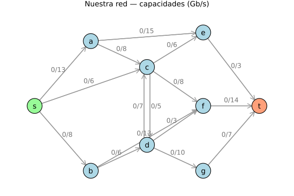
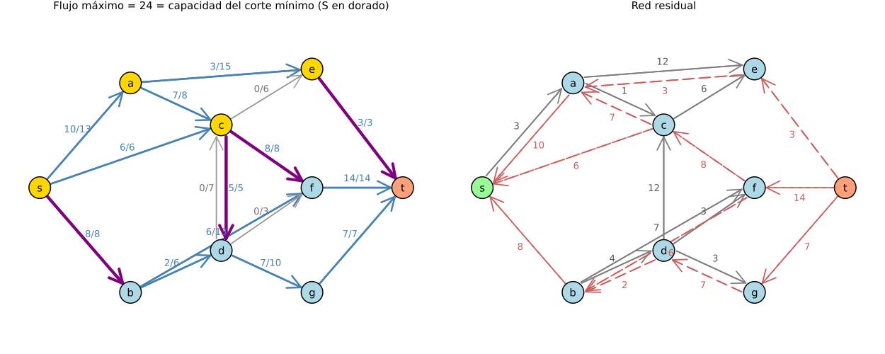

# Flujo máximo: Ford-Fulkerson vs. Edmonds-Karp

**Módulo de Redes Complejas — Universidad de Cuenca**
Capítulo de Optimización en Redes · Actividad práctica en parejas

| | |
|---|---|
| **Integrante 1** | Jean Carlo Aucapiña — jean.aucapina@ucuenca.edu.ec |
| **Integrante 2** | *(completar: nombre y correo institucional)* |
| **Código base** | [fabianastudillo/ComplexNetworks](https://github.com/fabianastudillo/ComplexNetworks) · `optimization/ford-fulkerson/`, `optimization/edmonds-karp/` |
| **Reproducir** | `julia --project=. src/parte1_exploracion.jl` … `src/parte4_comparacion.jl` |

---

## Resumen

Los dos algoritmos ejecutan el mismo ciclo y llegan al mismo flujo máximo. La única diferencia —cómo se elige el camino aumentante— no cambia el resultado, pero sí cuánto cuesta llegar a él. Nuestra evidencia:

- **En la red CLRS los dos métodos coinciden exactamente**: 3 iteraciones, los mismos caminos, el mismo reparto de flujo arco por arco. La red es demasiado benigna para separarlos.
- **En nuestra red sí se separan**: Edmonds-Karp necesita 5 iteraciones y Ford-Fulkerson con DFS necesita 8, para el mismo flujo de 24. Las longitudes de BFS no decrecen (3,3,3,5,7); las de DFS oscilan (3,4,3,4,3,4,5,6). Esa oscilación es precisamente lo que la demostración de la cota `O(V·E²)` prohíbe.
- **El peor caso de la red zigzag es real, pero no es culpa de DFS.** Ninguna DFS razonable lo alcanza: la del repositorio termina en 2 iteraciones para cualquier `M`. Hizo falta construir un adversario que alterna los dos caminos que cruzan el arco trampa para llegar a las **2M iteraciones exactas** que predice la teoría: 20, 200, 2000 y 20 000 para `M` = 10, 100, 1000 y 10 000.

La conclusión que nos llevamos: el problema no es DFS. Es la **libertad de elegir mal** que Ford-Fulkerson deja abierta, y que BFS cierra por construcción.

---

## 1. Parte 1 — Exploración guiada (red CLRS)

Red clásica de Cormen et al.: 6 nodos, 9 arcos, flujo máximo 23.

### 1.1 Tablas por iteración

**Edmonds-Karp (BFS)** — flujo máximo 23 en 3 iteraciones

| Iter | Camino aumentante | Longitud | Δ | Flujo acumulado |
|---:|---|---:|---:|---:|
| 1 | s → v₁ → v₃ → t | 3 | 12 | 12 |
| 2 | s → v₂ → v₄ → t | 3 | 4 | 16 |
| 3 | s → v₂ → v₄ → v₃ → t | 4 | 7 | 23 |

Longitudes: 3, 3, 4 — **no decrecientes** ✓

**Ford-Fulkerson (DFS)** — flujo máximo 23 en 3 iteraciones

| Iter | Camino aumentante | Longitud | Δ | Flujo acumulado |
|---:|---|---:|---:|---:|
| 1 | s → v₁ → v₃ → t | 3 | 12 | 12 |
| 2 | s → v₂ → v₄ → t | 3 | 4 | 16 |
| 3 | s → v₂ → v₄ → v₃ → t | 4 | 7 | 23 |

Longitudes: 3, 3, 4 — no decrecientes.

**Las dos tablas son idénticas.** No es casualidad ni error: la DFS del repositorio recorre `for v in n:-1:1` empujando a una pila, y como la pila devuelve el último insertado, el efecto neto es visitar primero los vecinos de índice bajo — el mismo orden que sigue la BFS al recorrer `for v in 1:n`. En una red pequeña y sin ambigüedades como CLRS, ambos tropiezan con los mismos caminos en el mismo orden. Para separarlos hace falta una red con más alternativas: la nuestra (Parte 3).

### 1.2 El arco de retroceso

Aquí encontramos algo que la guía da por supuesto y que no se cumple: **ninguna de las tres variantes estándar (BFS, DFS del repositorio, DFS con orden invertido) usa un arco de retroceso en la red CLRS.** Las tres llegan a 23 sin necesidad de cancelar flujo. Verificamos las tres ejecuciones arco por arco.

Para poder responder la pregunta, forzamos el fenómeno con una cuarta variante, la **DFS profunda** (prueba `t` en último lugar, de modo que elige caminos largos). Con ella sí aparece:

| Iter | Camino | Δ | ¿Retroceso? |
|---:|---|---:|---|
| 1 | s → v₁ → v₃ → v₂ → v₄ → t | 4 | no |
| 2 | s → v₁ → v₃ → t | 8 | no |
| 3 | **s → v₂ → v₃ → t** | 4 | **sí: v₂→v₃** |
| 4 | s → v₂ → v₄ → v₃ → t | 7 | no |

**Qué flujo se cancela.** En la red original no existe el arco v₂→v₃; sí existe v₃→v₂ con capacidad 9. En la iteración 1 mandamos 4 unidades por v₃→v₂. Eso crea, en la red residual, un arco de retroceso v₂→v₃ con capacidad residual 4: la posibilidad de *deshacer* ese envío. La iteración 3 lo usa y cancela las 4 unidades.

**Por qué el resultado sigue siendo válido.** Cancelar no es hacer trampa; es reencaminar. Las 4 unidades que iban v₃→v₂ no desaparecen: el camino s→v₂→v₃→t las reemplaza por 4 unidades que entran a v₂ desde s y salen de v₃ hacia t. En cada nodo intermedio sigue entrando lo mismo que sale (conservación) y ningún arco supera su capacidad. El flujo neto que sale de s aumenta en 4. La red residual codifica exactamente eso: un arco de retroceso es "puedo mandar hasta 4 unidades en sentido contrario porque ya mandé 4 en el directo". Sin esos arcos el algoritmo se quedaría atascado en asignaciones subóptimas de las que no podría salir; con ellos, cualquier decisión temprana es reversible, y por eso el método converge al óptimo global y no a uno local.

### 1.3 La onda BFS

Niveles de la primera iteración de Edmonds-Karp:

```
d(s) = 0     d(v₁) = 1     d(v₂) = 1     d(v₃) = 2     d(v₄) = 2     d(t) = 3
```

**Qué representa `d`.** La distancia desde `s` en la red residual, medida en número de arcos (no en capacidad). `d(v) = k` significa: el camino más corto de `s` a `v` por arcos con capacidad residual disponible tiene `k` arcos.

**Por qué el camino resaltado tiene exactamente `d(t)` arcos.** Porque BFS explora por capas: cuando descubre `t`, lo hace desde un nodo de nivel `d(t)−1`, que a su vez fue descubierto desde uno de nivel `d(t)−2`, y así hasta `s`. El camino que se reconstruye siguiendo los padres tiene un arco por cada nivel, es decir `d(t)` arcos. Y no puede haber uno más corto: si existiera un camino de `k < d(t)` arcos, BFS habría alcanzado `t` en la capa `k`, contradiciendo que su nivel sea `d(t)`. Esta propiedad —el camino elegido es siempre el más corto— es *toda* la diferencia entre Edmonds-Karp y Ford-Fulkerson.

### 1.4 Comparación del estado final

| Pregunta | Respuesta |
|---|---|
| ¿El corte mínimo es el mismo? | **Sí**: S = {s, v₁, v₂, v₄} en ambos |
| ¿El flujo máximo es el mismo? | **Sí**: 23 en ambos |
| ¿Los flujos arco por arco son los mismos? | **Sí, en esta red** |

Las tres coincidencias tienen explicaciones distintas, y conviene no confundirlas:

- **El flujo máximo coincide siempre**, en cualquier red y con cualquier estrategia. Lo garantiza el teorema max-flow min-cut: cuando no quedan caminos aumentantes, el valor del flujo iguala la capacidad del corte `(S, V∖S)` con `S` = alcanzables desde `s`. Ese valor es una propiedad de la red, no del algoritmo.
- **El corte mínimo coincide aquí, pero no tiene por qué.** Si hay varios cortes de capacidad mínima, distintas ejecuciones pueden reportar distintos. Coincide en CLRS y también en nuestra red, pero por suerte, no por necesidad.
- **Los flujos arco por arco coinciden solo porque las trazas son idénticas.** Esta es la coincidencia más frágil: en cuanto los métodos eligen caminos distintos, el reparto interno cambia. En nuestra red (Parte 3) BFS y DFS llegan ambos a 24 y al mismo corte, pero **reparten el flujo de forma distinta**. El valor total es único; el reparto que lo consigue, no.

---

## 2. Parte 2 — El experimento zigzag

Red de 4 nodos: dos rutas de capacidad `M` (s→u→t y s→v→t) unidas por un arco trampa u→v de capacidad 1. Flujo máximo = 2M.

### 2.1 Iteraciones medidas

| Método | M=10 | M=100 | M=1000 | M=10000 |
|---|---:|---:|---:|---:|
| BFS (Edmonds-Karp) | 2 | 2 | 2 | 2 |
| DFS del repositorio | 2 | 2 | 2 | 2 |
| DFS adversaria (orden invertido) | 2 | 2 | 2 | 2 |
| DFS profunda (`t` al final) | 4 | 4 | 4 | 4 |
| **Adversario alternante** | **20** | **200** | **2 000** | **20 000** |
| *Peor caso teórico (2M)* | *20* | *200* | *2 000* | *20 000* |

Los cinco métodos alcanzan el flujo correcto (2M) en todos los casos.

### 2.2 ¿La DFS del repositorio alcanza el peor caso? No, y la razón es geométrica

**No.** Se queda en 2 iteraciones para cualquier `M`, igual que BFS:

```
1. s → u → t    Δ = M
2. s → v → t    Δ = M
```

El motivo está en el orden de exploración de `buscar_camino_dfs`. La función recorre `for v in n:-1:1` insertando en una pila; como la pila devuelve el último elemento insertado, los vecinos de índice **bajo** se exploran primero. Con la numeración s=1, u=2, v=3, t=4, desde `s` se explora primero `u`; y desde `u`, el primer vecino residual por índice es `v`(3)... pero también está `t`(4), y la función **corta en cuanto descubre `t`** (`v == t && return`). El detalle decisivo: al procesar `u`, el bucle `for v in n:-1:1` visita `t`=4 *antes* que `v`=3, y retorna ahí mismo.

Y aquí está la razón de fondo, que es geométrica: **el camino trampa s→u→v→t tiene 3 arcos y el atajo s→u→t solo 2.** Cualquier búsqueda que se detenga al encontrar `t` tropieza antes con el atajo. Para caer en la trampa hay que *querer* el camino largo.

Eso hace la DFS profunda (prueba `t` en último lugar), y aun así solo llega a 4 iteraciones:

```
1. s → u → v → t   Δ = 1     ← cruza la trampa
2. s → u → t       Δ = M−1   ← pero aquí se "cura" sola
3. s → v → u → t   Δ = 1
4. s → v → t       Δ = M−1
```

Cruza la trampa una vez, pero en la iteración siguiente toma el atajo y se lleva `M−1` unidades de golpe. El daño se limita solo.

### 2.3 La modificación propuesta: el adversario alternante

La guía sugiere invertir el orden de los vecinos. Lo implementamos (`buscar_camino_dfs_adversaria`, `for v in 1:n`) y **no empeora nada**: sigue en 2 iteraciones, solo cambia cuál ruta toma primero. El orden de índices es demasiado débil como palanca.

Lo que sí funciona: un adversario que alterne los **dos** caminos largos (`buscar_camino_alternante`):

```
s → u → v → t    satura el arco trampa u→v
s → v → u → t    usa el RETROCESO v→u, que cancela ese flujo y REABRE la trampa
```

Traza real para M=5 (columna `r(u→v)` = capacidad residual del arco trampa):

| Iter | Camino | Δ | Flujo | r(u→v) | Qué pasó |
|---:|---|---:|---:|---:|---|
| 1 | s → u → v → t | 1 | 1 | 0 | satura el arco trampa |
| 2 | s → v → u → t | 1 | 2 | 1 | retroceso v→u ⇒ **reabre la trampa** |
| 3 | s → u → v → t | 1 | 3 | 0 | satura el arco trampa |
| 4 | s → v → u → t | 1 | 4 | 1 | retroceso v→u ⇒ **reabre la trampa** |
| … | … | 1 | … | … | … |
| 10 | s → v → u → t | 1 | 10 | 1 | retroceso v→u ⇒ reabre la trampa |

**10 iteraciones (= 2M) para transportar 10 unidades: avanza de una en una.** Cada par de iteraciones deja la red exactamente como estaba salvo por 2 unidades más de flujo, y el ciclo se puede repetir `M` veces. El efecto escala perfectamente: 20 000 iteraciones para M=10 000, exactamente 2M.

El hallazgo que nos parece más importante de toda la actividad: **el peor caso no es un defecto de DFS, sino del método de Ford-Fulkerson.** DFS es solo una forma de elegir el camino, y resulta ser una razonablemente afortunada en esta red. Pero Ford-Fulkerson *permite* elegir así, y su cota `O(E·|f*|)` tiene que contemplar al peor elector posible. Por eso la cota depende de `|f*|`: no describe lo que DFS hace, describe lo que el método no prohíbe.

### 2.4 ¿Por qué Edmonds-Karp es inmune, sin importar `M`?

Porque **BFS nunca elegiría esos caminos**. El adversario necesita caminos de 3 arcos (s→u→v→t); BFS siempre encuentra el de 2 (s→u→t), que existe desde la primera iteración. El arco trampa jamás se usa: BFS lo ignora por ser parte de un camino más largo.

Y esto no es suerte de esta red, es estructural. El lema de Edmonds-Karp dice que la distancia `d(v)` desde `s` en la red residual **nunca decrece** entre iteraciones. Cada iteración satura al menos un arco (el del cuello de botella), y un arco saturado `(u,v)` solo puede reaparecer cuando el flujo se cancela por su inverso, lo que exige que `d(u)` haya aumentado en al menos 2. Como `d` está acotada por `V`, cada arco se satura `O(V)` veces, y con `E` arcos salen `O(V·E)` iteraciones, cada una a coste `O(E)` de la BFS: **`O(V·E²)`**.

En esa cuenta **no aparece ninguna capacidad**. Ahí está toda la respuesta: la cota de Ford-Fulkerson depende de `|f*|` porque, si cada iteración empuja solo Δ=1, hacen falta `|f*|` iteraciones. Edmonds-Karp no puede caer en eso porque no cuenta unidades de flujo, cuenta *longitudes*, y las longitudes viven en un rango acotado por el tamaño del grafo. Duplicar todas las capacidades duplica `|f*|` pero no añade un solo nodo: BFS ni se entera.

---

## 3. Parte 3 — Nuestra red

### 3.1 Diseño

Modelamos el **backbone de un proveedor de Internet**: `s` es el punto de peering donde entra el tráfico, `t` el data center que lo consume, y los nodos intermedios son enrutadores. Las capacidades están en Gb/s.



| | |
|---|---|
| **Nodos** | 9 (s, a, b, c, d, e, f, g, t) — se piden ≥ 8 ✓ |
| **Arcos** | 16 — se piden ≥ 12 ✓ |
| **Antiparalelo** | c ⇄ d: c→d = 5, d→c = 7 ✓ |

Capacidades:

```
s→a=13   s→b=8    s→c=6
a→c=8    a→e=15
b→d=6    b→f=13
c→d=5    d→c=7        ← par antiparalelo
c→e=6    c→f=8
d→f=3    d→g=10
e→t=3    f→t=14   g→t=7
```

### 3.2 El proceso de diseño (y los intentos fallidos)

La topología la dibujamos a mano, decidiendo dónde queríamos el cuello de botella: `a→e` es ancho (15) pero `e→t` es estrecho (3), así que la ruta norte promete mucho y entrega poco. Las **capacidades**, en cambio, no se pueden ajustar a ojo: los cuatro requisitos dependen de ellas de forma nada intuitiva.

Nuestro primer intento fue fijarlas a mano por intuición. Falló en dos de los cuatro requisitos: BFS y DFS daban ambos 7 iteraciones (debían diferir) y ninguna ejecución usaba arcos de retroceso. Además el corte mínimo salía trivial —`S` = todos los nodos menos `t`—, lo que hace la verificación aburrida: el corte era simplemente "los tres arcos que entran a t".

Así que escribimos una búsqueda dirigida (`src/busqueda_red.jl`) que explora capacidades en `2..15` exigiendo seis condiciones: flujo coincidente en ambos métodos, DFS estrictamente peor que BFS, retroceso en ambas ejecuciones, violación de monotonía por DFS, corte no trivial y corte coincidente. De **400 000 combinaciones**, el reparto de fallos:

| Motivo del descarte | Casos | % |
|---|---:|---:|
| DFS no resulta peor que BFS | 309 909 | 77.5 % |
| BFS no usa ningún arco de retroceso | 88 074 | 22.0 % |
| DFS no usa ningún arco de retroceso | 1 912 | 0.5 % |
| Corte mínimo trivial | 24 | 0.01 % |

**Solo ~0.02 % de las redes cumple las seis a la vez.** Ese número es en sí mismo un resultado: encontrar una red donde DFS se comporte visiblemente peor que BFS es *difícil*, lo que explica por qué la red CLRS de la Parte 1 no logra separarlos. Con capacidades al azar, DFS acierta o empata el 77 % de las veces.

### 3.3 Resultados

**Edmonds-Karp (BFS)** — flujo 24 en **5 iteraciones**

| Iter | Camino | Long. | Δ | Flujo | Retroceso |
|---:|---|---:|---:|---:|---|
| 1 | s → a → e → t | 3 | 3 | 3 | — |
| 2 | s → b → f → t | 3 | 8 | 11 | — |
| 3 | s → c → f → t | 3 | 6 | 17 | — |
| 4 | s → a → c → d → g → t | 5 | 5 | 22 | — |
| 5 | s → a → c → f → b → d → g → t | 7 | 2 | 24 | **sí** |

Longitudes: 3, 3, 3, 5, 7 — **no decrecientes** ✓

**Ford-Fulkerson (DFS)** — flujo 24 en **8 iteraciones**

| Iter | Camino | Long. | Δ | Flujo | Retroceso |
|---:|---|---:|---:|---:|---|
| 1 | s → a → e → t | 3 | 3 | 3 | — |
| 2 | s → b → d → g → t | 4 | 6 | 9 | — |
| 3 | s → b → f → t | 3 | 2 | 11 | — |
| 4 | s → c → d → g → t | 4 | 1 | 12 | — |
| 5 | s → c → f → t | 3 | 5 | 17 | — |
| 6 | s → a → c → f → t | 4 | 3 | 20 | — |
| 7 | s → a → c → d → f → t | 5 | 3 | 23 | — |
| 8 | s → a → c → d → b → f → t | 6 | 1 | 24 | **sí** |

Longitudes: 3, 4, 3, 4, 3, 4, 5, 6 — **oscilan** ✗

**Esta es la evidencia central del lema.** Las longitudes de BFS nunca bajan; las de DFS suben y bajan tres veces (3→4→3→4→3→4). La demostración de `O(V·E²)` se apoya exactamente en que eso no puede pasar, y aquí se ve pasar en la misma red, con la misma implementación, cambiando solo la línea que elige el camino.

Nótese también el desperdicio: DFS gasta las iteraciones 4 y 8 en aumentos de **Δ=1**. BFS nunca baja de Δ=2.

### 3.4 Arcos de retroceso

Cada método usa exactamente uno, y en su última iteración:

- **BFS, iteración 5** — camino `s → a → c → f → b → d → g → t`. El arco `f→b` es de retroceso (en la red solo existe b→f, capacidad 13). Cancela **2** de las 8 unidades que la iteración 2 había enviado por b→f. A cambio, esas 2 unidades salen ahora por `b→d→g→t`, y el hueco liberado en `f→t` lo aprovecha el tráfico que viene por `c→f`.
- **DFS, iteración 8** — camino `s → a → c → d → b → f → t`. El arco `d→b` es de retroceso (solo existe b→d, capacidad 6). Cancela **1** de las 6 unidades enviadas en la iteración 2.

En ambos casos el retroceso es lo que permite exprimir las 2 últimas unidades (BFS) y la última (DFS): sin cancelar, el algoritmo se habría detenido en 22 y 23 respectivamente, por debajo del óptimo.

### 3.5 Corte mínimo, verificado a mano



**S = {s, a, c, e}** (alcanzables desde `s` en la red residual final) · **V∖S = {b, d, f, g, t}**

Aristas que van de S a V∖S, con su capacidad y su flujo:

| Arista | Capacidad | Flujo | ¿Saturada? |
|---|---:|---:|---|
| s→b | 8 | 8/8 | sí |
| c→d | 5 | 5/5 | sí |
| c→f | 8 | 8/8 | sí |
| e→t | 3 | 3/3 | sí |
| **Suma** | **24** | | |

**8 + 5 + 8 + 3 = 24 = flujo máximo** ✓ — teorema max-flow min-cut verificado sumando a mano.

Dos comprobaciones adicionales que confirman que el corte es correcto:

- **Las cuatro aristas están saturadas.** Tienen que estarlo: si alguna tuviera capacidad libre, su destino sería alcanzable desde `s` en la red residual y estaría en `S`, contradicción.
- **Ningún arco de V∖S hacia S lleva flujo.** También es forzoso: si `(u,v)` con `u ∉ S`, `v ∈ S` tuviera flujo, existiría el arco residual `v→u` y `u` estaría en `S`.

El corte es interesante porque **atraviesa el interior de la red**, no se limita a los arcos que entran a `t`. Su lectura de ingeniería: la red no está limitada por la entrada ni por la salida, sino por tres estrangulamientos internos (`s→b`, `c→d`, `c→f`) más el enlace `e→t`. Ampliar `f→t` (que tiene 14 y usa 14) no serviría de nada mientras `c→f` siga en 8.

### 3.6 Mismo flujo, mismo corte, distinto reparto

BFS y DFS coinciden en el flujo (24) y en el corte ({s,a,c,e}), pero **reparten el tráfico de forma distinta** por dentro. Es la ilustración de que el óptimo es único en valor, no en forma: hay muchas maneras de mover 24 Gb/s por esta red, y las dos estrategias encuentran maneras distintas. Para un operador de red esto importa: ambas soluciones son igual de buenas en capacidad, pero pueden diferir en latencia, en número de saltos o en resiliencia.

### 3.7 Animaciones

| Archivo | Contenido |
|---|---|
| `results/animations/propia_ff_bfs.gif` | Ford-Fulkerson con BFS sobre nuestra red |
| `results/animations/propia_ff_dfs.gif` | Ford-Fulkerson con DFS (8 iteraciones) |
| `results/animations/propia_ek.gif` | Edmonds-Karp con la **onda BFS** capa por capa |
| `results/animations/zigzag_adversario.gif` | El adversario cayendo en la trampa (M=3) |
| `results/animations/zigzag_bfs.gif` | BFS sobre la misma red: 2 iteraciones |
| `results/animations/clrs_bfs.gif`, `clrs_dfs.gif` | Red CLRS con ambos métodos |

---

## 4. Parte 4 — Análisis comparativo

### 4.1 Cuadro comparativo

| Criterio | Ford-Fulkerson (DFS) | Edmonds-Karp (BFS) |
|---|---|---|
| **Estrategia de búsqueda** | DFS: el primer camino que encuentre | BFS: siempre el más corto en nº de arcos |
| **Complejidad teórica** | `O(E·|f*|)` | `O(V·E²)` |
| **¿Termina con capacidades irracionales?** | No garantizado (Zwick, 1995) | Sí, siempre (≤ V·E/2 iteraciones) |
| **Iteraciones observadas (CLRS)** | 3 | 3 |
| **Iteraciones observadas (zigzag, M=10⁴)** | 2 (repo) · **20 000** (adversario) | 2 |
| **Iteraciones observadas (red propia)** | 8 | 5 |
| **Longitudes de los caminos (red propia)** | 3,4,3,4,3,4,5,6 — **oscilan** | 3,3,3,5,7 — **no decrecen** |
| **Sensibilidad al valor de las capacidades** | Sí en el peor caso (2M iteraciones) | No: la cota no menciona capacidades |
| **Flujo máximo obtenido (red propia)** | 24 | 24 |
| **Corte mínimo obtenido (red propia)** | {s,a,c,e} = 24 | {s,a,c,e} = 24 |

**Sobre la sensibilidad**, medimos algo que matiza la tabla: al multiplicar todas las capacidades de nuestra red por `k` ∈ {1, 10, 100, 1000}, el flujo escala de 24 a 24 000 pero **las iteraciones no se mueven** (BFS sigue en 5, DFS en 8). En una red concreta, DFS puede ser perfectamente insensible al valor. La diferencia es que para BFS eso está *garantizado* y para DFS es *suerte*: la red zigzag muestra qué pasa cuando la suerte se acaba.

**Sobre las capacidades irracionales**, una nota de honestidad: no presentamos experimento propio. Reproducir la red de Zwick exige aritmética exacta en `ℚ(√5)`, porque la no terminación depende de que los residuos sigan exactamente la identidad `r^(k+2) = r^k − r^(k+1)` de la razón áurea. En `Float64` ese invariante se rompe por redondeo y el algoritmo termina — pero termina por el error numérico, no por el algoritmo. Un experimento así "confirmaría" la terminación por el motivo equivocado. Preferimos citar la teoría y apoyar el argumento en la evidencia que sí obtuvimos: el peor caso 2M de la Parte 2.

### 4.2 Similitudes: ¿qué comparten exactamente?

**Comparten todo menos una línea.** Literalmente: en el código del repositorio, `ford_fulkerson(red, s, t; metodo=:bfs)` y `metodo=:dfs` ejecutan la misma función; lo único que cambia es qué `buscar_camino_*` se invoca.

En concreto comparten:

- **El invariante.** En todo momento `f` es un flujo factible: respeta capacidades (`f(u,v) ≤ c(u,v)`) y conserva el flujo en los nodos intermedios. Aumentar en Δ = mínima capacidad residual del camino preserva ambas cosas por construcción.
- **La estructura del ciclo.** Mientras exista camino aumentante en la red residual: buscarlo, calcular el cuello de botella Δ, aumentar en Δ. Ninguno de los dos mira las capacidades para decidir *dónde* aumentar.
- **La condición de parada.** Ambos paran cuando no hay camino de `s` a `t` en la red residual.
- **El resultado final.** El mismo valor de flujo máximo, siempre.
- **La antisimetría** `F[u,v] = −F[v,u]`, que hace que la capacidad residual sea `C[u,v] − F[u,v]` uniformemente para arcos directos y de retroceso.

**Qué teorema garantiza el mismo valor: max-flow min-cut.** Cuando el ciclo termina, sea `S` = nodos alcanzables desde `s` en la red residual. Por definición `t ∉ S` (si no, habría camino aumentante). Todo arco de `S` a `V∖S` está saturado y todo arco de `V∖S` a `S` tiene flujo cero — si no, el destino sería alcanzable. Entonces `|f| = capacidad(S, V∖S)`. Como *todo* flujo es ≤ *todo* corte, un flujo que iguala a un corte es máximo y ese corte es mínimo.

La clave del argumento: **no menciona cómo se eligieron los caminos.** Solo usa la condición de parada. Por eso cualquier estrategia —BFS, DFS, o elegir al azar— que termine, termina en el óptimo. La elección afecta el *camino recorrido*, nunca el *destino*.

### 4.3 Diferencias: la monotonía de las longitudes

**En Edmonds-Karp las longitudes nunca decrecen.** Verificado en nuestras tablas: CLRS 3,3,4 · red propia 3,3,3,5,7 · zigzag 2,2.

**¿Se cumple con DFS? No.** En nuestra red las longitudes de DFS hacen 3,**4**,**3**,**4**,**3**,4,5,6: tres violaciones. En CLRS con la DFS de orden invertido: 3,**4**,**3**. La propiedad falla en cuanto DFS tiene alternativas reales entre las que elegir.

**Qué papel juega en la demostración de `O(V·E²)`.** Es la pieza central, y el argumento va así:

1. *Lema (monotonía).* Con BFS, `d(v)` —distancia de `s` a `v` en la red residual— nunca decrece entre iteraciones. Intuición: BFS satura arcos del camino más corto; los arcos nuevos que aparecen son de retroceso, que apuntan "hacia atrás" en el árbol BFS y no pueden crear atajos.
2. *Arco crítico.* En cada iteración, al menos un arco del camino se satura (el del cuello de botella). Se le llama *crítico* en esa iteración.
3. *Cada arco es crítico O(V) veces.* Si `(u,v)` es crítico ahora, se cumple `d(v) = d(u) + 1`. Para volver a serlo, primero debe reaparecer en la red residual, y eso solo pasa si alguna iteración manda flujo por `v→u`, lo que exige `d'(u) = d'(v) + 1`. Combinando con la monotonía: `d'(u) = d'(v) + 1 ≥ d(v) + 1 = d(u) + 2`. Cada vez que `(u,v)` vuelve a ser crítico, `d(u)` ha subido **al menos 2**. Como `d(u) < V`, esto pasa a lo sumo `V/2` veces.
4. *Cuenta final.* `E` arcos × `O(V)` veces cada uno = `O(V·E)` iteraciones; cada una cuesta `O(E)` (una BFS) ⇒ **`O(V·E²)`**.

**Dónde se rompe todo si las longitudes decrecen.** El paso 3 usa la monotonía en `d'(v) ≥ d(v)`. Sin ella, `d(u)` puede subir *y bajar*, y no hay forma de acotar cuántas veces un arco vuelve a ser crítico: podría serlo `|f*|` veces. Ahí es donde reaparece la dependencia de las capacidades y la cota se degrada a `O(E·|f*|)`. Nuestra tabla de DFS, con sus longitudes oscilando, es exactamente la situación que el lema prohíbe — y la red zigzag con el adversario alternante es esa misma situación llevada al extremo: longitudes 3,3,3,… con Δ=1 cada vez, 2M iteraciones.

### 4.4 Ventajas y desventajas: ¿cuándo preferir DFS?

Edmonds-Karp domina en garantías, así que la pregunta interesante es cuándo la variante DFS es defendible. Nuestra respuesta, con matices:

**Argumentos a favor de DFS:**

- **Memoria y constantes.** Una DFS recursiva usa la pila de llamadas, `O(V)` de espacio en el mejor caso, frente a la cola explícita de BFS. En redes enormes con localidad de acceso importante, DFS puede tener mejores constantes por cache. Es un argumento real pero modesto: ambas son `O(V)` en espacio asintótico.
- **Simplicidad.** Cabe en cinco líneas recursivas, sin estructura de cola. Para prototipar o para enseñar el concepto de camino aumentante antes de refinarlo, tiene valor.
- **Redes con estructura conocida.** Este es el argumento fuerte. **En nuestros propios datos, DFS empata con BFS en la red CLRS (3 iteraciones) y en la red zigzag (2 iteraciones para cualquier M, incluido M=10⁴).** Si se conoce la topología y se sabe que no admite el patrón patológico, DFS es igual de rápida y más simple. Nuestra búsqueda de la Parte 3 lo cuantifica: con capacidades al azar sobre nuestra topología, **DFS iguala o supera a BFS el 77 % de las veces**.
- **Cuando `|f*|` es pequeño.** Si el flujo máximo está acotado por una constante pequeña (grafos de matching unitario, por ejemplo), `O(E·|f*|)` puede batir a `O(V·E²)`.

**Argumentos en contra, que a nuestro juicio pesan más:**

- El peor caso no es teórico: lo construimos y son **20 000 iteraciones donde BFS necesita 2**.
- La garantía de DFS depende del *valor* de las capacidades, algo que suele venir de datos externos y cambia. Una red que hoy va bien puede degradarse mañana solo porque un enlace cambió de 1 Gb/s a 10 Gb/s.
- Con capacidades irracionales, ni siquiera hay garantía de terminación (Zwick 1995).
- El sobrecosto de BFS sobre DFS es despreciable: la misma complejidad por iteración, `O(E)`.

**Nuestra recomendación:** usar Edmonds-Karp por defecto. El precio es cero y compra una garantía independiente de los datos. DFS solo si se conoce la estructura de la red *y* se ha verificado que el patrón patológico no aparece — y eso, como muestra nuestra búsqueda, es más fácil de suponer que de comprobar.

### 4.5 Dos aplicaciones en redes complejas

**(a) Robustez de una red de comunicaciones: cuántos enlaces hay que cortar.**

Por el teorema max-flow min-cut, el corte mínimo entre `s` y `t` es el **conjunto más barato de enlaces cuya eliminación desconecta** `s` de `t`. Es la medida natural de robustez: si la capacidad del corte mínimo es 24 Gb/s repartidos en 4 enlaces, un atacante que tumbe esos 4 aísla el destino, y no hay forma más barata de lograrlo. En nuestra red esto es directamente accionable: el corte {s→b, c→d, c→f, e→t} identifica los cuatro enlaces críticos, y dice que reforzar cualquier otro es dinero perdido.

En su versión no ponderada (todas las capacidades = 1), el flujo máximo entre `s` y `t` es el **número de caminos disjuntos** entre ellos, por el teorema de Menger. Ese número es la conectividad de aristas: cuántos fallos simultáneos tolera el par. Calculado para todos los pares, da un perfil de fragilidad de la red completa.

**(b) Detección de comunidades por cortes (algoritmo de Girvan-Newman por flujo).**

Si dos grupos de nodos están densamente conectados por dentro y poco entre sí, el corte mínimo entre un nodo de cada grupo tiende a caer justo en la frontera. Repitiendo el cálculo para pares bien elegidos y quedándose con los cortes de capacidad baja respecto al tamaño de los grupos, emergen las comunidades. Es la base de métodos como Gomory-Hu, que resume los `n(n−1)/2` cortes mínimos de todos los pares en un solo árbol de `n−1` aristas.

**Modelado detallado de la aplicación (a)**, como pide la guía:

| Elemento | Qué representa |
|---|---|
| **Nodos** | Enrutadores, switches o centros de datos de la red física |
| **Arcos** | Enlaces físicos (fibra, radio); dirigidos, porque un enlace puede ser asimétrico |
| **`s`** | El origen del tráfico crítico — p. ej. el punto de peering donde entra el tráfico de Internet |
| **`t`** | El destino que queremos mantener conectado — p. ej. el data center que sirve la aplicación |
| **Capacidades** | Ancho de banda del enlace en Gb/s. Si el objetivo es robustez ante fallos en lugar de throughput, se pone capacidad 1 en cada enlace: el flujo máximo pasa a contar enlaces disjuntos, es decir, fallos simultáneos tolerables |
| **Flujo máximo** | Tráfico máximo sostenible de `s` a `t` |
| **Corte mínimo** | Los enlaces que hay que reforzar (o que un atacante tumbaría). Ampliar cualquier enlace fuera del corte no aumenta la capacidad ni un bit |

La segunda fila de "capacidades" es la más interesante: **cambiando la interpretación de la capacidad, el mismo algoritmo responde una pregunta distinta** — throughput con capacidades reales, robustez con capacidades unitarias.

---

## 5. Conclusiones

1. **La elección del camino no afecta el resultado, solo el costo.** Los dos métodos llegan siempre al mismo flujo máximo, y el teorema max-flow min-cut explica por qué: la demostración solo usa la condición de parada, nunca cómo se eligieron los caminos.

2. **El peor caso de Ford-Fulkerson es real pero cuesta provocarlo.** La DFS del repositorio no lo alcanza en la red zigzag (2 iteraciones para cualquier M), ni tampoco una DFS que prefiera caminos largos (4 iteraciones). Hizo falta un adversario que alternara los dos caminos que cruzan el arco trampa para llegar a las 2M exactas.

3. **Y por eso el peor caso no es culpa de DFS.** Es culpa de la libertad que el método deja abierta. La cota `O(E·|f*|)` no describe lo que DFS hace; describe lo que Ford-Fulkerson no prohíbe. Edmonds-Karp no es "DFS arreglado": es Ford-Fulkerson **con la libertad de elegir mal eliminada**.

4. **La monotonía de las longitudes es la bisagra de todo.** Nuestra red la exhibe en las dos direcciones a la vez: BFS 3,3,3,5,7 (nunca baja) y DFS 3,4,3,4,3,4,5,6 (baja tres veces), con la misma implementación y la misma red. Esa propiedad es lo que hace que la cota de Edmonds-Karp no mencione las capacidades.

5. **Encontrar una red donde DFS se vea mal es estadísticamente difícil.** De 400 000 combinaciones de capacidades sobre nuestra topología, el 77.5 % daba DFS igual o mejor que BFS. Eso explica por qué la red CLRS no separa los métodos, y sugiere una lección práctica incómoda: **medir DFS en unos pocos casos y concluir que va bien es exactamente el error que la teoría del peor caso previene**.

---

## 6. Reproducibilidad

```bash
cd Caminos_Minimos_Flujo_Max
julia --project=. -e 'using Pkg; Pkg.instantiate()'

julia --project=. src/parte1_exploracion.jl    # tablas CLRS, onda BFS, GIFs
julia --project=. src/parte2_zigzag.jl         # escalado M, adversario 2M
julia --project=. src/parte3_red_propia.jl     # red propia, corte, GIFs
julia --project=. src/parte4_comparacion.jl    # tabla comparativa, sensibilidad
julia --project=. src/busqueda_red.jl          # cómo se diseñó la red propia
```

Modo interactivo (paso a paso con `[Enter]`):

```julia
include("src/motor.jl")
red, s, t = red_propia()
ford_fulkerson_interactivo(red, s, t)              # BFS
ford_fulkerson_interactivo(red, s, t; metodo=:dfs) # DFS
```

### Estructura

| Ruta | Contenido |
|---|---|
| `src/ford_fulkerson.jl`, `src/edmonds_karp.jl` | Código base del repositorio del profesor, **sin modificar** |
| `src/redes.jl` | Las tres redes: CLRS, zigzag(M) y la propia |
| `src/motor.jl` | Instrumentación + las variantes de búsqueda que añadimos |
| `src/busqueda_red.jl` | El proceso de diseño de la red propia |
| `src/parte{1,2,3,4}_*.jl` | Un script por parte de la guía |
| `results/data/*.json` | Todos los números de este informe |
| `results/animations/*.gif` | Las animaciones |
| `presentacion/` | Diapositivas |

## 7. Referencias

- Cormen, T., Leiserson, C., Rivest, R., Stein, C. (2009). *Introduction to Algorithms*, 3ª ed., cap. 26. MIT Press.
- Ford, L. R., Fulkerson, D. R. (1956). Maximal flow through a network. *Canadian Journal of Mathematics*, 8, 399–404.
- Edmonds, J., Karp, R. M. (1972). Theoretical improvements in algorithmic efficiency for network flow problems. *Journal of the ACM*, 19(2), 248–264.
- Zwick, U. (1995). The smallest networks on which the Ford-Fulkerson maximum flow procedure may fail to terminate. *Theoretical Computer Science*, 148(1), 165–170.
- Astudillo-Salinas, F. (2026). *ComplexNetworks* — código base de la actividad. https://github.com/fabianastudillo/ComplexNetworks
