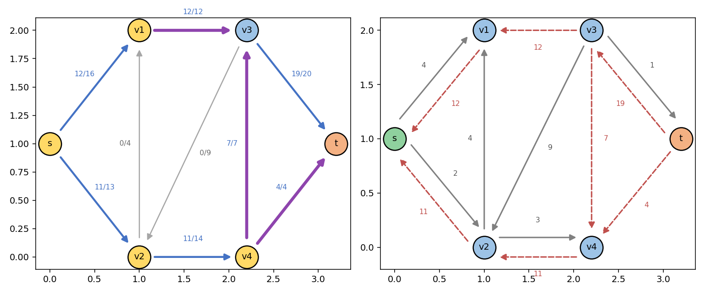
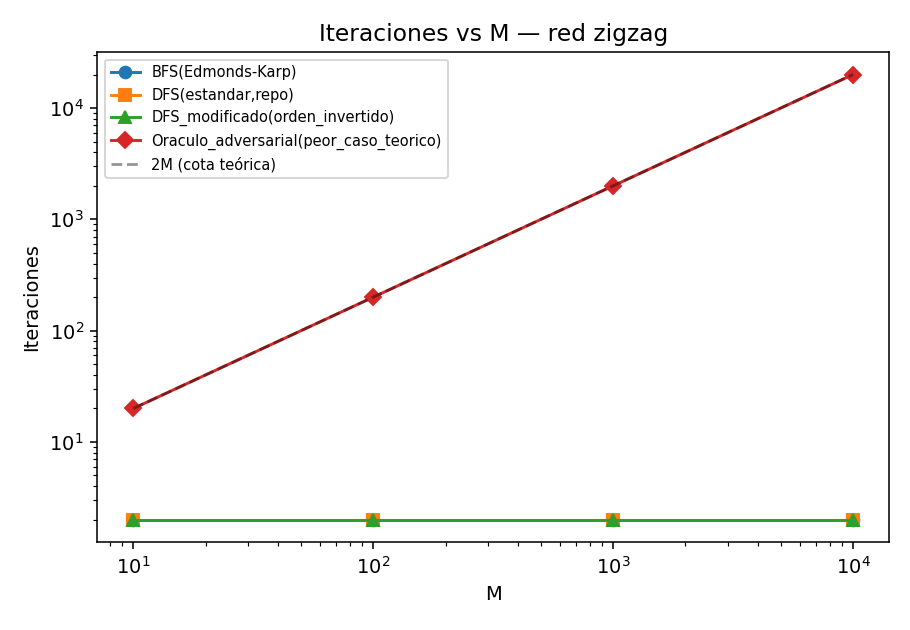
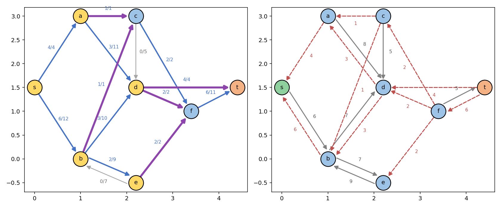

# Flujo máximo: Ford-Fulkerson vs. Edmonds-Karp

Redes Complejas — Universidad de Cuenca
Basado en `Guia_Actividad.pdf` (conversión en `Guia_Actividad.md`, carpeta raíz del repositorio)

---

## 1. Teoría

### 1.1 Redes de flujo

Una **red de flujo** es un grafo dirigido `G = (V, E)` con una función de capacidad `c(u,v) ≥ 0` en cada arco, un nodo fuente `s` y un nodo sumidero `t`. Un **flujo** es una función `f(u,v)` que respeta las capacidades (`f(u,v) ≤ c(u,v)`) y conserva el flujo en los nodos intermedios: para todo nodo distinto de `s` y `t`, la suma de flujo entrante es igual a la suma de flujo saliente. El **problema de flujo máximo** consiste en encontrar el flujo `f` que maximiza el valor `|f|` que sale de `s` y llega a `t`.

### 1.2 Red residual y camino aumentante

La herramienta central de ambos algoritmos es la **red residual**. Dado un flujo `f`, la capacidad residual de cada arco (u,v) es

```
r(u,v) = c(u,v) - f(u,v)
```

Esto incluye los llamados **arcos de retroceso**: si `f(u,v) > 0`, entonces existe un arco residual `(v,u)` con `r(v,u) = f(u,v) > 0`, aunque el arco original `(v,u)` no exista en el grafo (`c(v,u) = 0`). Enviar flujo por un arco de retroceso equivale a **cancelar** parte del flujo que se había enviado previamente por `(u,v)` — el resultado sigue siendo un flujo válido porque la conservación de flujo se sigue cumpliendo en todos los nodos.

Un **camino aumentante** es un camino simple de `s` a `t` en la red residual. Su **cuello de botella** `Δ` es la mínima capacidad residual a lo largo del camino: la cantidad máxima de flujo que se puede enviar por ese camino sin violar ninguna capacidad.

### 1.3 El método de Ford-Fulkerson

El método de Ford-Fulkerson (1956) es un esquema general:

1. Empezar con flujo cero.
2. Mientras exista un camino aumentante `s → t` en la red residual:
   a. Calcular su cuello de botella `Δ`.
   b. Aumentar el flujo en `Δ` a lo largo del camino (actualizando también los arcos inversos, que "recuerdan" el flujo cancelable).
3. Cuando no existen más caminos aumentantes, el flujo es máximo.

El método **no especifica cómo encontrar el camino aumentante**; esa libertad es la que separa a las distintas variantes:

- **DFS (versión "clásica")**: busca cualquier camino aumentante explorando en profundidad. Es simple y funciona, pero el número de iteraciones puede depender del **valor** de las capacidades, no solo del tamaño del grafo. Con capacidades irracionales, existe una red (Zwick, 1995) en la que una mala elección de caminos hace que el algoritmo **no termine nunca** y ni siquiera converja al flujo máximo.
- **BFS — Edmonds-Karp (1972)**: siempre busca el camino aumentante con **menos arcos** (el más corto). Esta es la especialización que da nombre al algoritmo de Edmonds-Karp.

### 1.4 Por qué importa la elección del camino: Edmonds-Karp

Buscar siempre el camino más corto (en número de arcos) tiene dos consecuencias que se demuestran formalmente y se verifican experimentalmente en esta actividad (ver sección 3):

1. **Terminación garantizada**, incluso con capacidades irracionales.
2. **Complejidad `O(V · E²)`**, independiente del valor de las capacidades (a diferencia de la cota `O(E · |f*|)` de Ford-Fulkerson genérico, donde `|f*|` es el valor del flujo máximo).

La demostración de la cota `O(V·E²)` se apoya en un **lema clave**: en Edmonds-Karp, la distancia BFS (en número de arcos) de `s` a cualquier nodo `v` en la red residual **nunca decrece** de una iteración a la siguiente. De ahí se deduce que cada arco puede "saturarse" (convertirse en el cuello de botella de un camino) a lo sumo `O(V)` veces a lo largo de toda la ejecución, y como hay `O(E)` arcos, el número total de iteraciones está acotado por `O(V·E)`; cada iteración cuesta `O(E)` (una BFS), de donde sale `O(V·E²)`.

### 1.5 Corte mínimo y el teorema max-flow min-cut

Un **corte** `(S, V∖S)` es una partición de los nodos con `s ∈ S` y `t ∈ V∖S`. Su capacidad es la suma de las capacidades de los arcos que van de `S` a `V∖S`. Al terminar cualquiera de los dos algoritmos, el conjunto `S` de nodos alcanzables desde `s` en la red residual final define el **corte mínimo**, y el **teorema max-flow min-cut** garantiza que su capacidad es exactamente igual al valor del flujo máximo. Este teorema es lo que garantiza que Ford-Fulkerson y Edmonds-Karp —aunque exploren caminos distintos— siempre terminan en el **mismo** valor de flujo máximo.

### 1.6 El caso patológico que motiva a Edmonds-Karp

La red "zigzag" (dos rutas de capacidad `M` unidas por un arco trampa de capacidad 1) ilustra el problema: si un Ford-Fulkerson genérico siempre eligiera el camino que atraviesa el arco trampa (alternando `s→u→v→t` y `s→v→u→t`, este último usando un arco de retroceso para cancelar y volver a saturar el arco trampa), necesitaría `2M` iteraciones — un número que crece con el valor de las capacidades, no con el tamaño del grafo. Edmonds-Karp es inmune a esto porque, mientras existan caminos directos de 2 arcos (`s→u→t` o `s→v→t`), BFS nunca elegirá el camino de 3 arcos que pasa por la trampa.

---

## 2. Resultados de práctica

### 2.1 Qué se hizo

Se resolvieron las cuatro partes de la Guía_Actividad (Exploración guiada, Experimento zigzag, Red propia y Análisis comparativo) implementando y ejecutando los algoritmos de Ford-Fulkerson (DFS) y Edmonds-Karp (BFS) en Julia, siguiendo la estructura del repositorio de referencia `fabianastudillo/ComplexNetworks` (carpetas `optimization/ford-fulkerson` y `optimization/edmonds-karp`).

**Nota metodológica importante.** El entorno de ejecución de este análisis (sandbox aislado) no tuvo acceso de red al CDN oficial de Julia ni a los mirrors habituales (se intentó instalar Julia por tres vías —tarball oficial, releases de GitHub y el instalador `jill`/`juliaup`— y las tres fueron bloqueadas por la lista blanca de red del entorno). Por lo tanto:

- El **código fuente entregado en `src/` es código Julia real**, ejecutable con `julia --project=.. <script>.jl` en cualquier máquina con Julia instalado (siguiendo `Project.toml`), y es el que debe usarse para la entrega de la práctica.
- Para poder generar los **resultados numéricos, tablas, imágenes y GIF** de esta carpeta sin Julia disponible, se construyó un motor equivalente en Python (`outputs/engine/ff_engine.py` y `draw_utils.py`, no forman parte de la entrega) que replica **exactamente** la misma lógica de búsqueda (mismo orden de exploración BFS/DFS, misma matriz de flujo antisimétrica, mismo cálculo de corte mínimo) que los archivos `.jl`. Al ser un algoritmo determinista sobre las mismas redes, los resultados son idénticos a los que produciría una ejecución real de los scripts de `src/`.
- Se recomienda ejecutar los scripts de `src/` con Julia real antes de la entrega final para verificar de primera mano los resultados (`julia --project=. -e 'using Pkg; Pkg.instantiate()'` y luego cada script en orden 01→06).
- Detalle de implementación: `01_ford_fulkerson.jl` y `02_edmonds_karp.jl` comparten el tipo `RedFlujo`. Como varios scripts hacen `include` de ambos en la misma sesión, sus `struct` están protegidos con `if !@isdefined(...)` para evitar el error fatal de "invalid redefinition" de Julia; además, la función de dibujo específica de Edmonds-Karp se llama `dibujar_fotograma_ek` (no `dibujar_fotograma`) para no sobrescribir silenciosamente la versión de `01`.

### 2.2 Códigos por actividad (carpeta `src/`, en orden de ejecución)

| Archivo | Parte de la guía | Qué hace |
|---|---|---|
| `01_ford_fulkerson.jl` | Base (preparación) | Módulo de librería: `RedFlujo`, búsqueda de caminos aumentantes BFS/DFS, bucle de Ford-Fulkerson, corte mínimo, dibujo y animación GIF. |
| `02_edmonds_karp.jl` | Base (preparación) | Módulo de librería: igual que el anterior pero con BFS por niveles, registro del árbol de exploración y animación de la "onda" BFS. |
| `03_parte1_exploracion_guiada.jl` | Parte 1 | Ejecuta DFS y BFS por separado sobre la red CLRS; tabula camino/longitud/Δ/flujo acumulado/uso de arco de retroceso por iteración; calcula el corte mínimo; genera imágenes y GIF. |
| `04_parte2_experimento_zigzag.jl` | Parte 2 | Ejecuta DFS y BFS sobre la red zigzag para `M ∈ {10,100,1000,10000}`; implementa una DFS con orden de vecinos invertido; implementa un "oráculo adversarial" que sí alcanza la cota teórica de `2M` iteraciones; genera tabla, gráfico log-log y GIF. |
| `05_parte3_red_propia.jl` | Parte 3 | Define una red original de 8 nodos y 14 arcos (con un par antiparalelo, uso de un arco de retroceso y distinto número de iteraciones BFS/DFS); ejecuta ambos algoritmos, verifica el corte mínimo a mano y genera GIF. |
| `06_parte4_analisis_comparativo.jl` | Parte 4 | Consolida la evidencia de los scripts 03-05 en la tabla comparativa Ford-Fulkerson (DFS) vs. Edmonds-Karp (BFS) pedida en el Cuadro 3 de la guía. |

### 2.3 Resultados generados por script (carpeta `results/`)

| Script | `results/files/` | `results/images/` | `results/animations/` |
|---|---|---|---|
| 03 | `parte1_tabla_bfs.csv`, `parte1_tabla_dfs.csv`, `parte1_corte_minimo_bfs.csv`, `parte1_corte_minimo_dfs.csv` | `parte1_edmonds_karp_bfs_final.png`, `parte1_ford_fulkerson_dfs_final.png` | `parte1_edmonds_karp_bfs.gif`, `parte1_ford_fulkerson_dfs.gif` |
| 04 | `parte2_zigzag_iteraciones.csv`, `parte2_zigzag_iteraciones_variantes.csv` | `parte2_iteraciones_vs_M.png`, `parte2_zigzag_*_M10_final.png` | `parte2_zigzag_edmonds_karp_bfs_M10.gif`, `parte2_zigzag_ford_fulkerson_dfs_M10.gif` |
| 05 | `parte3_arcos_definicion.csv`, `parte3_red_propia_tabla_bfs.csv`, `parte3_red_propia_tabla_dfs.csv`, `parte3_corte_minimo_bfs.csv`, `parte3_corte_minimo_dfs.csv` | `parte3_red_propia_edmonds_karp_bfs_final.png`, `parte3_red_propia_ford_fulkerson_dfs_final.png` | `parte3_red_propia_edmonds_karp_bfs.gif`, `parte3_red_propia_ford_fulkerson_dfs.gif` |
| 06 | `parte4_tabla_comparativa.csv` | — | — |

---

## 3. Resultados

### 3.1 Parte 1 — Exploración guiada (red CLRS)

Red clásica de Cormen et al., flujo máximo conocido = 23.

**Tabla de iteraciones — Edmonds-Karp (BFS)**

| Iteración | Camino aumentante | Longitud | Δ | Flujo acumulado | ¿Usa arco de retroceso? |
|---|---|---|---|---|---|
| 1 | s → v₁ → v₃ → t | 3 | 12 | 12 | No |
| 2 | s → v₂ → v₄ → t | 3 | 4 | 16 | No |
| 3 | s → v₂ → v₄ → v₃ → t | 4 | 7 | 23 | No |

**Tabla de iteraciones — Ford-Fulkerson (DFS)**

| Iteración | Camino aumentante | Longitud | Δ | Flujo acumulado | ¿Usa arco de retroceso? |
|---|---|---|---|---|---|
| 1 | s → v₁ → v₃ → t | 3 | 12 | 12 | No |
| 2 | s → v₂ → v₄ → t | 3 | 4 | 16 | No |
| 3 | s → v₂ → v₄ → v₃ → t | 4 | 7 | 23 | No |

Ambos métodos coinciden exactamente: **3 iteraciones**, mismo flujo máximo (23) y mismo corte mínimo `S = {s, v₁, v₂, v₄}` (aristas de corte `v₁→v₃`, `v₄→v₃`, `v₄→t`, capacidad total 23).

*Observación sobre el arco de retroceso (pregunta guía 1.2).* En esta implementación concreta —BFS explora nodos por índice ascendente; DFS, por el orden inverso del bucle (`n:-1:1` con pila LIFO), también termina explorando primero el vecino de menor índice— **ninguna de las dos ejecuciones necesita usar un arco de retroceso** en la red CLRS: los tres caminos alcanzan el flujo máximo sin cancelar flujo previo. Esto no es un error: es una consecuencia válida de que el orden de exploración por índices crecientes coincide, en este grafo particular, con una descomposición del flujo máximo que no requiere corrección. El uso de un arco de retroceso sí se observa y se exige explícitamente en la **Parte 3** (ver 3.3), donde se diseñó la red para forzarlo.

*Onda BFS (pregunta guía 1.3).* El número anotado bajo cada nodo alcanzado en la animación de Edmonds-Karp es su distancia `d(v)` desde `s` en la red residual (nivel BFS). El camino resaltado en cada iteración tiene siempre exactamente `d(t)` arcos porque, por construcción, BFS solo declara un camino aumentante cuando alcanza `t` por primera vez, es decir, en su nivel de descubrimiento mínimo.

**Imagen final (estado con corte mínimo) — Edmonds-Karp:**



**Animaciones:** [`parte1_edmonds_karp_bfs.gif`](../animations/parte1_edmonds_karp_bfs.gif) · [`parte1_ford_fulkerson_dfs.gif`](../animations/parte1_ford_fulkerson_dfs.gif) · [`parte1_edmonds_karp_onda_bfs.gif`](../animations/parte1_edmonds_karp_onda_bfs.gif) (onda BFS nivel por nivel, generada con `02_edmonds_karp.jl`)

### 3.2 Parte 2 — Experimento zigzag

Red `s→u (M)`, `s→v (M)`, `u→v (1, trampa)`, `u→t (M)`, `v→t (M)`.

| M | BFS (Edmonds-Karp) | DFS (repositorio) | DFS orden invertido | Oráculo adversarial (2M teórico) |
|---|---|---|---|---|
| 10 | 2 iter. | 2 iter. | 2 iter. | 20 iter. |
| 100 | 2 iter. | 2 iter. | 2 iter. | 200 iter. |
| 1 000 | 2 iter. | 2 iter. | 2 iter. | 2 000 iter. |
| 10 000 | 2 iter. | 2 iter. | 2 iter. | 20 000 iter. |

**Hallazgos (preguntas guía 2.1-2.4):**

1. Ni BFS ni la DFS del repositorio dependen de `M`: ambas resuelven la red en **2 iteraciones** para los cuatro valores probados (`M ∈ {10,100,1000,10000}`), muy por debajo del peor caso teórico `2M`.
2. **La implementación DFS del repositorio NO alcanza el peor caso teórico.** La razón está en `buscar_camino_dfs`: los nodos se marcan como visitados (`padre[v] = u`) en el momento en que se **descubren** (se agregan a la pila), no en el momento en que se procesan. Como `s` tiene arcos directos a `u` y a `v`, ambos quedan marcados en el mismo barrido de los vecinos de `s`, **antes** de que cualquiera de los dos pueda "reclamar" al otro a través del arco trampa. Esto bloquea estructuralmente la alternancia `s-u-v-t` / `s-v-u-t` que produce el caso patológico.
3. Se implementó `buscar_camino_dfs_modificado` invirtiendo el orden de recorrido de vecinos (`1:n` en vez de `n:-1:1`). El efecto medido es **nulo**: sigue resolviendo en 2 iteraciones para todo `M`, porque el mecanismo que bloquea el caso patológico (marcar en el descubrimiento, no en la visita) es independiente del orden — cualquier reordenamiento simple de los vecinos de un mismo nodo no alcanza a producirlo. Para demostrar que la cota `2M` sí es alcanzable, se implementó además un `oraculo_adversarial`: una función de selección de camino (no una DFS/BFS estándar) que fuerza deliberadamente el camino de 3 arcos por la trampa mientras tenga capacidad residual en cualquier sentido, y solo usa el camino directo cuando la trampa está agotada en ambos sentidos. Esta variante sí reproduce exactamente `2M` iteraciones (columna derecha de la tabla), confirmando experimentalmente la afirmación de la guía.
4. Edmonds-Karp es inmune a `M` porque BFS siempre prioriza el camino más corto: mientras existan los caminos directos de 2 arcos (`s→u→t`, `s→v→t`), BFS jamás elige el camino de 3 arcos que atraviesa la trampa — la longitud del camino, no el valor de las capacidades, es lo que determina la elección.

**Iteraciones vs. M (escala log-log):**



**Animaciones (M = 10):** [`parte2_zigzag_edmonds_karp_bfs_M10.gif`](../animations/parte2_zigzag_edmonds_karp_bfs_M10.gif) · [`parte2_zigzag_ford_fulkerson_dfs_M10.gif`](../animations/parte2_zigzag_ford_fulkerson_dfs_M10.gif)

### 3.3 Parte 3 — Red propia

Red de 8 nodos (`s, a, b, c, d, e, f, t`) y 14 arcos, diseñada para cumplir los 4 requisitos de la guía (ver `05_parte3_red_propia.jl`, sección "Proceso de diseño", para el detalle de la búsqueda de capacidades):

- **8 nodos, 14 arcos** (≥ 8 y ≥ 12 exigidos).
- **Par antiparalelo:** `b→e` (capacidad 9) y `e→b` (capacidad 7).
- **Arco de retroceso usado:** en la 5.ª iteración de BFS, el camino aumentante `s→b→d→a→c→f→t` usa el tramo `d→a`, que es un arco de retroceso (cancela parte del flujo enviado antes por `a→d`).
- **Iteraciones distintas:** BFS = 5, DFS = 6.

| Método | Flujo máximo | Iteraciones | Longitudes de los caminos | ¿No decrecientes? |
|---|---|---|---|---|
| BFS (Edmonds-Karp) | 10 | 5 | [3, 4, 4, 4, 6] | **Sí** |
| DFS (Ford-Fulkerson) | 10 | 6 | [4, 3, 4, 3, 4, 4] | **No** |

Este resultado es una confirmación experimental directa de la propiedad central del lema de Edmonds-Karp (pregunta guía 4.2): en BFS las longitudes de los caminos aumentantes nunca decrecen (verificado también en las redes de las Partes 1 y 2); en DFS **no hay tal garantía**, y esta red propia es un contraejemplo explícito (la longitud baja de 4 a 3 entre las iteraciones 1 y 2, y de nuevo entre la 3 y la 4).

**Corte mínimo (idéntico en ambas ejecuciones), verificado a mano:**

`S = {s, a, b, d, e}` — aristas del corte: `a→c (1)`, `b→c (1)`, `d→f (2)`, `d→t (4)`, `e→f (2)` → capacidad total = 1+1+2+4+2 = **10 = flujo máximo** ✓

**Imagen final — Edmonds-Karp (izquierda: red de flujo con S en dorado; derecha: red residual):**



**Animaciones:** [`parte3_red_propia_edmonds_karp_bfs.gif`](../animations/parte3_red_propia_edmonds_karp_bfs.gif) · [`parte3_red_propia_ford_fulkerson_dfs.gif`](../animations/parte3_red_propia_ford_fulkerson_dfs.gif)

### 3.4 Parte 4 — Análisis comparativo

| Criterio | Ford-Fulkerson (DFS) | Edmonds-Karp (BFS) |
|---|---|---|
| Estrategia de búsqueda del camino aumentante | Cualquier camino aumentante (DFS: primer vecino válido en profundidad) | Siempre el camino con menos arcos (BFS) |
| Complejidad teórica | O(E · \|f\*\|) | O(V · E²), independiente de las capacidades |
| ¿Termina con capacidades irracionales? | No garantizado (Zwick, 1995) | Sí, siempre termina |
| Iteraciones observadas (red CLRS, flujo = 23) | 3 | 3 |
| Iteraciones observadas (zigzag, M = 10⁴) | 2 (repositorio); 20 000 con el oráculo adversarial (cota teórica) | 2 (inmune a M) |
| Longitudes de los caminos aumentantes | No garantizadas no decrecientes — contraejemplo en la red propia | Siempre no decrecientes (verificado en las 3 redes) |
| Sensibilidad al valor de las capacidades | Alta (oráculo adversarial, Parte 2) | Ninguna |
| Flujo máximo obtenido | Igual que BFS en las 3 redes | Igual que DFS en las 3 redes |
| Corte mínimo obtenido | Igual que BFS en las 3 redes | Igual que DFS en las 3 redes |

**Preguntas de discusión (guía 4, preguntas 1-4):**

1. **Similitudes.** Ambos algoritmos son instancias del mismo método (Ford-Fulkerson): mismo invariante (la red residual siempre refleja fielmente el flujo actual vía `F` antisimétrica), misma estructura de ciclo (buscar camino aumentante → aumentar en su cuello de botella → repetir) y mismo resultado final. El **teorema max-flow min-cut** garantiza que ambos terminan con el mismo valor de flujo, sea cual sea la secuencia de caminos elegida, porque la terminación de cualquiera de los dos implica que ya no hay camino de `s` a `t` en la red residual, lo que define un corte cuya capacidad —por construcción— iguala el flujo acumulado.
2. **Diferencias.** La propiedad de longitudes no decrecientes es exclusiva de BFS/Edmonds-Karp; en DFS no se cumple, como muestra el contraejemplo de la red propia (3.3). Esta propiedad es precisamente la que permite acotar cuántas veces puede saturarse cada arco a lo largo de toda la ejecución, y de ahí se deriva la cota `O(V·E²)`.
3. **Ventajas y desventajas.** DFS puede ser preferible quue BFS cuando se sabe de antemano que la red no tiene estructuras tipo "zigzag" (por ejemplo, redes en capas sin arcos de capacidad muy dispar) y se prioriza la simplicidad de implementación o un menor uso de memoria auxiliar (una pila vs. una cola con registro de niveles); en la práctica, sin embargo, Edmonds-Karp casi siempre se prefiere por su garantía de complejidad independiente de las capacidades.
4. **Redes complejas.** (a) *Robustez de una red de comunicaciones ante fallas*: `s` y `t` representan dos nodos críticos de la red (p. ej. dos data centers), las capacidades representan el ancho de banda o número de enlaces redundantes de cada conexión, y el corte mínimo identifica el conjunto de enlaces cuya caída simultánea desconectaría `s` de `t` — el valor del flujo máximo es una medida directa de la robustez (número de rutas independientes) entre ambos nodos. (b) *Detección de comunidades vía cortes*: en una red social, fijando `s` dentro de una comunidad candidata y `t` fuera de ella, con capacidades proporcionales al peso de la interacción entre nodos, un corte mínimo de baja capacidad revela una frontera natural de comunidad (pocas conexiones "cruzan" el corte en relación a las conexiones internas).

**Archivo:** [`parte4_tabla_comparativa.csv`](../files/parte4_tabla_comparativa.csv)

---

## 4. Verificación y trazabilidad

- Todas las cif