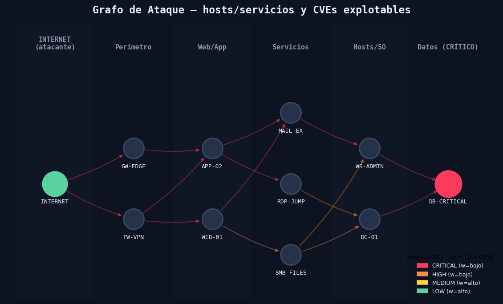
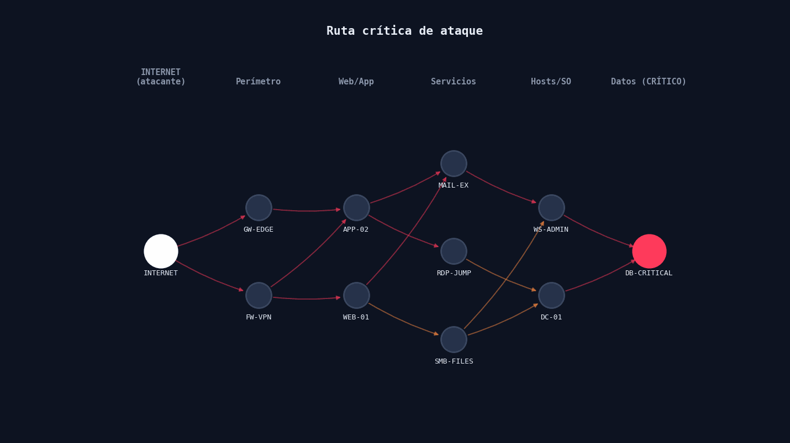
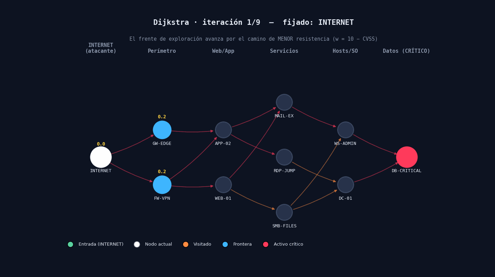

# Reporte — Caminos Mínimos en Grafos de Ataque (Dijkstra)

> **Generado:** 2026-06-17  |  **Fuente CVE:** embedded  |  **Nodos:** 11  |  **Aristas:** 15

---

## 1. Modelo

Infraestructura modelada como **grafo dirigido**: nodos = hosts/servicios, aristas = **CVEs explotables**. Peso `w = 10 − CVSS` (CVSS inverso): vulnerabilidades críticas → menor costo → **camino de menor resistencia**.

- **Entrada:** `INTERNET` (atacante externo)
- **Objetivo:** `DB-CRITICAL` (activo crítico)

---

## 2. Ruta Crítica (secuencia de ataque más probable)

Camino de mínimo costo hallado por Dijkstra:

**INTERNET  →  FW-VPN  →  APP-02  →  MAIL-EX  →  WS-ADMIN  →  DB-CRITICAL**

Resistencia total (Σ w): **0.90**  ·  Iteraciones de Dijkstra: **9**

| # | Salto | CVE | CVSS | w | Severidad | Producto |
|---|-------|-----|------|---|-----------|----------|
| 1 | INTERNET → FW-VPN | CVE-2023-27997 | 9.8 | 0.2 | CRITICAL | Fortinet FortiOS |
| 2 | FW-VPN → APP-02 | CVE-2021-44228 | 10.0 | 0.1 | CRITICAL | Apache Log4j (Log4Shell) |
| 3 | APP-02 → MAIL-EX | CVE-2019-0708 | 9.8 | 0.2 | CRITICAL | Microsoft RDP (BlueKeep) |
| 4 | MAIL-EX → WS-ADMIN | CVE-2019-0708 | 9.8 | 0.2 | CRITICAL | Microsoft RDP (BlueKeep) |
| 5 | WS-ADMIN → DB-CRITICAL | CVE-2019-10149 | 9.8 | 0.2 | CRITICAL | Exim MTA |

---

## 3. Expansión de Dijkstra

El frente de exploración avanza nodo a nodo eligiendo siempre la menor distancia acumulada. Los números amarillos son la resistencia mínima conocida hasta cada nodo.

---

## 4. Nodos Cuello de Botella

Nodos por los que pasan más de las rutas de menor costo — puntos de control prioritarios para la defensa:

| Nodo | Rutas que lo atraviesan |
|------|:---:|
| `FW-VPN` | 4 |
| `APP-02` | 4 |
| `MAIL-EX` | 3 |

---

## 5. Interpretación defensiva

- **Parchar primero los CVEs de la ruta crítica** sube su resistencia y obliga al atacante a un camino más costoso.
- **Segmentar/monitorear los cuellos de botella** corta múltiples rutas a la vez.
- La arista más barata (CVE más crítico) de la ruta es el eslabón a priorizar.

---
*Datos CVE/CVSS reales de la National Vulnerability Database (NVD).*
