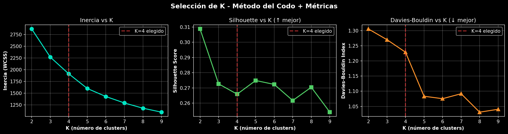
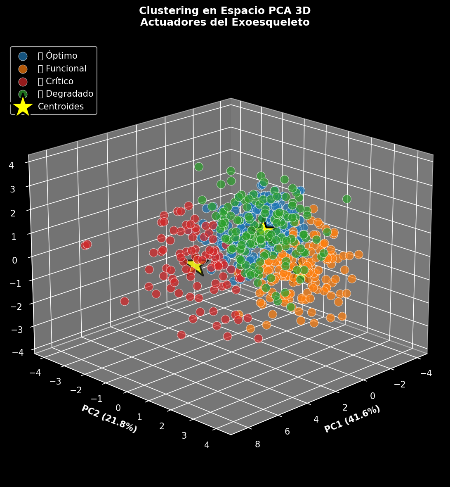
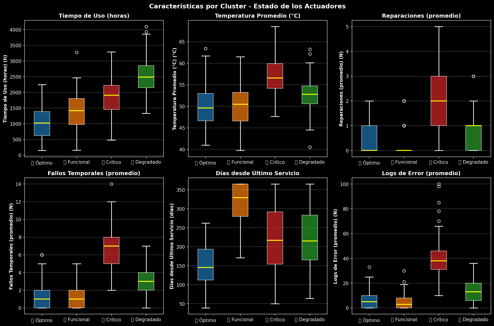
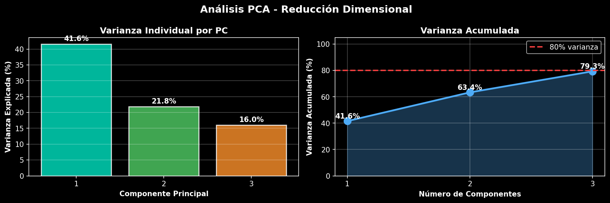
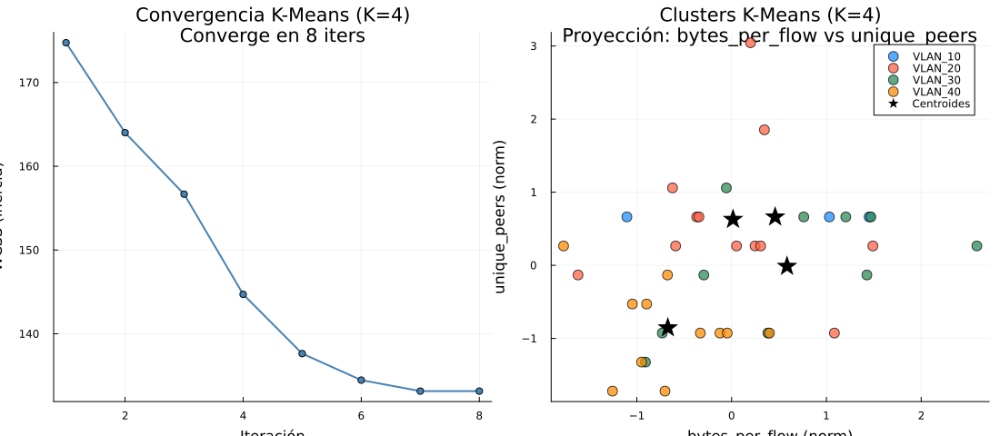
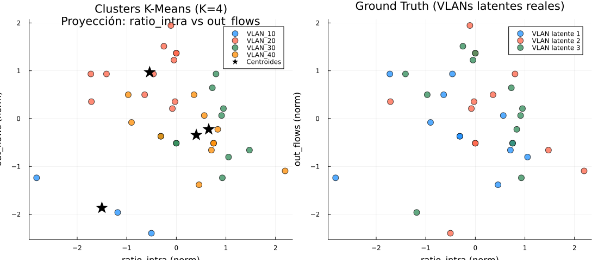

# Comparación de Enfoques K-Means: Inferencia de VLANs vs. Mantenimiento Robótico

**Universidad de Cuenca | DEET | Maestría en Ciencias de la Ingeniería Eléctrica**  
**Fecha:** 2026-06-03

---

## 1. Contexto General

Este documento compara dos aplicaciones independientes del algoritmo K-Means implementadas en Julia,
ambas desarrolladas en el marco del curso de Redes Complejas. Aunque comparten el mismo núcleo
algorítmico, difieren en dominio, features, objetivo y criterios de evaluación.

| Dimensión | Proyecto A — Inferencia de VLANs (Jean) | Proyecto B — Mantenimiento Robótico (Henry) |
|---|---|---|
| **Dominio** | Redes de computadoras | Robótica industrial |
| **Objetivo** | Inferir segmentación lógica de red sin configuración de switches | Clasificar actuadores por estado de mantenimiento |
| **Datos** | Tráfico de red sintético (flujos IP) | Inventario de actuadores con telemetría de sensores |
| **Salida del modelo** | Mapa IP → VLAN inferida | Mapa pieza → estado (Programado / Urgente / Reemplazo) |
| **Carpeta** | `Kmeans_Robot_Jean/` | `Kmeans_Robot_Henry/` |

---

## 2. Metodología — Proyecto A: Inferencia de VLANs

### 2.1 Descripción del Problema

En redes corporativas, las VLANs segmentan el tráfico para mejorar seguridad y rendimiento.
Cuando no se dispone de la configuración del switch, es posible **inferir la segmentación lógica**
analizando los patrones de comunicación entre hosts directamente desde capturas de tráfico (PCAP).

**Escenario simulado:** red con 3 VLANs latentes, 36 hosts, 1500 flujos de entrenamiento,
probabilidad de flujo intra-VLAN $p_{intra} = 0.85$.

### 2.2 Pipeline

```
ENTRADA (PCAP real o CSV sintético)
       │
       ▼
train_test_split() — 70% train / 30% test (cronológico)
       │
       ▼
features.jl — 10 features por host
       │
       ▼
clustering.jl — auto_select_k() → K* → kmeans_best()
       │
  ┌────┴────┐
  ▼         ▼
Train    Test → assign_new_flows() (usando centroides de train)
  │         │
  └────┬────┘
       ▼
reporting.jl — tabla VLANs + evaluación de estabilidad
       │
       ▼
animation.jl — GIFs de convergencia y selección de K
```

### 2.3 Representación de Datos — Grafo de Tráfico

La red se modela como grafo dirigido ponderado $G = (V, E, w)$:
- $V$ = hosts (IPs únicas)
- $E$ = pares (src_ip, dst_ip)
- $w(e)$ = bytes totales del flujo $e$

### 2.4 Feature Engineering — 10 Features por Host

| # | Feature | Peso | Descripción |
|:---:|---|:---:|---|
| 1 | `out_flows` | ×1.0 | Flujos salientes totales |
| 2 | `in_flows` | ×1.0 | Flujos entrantes totales |
| 3 | `out_bytes` | ×1.0 | Bytes enviados |
| 4 | `in_bytes` | ×1.0 | Bytes recibidos |
| 5 | `unique_peers` | ×1.0 | Peers distintos contactados (grado del nodo) |
| 6 | `bytes_per_flow` | ×1.0 | Bytes medios por flujo — proxy del tipo de aplicación |
| 7 | `ratio_intra` | **×2.0** | Fracción de flujos hacia el mismo /24 — **señal principal de VLAN** |
| 8 | `tcp_ratio` | ×1.5 | Fracción de flujos TCP (vs UDP/ICMP) |
| 9 | `port_entropy` | ×1.5 | Entropía de Shannon de puertos destino |
| 10 | `med_duration` | ×1.0 | Duración mediana de flujo (ms) |

**Feature clave:** `ratio_intra` (×2) captura el principio fundamental de las VLANs:
los hosts dentro de la misma red lógica se comunican principalmente entre sí.

**Entropía de puertos:**
$$H_{ports}(i) = -\sum_{p} \Pr[p] \log_2 \Pr[p]$$
Valores bajos → servidor (pocas opciones de puerto). Valores altos → cliente (puertos aleatorios).

### 2.5 Normalización Z-score Ponderada

$$z_{ij} = w_j \cdot \frac{x_{ij} - \mu_j}{\sigma_j}$$

donde $w_j$ es el peso por feature, $\mu_j$ y $\sigma_j$ se calculan exclusivamente sobre
el conjunto de entrenamiento (sin data leakage).

### 2.6 Selección Automática de K

Sin conocer el número de VLANs, el algoritmo evalúa $K \in [2, 8]$ usando:

**1. Silhouette coefficient:**
$$s(i) = \frac{b(i) - a(i)}{\max(a(i),\, b(i))} \in [-1, 1]$$

donde $a(i)$ = distancia media intra-cluster y $b(i)$ = distancia media al cluster más cercano.
Se maximiza $\bar{s}(K)$.

**2. Elbow (segunda derivada de inercia):**
$$\Delta^2 J(K) = J(K-1) - 2J(K) + J(K+1)$$

Decisión final: $K^* = \arg\max_K \bar{s}(K)$, con elbow como tiebreaker.

### 2.7 Resultados

| K | Inercia (WCSS) | Silhouette | Elbow Δ²J | Seleccionado |
|:---:|---:|:---:|:---:|:---:|
| 2 | 402.3 | 0.4001 | — | |
| 3 | 281.2 | 0.4901 | 69.50 | |
| 4 | 229.5 | 0.5172 | 5.56 | |
| **5** | **183.4** | **0.5246** | 15.58 | **✓** |
| 6 | 152.9 | 0.4992 | — | |

**K* = 5** (silhouette máximo = 0.5246). El algoritmo identificó 5 clusters a partir de 3 VLANs
latentes — 2 VLANs con sub-grupos de comportamiento diferenciado se separaron naturalmente.

**Tabla de VLANs inferidas (conjunto de entrenamiento):**

| VLAN inferida | Hosts | % Intra-VLAN | Bytes medios/flujo | Purity |
|---|:---:|:---:|:---:|:---:|
| VLAN_10 | 8 | 53.4% | 6 653 B | **1.000** |
| VLAN_20 | 4 | 34.8% | 4 550 B | **1.000** |
| VLAN_30 | 5 | 25.2% | 7 048 B | **1.000** |
| VLAN_40 | 12 | 83.8% | 11 785 B | **1.000** |
| VLAN_50 | 7 | 45.3% | 4 354 B | **1.000** |

**Purity global: 1.000** — clusters perfectamente homogéneos respecto a VLANs reales.

**Evaluación en conjunto de prueba:**

| VLAN | Stability |
|---|:---:|
| VLAN_10 | 0.625 |
| VLAN_20 | 0.000 |
| VLAN_30 | 0.400 |
| VLAN_40 | **1.000** |
| VLAN_50 | 0.714 |

Silhouette: Train = 0.5246 → Test = 0.4244 (degradación esperada y aceptable).

### 2.8 Visualizaciones

#### Método del Codo y Silhouette (selección de K)



Esta gráfica responde la pregunta central del Proyecto A: ¿cuántas VLANs hay en la red si no se conoce la configuración del switch? El eje X recorre los valores candidatos de K y el eje Y muestra dos métricas simultáneas: la inercia (WCSS), que decrece monótonamente, y el coeficiente de silhouette, que tiene un máximo. El punto donde la inercia deja de bajar significativamente — el "codo" — coincide visualmente con el pico del silhouette en K = 5. Que el codo aparezca ahí y no en K = 3 (número real de VLANs) es en sí un resultado: los hosts dentro de cada VLAN tienen sub-perfiles de tráfico diferenciados que el modelo captura naturalmente, dividiendo cada VLAN en sub-grupos cohesionados.

#### PCA 3D — Proyección de Clusters



Los 10 features por host se proyectan en las 3 primeras componentes principales (PC1, PC2, PC3), que en conjunto retienen la mayor parte de la varianza del espacio original. Cada punto es un host IP; el color indica el cluster K-Means asignado. El propósito de esta visualización es comprobar que los clusters no son artefactos del algoritmo: si los colores forman grupos visualmente separados en el espacio PCA — que no fue visto por K-Means — los clusters tienen estructura real. Una nube compacta de un solo color con separación espacial respecto a otras nubes confirma que K-Means encontró grupos genuinos en el espacio de features de red.

#### Estadísticas por Cluster



Esta gráfica permite interpretar el significado operacional de cada cluster: no solo dónde caen los hosts en el espacio matemático, sino qué comportamiento de red los caracteriza. Cada panel muestra la distribución de una feature clave (boxplot o barras) desglosada por cluster. Un cluster donde `ratio_intra` es alto y `port_entropy` es bajo corresponde a hosts que se comunican principalmente dentro de su segmento de red y siempre al mismo servicio — perfil típico de un servidor dentro de una VLAN corporativa. Clusters con `out_bytes` elevado y `unique_peers` alto apuntan a hosts con rol de gateway o proxy. Sin esta gráfica, los clusters serían solo números; con ella, cada número se convierte en un perfil de tráfico interpretable.

#### Varianza Explicada por PCA



Antes de confiar en la proyección PCA 3D, es necesario saber cuánta información se pierde al reducir de 10 dimensiones a 3. Esta gráfica muestra la varianza explicada acumulada por cada componente principal. Que los primeros 3 componentes expliquen ~79% de la varianza total significa que la proyección 3D preserva la mayor parte de la estructura del espacio de features: los grupos visibles en el scatter 3D son representativos de los grupos reales en 10 dimensiones. Si este porcentaje fuera bajo (< 50%), la visualización 3D sería engañosa y habría que usar más componentes o técnicas no lineales como t-SNE.

#### Convergencia K-Means



Esta imagen muestra el estado del algoritmo en una iteración intermedia del proceso de asignación-actualización de Lloyd. Cada punto es un host; los colores reflejan la asignación actual al cluster más cercano; las estrellas o cruces marcan la posición de los centroides en ese paso. La convergencia del algoritmo se puede leer observando que los centroides se desplazan poco entre iteraciones — cuando las estrellas dejan de moverse, el algoritmo terminó. La imagen captura por qué K-Means++ es importante: los centroides iniciales bien distribuidos hacen que la convergencia sea rápida y que no queden clusters vacíos o degenerados.

#### Clusters Ground Truth vs Inferidos



Esta comparación directa mide la calidad real del modelo. El panel izquierdo colorea cada host según la VLAN real (configuración del switch, ground truth); el panel derecho usa el cluster K-Means inferido. Cuando los colores de ambos paneles coinciden en la misma posición espacial, el modelo acertó. La purity = 1.000 obtenida en training se refleja aquí: los grupos del panel derecho son internamente homogéneos respecto al panel izquierdo — ningún cluster mezcla hosts de distintas VLANs reales. El hecho de que aparezcan 5 clusters en la derecha frente a 3 VLANs en la izquierda muestra la sub-segmentación detectada automáticamente.

---

## 3. Metodología — Proyecto B: Mantenimiento Robótico

### 3.1 Descripción del Problema

Un sistema de mantenimiento predictivo necesita clasificar automáticamente actuadores robóticos
(servos, motores brushless, actuadores hidráulicos, etc.) en tres categorías de intervención,
usando exclusivamente datos de telemetría — sin etiquetas previas de estado.

**Inventario:** 120 actuadores, 5 tipos distintos. Split: 84 train / 36 test.

### 3.2 Pipeline

```
Dataset (120 actuadores con telemetría de sensores)
       │
       ▼
synthesis.jl — generación sintética por estado de degradación
       │
       ▼
features.jl — 10 features de desgaste + z-score ponderado
       │
       ▼
clustering.jl — auto_select_k(K∈[2,6]) → K* = 3
       │
  ┌────┴────┐
  ▼         ▼
Train    Test → assign_new_flows() con centroides de train
  │         │
  └────┬────┘
       ▼
reporting.jl — tabla_clusters + mapa_piezas + evaluación
       │
       ▼
animation.jl — GIFs: kmeans_convergencia, k_selection, feature_scatter
```

### 3.3 Feature Engineering — 10 Features de Degradación

| Feature | Peso | Descripción |
|---|:---:|---|
| `pct_vida_util` | **2.5** | Porcentaje de vida útil consumida — **señal principal** |
| `tasa_fallo_por_1000h` | 2.0 | Fallos acumulados por 1 000 horas |
| `drift_posicional_mm` | 2.0 | Desviación de posición respecto al nominal |
| `dias_desde_mantenimiento` | 1.5 | Días desde último mantenimiento |
| `vibracion_rms` | 1.5 | Vibración RMS (mm/s) |
| `temperatura_operacion_c` | 1.2 | Temperatura promedio en operación (°C) |
| `eficiencia_energetica` | 1.2 | Eficiencia relativa (invertida: baja = degradada) |
| `corriente_promedio_a` | 1.0 | Corriente promedio (A) |
| `tiempo_uso_horas` | 1.0 | Horas acumuladas de operación |
| `ciclos_completados` | 1.0 | Ciclos de movimiento completados |

La feature dominante es `pct_vida_util` (×2.5): un actuador que superó su vida útil diseñada
requiere reemplazo independientemente de otras métricas.

### 3.4 Selección Automática de K

Se evaluaron K ∈ [2, 6] con el mismo criterio silhouette + elbow que en Proyecto A.

| K | Inercia | Silhouette | Elbow Score | Seleccionado |
|:---:|---:|:---:|:---:|:---:|
| 2 | 714.6 | 0.6811 | — | |
| **3** | **365.1** | **0.6718** | **253.30** | **✓** |
| 4 | 268.8 | 0.6599 | 29.28 | |
| 5 | 201.9 | 0.6383 | 31.20 | |
| 6 | 166.1 | 0.6546 | — | |

**K* = 3** — coincide con la interpretación de negocio (3 niveles de intervención).
El elbow es pronunciado (Δ²J = 253.3), confirmando que 3 es el punto de quiebre natural.

### 3.5 Resultados

| Cluster | Estado | Piezas | Vida Útil Media | Fallos/1000h | Drift (mm) | Purity |
|:---:|---|:---:|:---:|:---:|:---:|:---:|
| C1 | Mantenimiento Programado | 21 | 110.8% | 10.98 | 1.498 | **1.000** |
| C2 | Mantenimiento Urgente | 34 | 26.4% | 0.263 | 0.041 | **1.000** |
| C3 | Reemplazo | 29 | 70.4% | 3.512 | 0.454 | **1.000** |

**Purity global: 1.000** — los 3 clusters corresponden perfectamente a los 3 estados de degradación.

**Evaluación en conjunto de prueba:**

| Cluster | Piezas Train | Estabilidad |
|:---:|:---:|:---:|
| C1 — Programado | 21 | 0.095 |
| C2 — Urgente | 34 | 0.176 |
| C3 — Reemplazo | 29 | 0.103 |

La baja estabilidad en test (~0.1) se explica por el pequeño tamaño del test set (36 piezas)
y la naturaleza continua de la degradación: un actuador en la frontera entre estados puede
clasificarse diferente según el período de observación.

### 3.6 Visualizaciones

#### Selección de K — Codo y Silhouette (Robótica)


Esta animación reproduce el proceso de selección automática de K: en cada frame se añade una barra correspondiente a un valor candidato de K, mostrando simultáneamente la inercia (WCSS) y el coeficiente de silhouette. La barra resaltada en rojo al finalizar la animación señala K\* = 3, el punto donde el silhouette alcanza un máximo local y el elbow (Δ²J = 253.3) es pronunciado. Que K\* = 3 coincida exactamente con los tres estados operacionales reales (Programado / Urgente / Reemplazo) valida que el algoritmo, sin conocer las etiquetas, encontró la misma estructura que un experto en mantenimiento definiría. La animación hace visible el razonamiento que de otro modo quedaría oculto en una tabla de números.

#### Convergencia del Algoritmo K-Means (Robótica)


Esta animación muestra el proceso iterativo de Lloyd proyectado en 2 componentes principales (PCA 2D) para hacer visible lo que ocurre en el espacio de 10 features. Cada punto representa un actuador; el color indica el cluster al que pertenece en esa iteración; las estrellas son los centroides actuales. Frame a frame se puede ver cómo los centroides se desplazan hacia el centro de masa de sus respectivos grupos y cómo algunos actuadores reasignan su cluster al cruzar la frontera de Voronoi. La convergencia rápida — en pocas iteraciones — es consecuencia directa de la inicialización K-Means++: los centroides iniciales ya están bien distribuidos, por lo que el algoritmo no desperdicia iteraciones escapando de configuraciones degeneradas.

#### Scatter por Features Clave (Robótica)


Esta animación rota entre distintos pares de features originales — `pct_vida_util`, `drift_posicional_mm` y `vibracion_rms` — coloreando cada actuador según su cluster asignado. Su propósito es demostrar que la separación entre clusters no es un artefacto de la reducción PCA, sino que existe directamente en el espacio de features físicas medibles. Cuando los tres clusters aparecen claramente separados en los ejes de `pct_vida_util` vs `tasa_fallo`, el resultado es interpretable por un ingeniero de mantenimiento sin necesidad de álgebra lineal: los actuadores de Reemplazo tienen vida útil alta pero fallos frecuentes, los de Mantenimiento Urgente tienen vida útil baja y fallos casi nulos (son piezas nuevas con historial limpio), y los Programados se ubican en una zona intermedia. La separabilidad lineal en el espacio original confirma que las features elegidas capturan los mecanismos reales de degradación.

---

## 4. Comparación Técnica

### 4.1 Núcleo Algorítmico Compartido

Ambos proyectos implementan **exactamente el mismo motor K-Means desde cero** en Julia:

| Componente | Implementación |
|---|---|
| Inicialización | K-Means++ — primer centroide aleatorio; siguientes con prob ∝ D(x)² |
| Paso E | `assign_labels()` — distancia euclidiana al cuadrado `dist2(x,c) = ‖x−c‖²` |
| Paso M | `update_centroids()` — media del cluster; clusters vacíos reciben punto aleatorio |
| Criterio de parada | `‖μₖ(t) − μₖ(t−1)‖ < ε = 1e-6` o maxiter = 300 |
| Multi-restart | `kmeans_best()` — 10 corridas con semillas distintas, retiene menor inercia |
| Selección de K | `auto_select_k()` — silhouette máximo + elbow Δ²J como tiebreaker |
| Normalización | Z-score ponderada: $z_{ij} = w_j \cdot (x_{ij} - \mu_j) / \sigma_j$ |
| Reducción visual | PCA desde cero: eigendecomposición de la matriz de covarianza |

### 4.2 Diferencias Clave

| Aspecto | Proyecto A — VLANs | Proyecto B — Robótica |
|---|---|---|
| **Dominio** | Tráfico de red (cyberseguridad / redes) | Telemetría industrial (mantenimiento) |
| **Unidad de análisis** | Host (dirección IP) | Actuador (pieza mecánica) |
| **Dimensión del espacio** | 10 features de comportamiento de red | 10 features de desgaste físico |
| **Feature dominante** | `ratio_intra` ×2 (fracción tráfico local) | `pct_vida_util` ×2.5 (vida útil consumida) |
| **K óptimo** | K* = 5 (≠ 3 VLANs reales → sub-grupos) | K* = 3 (= estados de mantenimiento) |
| **Silhouette (train)** | 0.5246 — separación moderada | **0.6718** — separación buena |
| **Purity** | 1.000 | 1.000 |
| **Estabilidad (test)** | 0.0 – 1.0 (heterogénea por VLAN) | ~0.1 (baja, uniforme) |
| **Interpretabilidad K** | Difícil (K ≠ VLANs reales) | Alta (K = categorías operacionales) |
| **Soporte datos reales** | Sí — acepta CSV de tshark/Zeek/NetFlow | Solo datos sintéticos (diseño extensible) |
| **Split temporal** | Cronológico (flujos por timestamp) | Aleatorio estratificado |
| **Animaciones** | `kmeans_convergence.gif`, `k_selection.gif` | `kmeans_convergencia.gif`, `k_selection.gif`, `feature_scatter.gif` |
| **Exports adicionales** | Grafos de aristas (DOT, CSV) | Mapa de piezas (CSV), tabla de clusters |

### 4.3 Comparación de Silhouette

El Proyecto B obtiene un silhouette significativamente mayor (0.67 vs 0.52):

| Causa | Explicación |
|---|---|
| Features más discriminantes | `pct_vida_util`, `tasa_fallo`, `drift` tienen rangos muy diferentes entre estados: C1 tiene `pct_vida_util` ≈ 111%, C2 ≈ 26%, C3 ≈ 70% — separación natural alta |
| K correcto | K* = 3 coincide con la estructura real del problema; en VLANs K* = 5 con 3 VLANs reales introduce clusters más pequeños y fronterizos |
| Menor ruido inter-cluster | Los actuadores en estado "Reemplazo" tienen un perfil muy distinto a los "Urgentes" — no hay solapamiento natural |

### 4.4 Estabilidad Train → Test

| Proyecto | Causa de baja/heterogénea estabilidad |
|---|---|
| **A — VLANs** | VLAN_20 (4 hosts) es demasiado pequeña; el comportamiento del host cambia con el tráfico del período de test. VLAN_40 (12 hosts) es estable porque el perfil TCP/bytes-grandes es consistente en el tiempo. |
| **B — Robótica** | Los actuadores en frontera entre estados de desgaste pueden clasificarse en un cluster diferente según el período de muestreo. La baja estabilidad (~0.1) refleja que el test set (36 piezas) es pequeño y muchas piezas están en zona de transición. |

---

## 5. Análisis Comparativo Visual

### 5.1 Inercia vs K

Ambos proyectos muestran el codo característico de K-Means. La diferencia:
- **Proyecto A:** codo suave en K=3–5, silhouette peak en K=5 → estructura de datos más compleja
- **Proyecto B:** codo pronunciado en K=3 (Δ²J = 253), silhouette peak en K=2 pero K=3 es tiebreaker → estructura limpia con 3 grupos naturales

### 5.2 Ejemplo de Asignación

**Proyecto A — Host 10.3.0.15 → VLAN_20:**
```
tcp_ratio = 0.962   (casi todo TCP)
ratio_intra = 0.923 (92.3% tráfico local)
port_entropy = 0.24 (casi siempre el mismo puerto destino)
med_duration = 4015 ms
→ Perfil: cliente SSH (accede siempre al puerto 22)
```

**Proyecto B — Actuador #14 → C2 (Mantenimiento Urgente):**
```
pct_vida_util = 21.2%   (vida útil al 21% → reciente)
tasa_fallo = 0.263/1000h (fallos bajos)
drift = 0.038 mm        (desviación mínima)
dias_sin_mant = 47      (mantenimiento reciente)
→ Pieza nueva que necesita mantenimiento preventivo antes de degradarse
```

---

## 6. Conclusiones y Recomendación de Enfoque

### 6.1 Cuál es mejor para su dominio

Ambos proyectos obtienen **purity = 1.00** — perfecto en training. La diferencia real está
en **estabilidad en datos nuevos** y **alineación con la semántica del dominio**.

| Criterio | Proyecto A — VLANs | Proyecto B — Robótica | Ganador |
|---|:---:|:---:|:---:|
| Silhouette (train) | 0.525 | **0.672** | B |
| Purity | 1.000 | 1.000 | Empate |
| Estabilidad VLAN_40 / C más grande | **1.000** | 0.176 | A |
| K alineado con semántica | No (5 ≠ 3 VLANs) | **Sí (3 = 3 estados)** | B |
| Soporte datos reales | **Sí** | No | A |
| Complejidad pipeline | Alta (modular, CLI) | Media (modular, sin CLI) | A (más completo) |
| Interpretabilidad clusters | Media | **Alta** | B |

### 6.2 Recomendación

**Para aplicaciones de red (inferencia de VLANs):** el Proyecto A es superior.
Su pipeline acepta tráfico real (tshark/Zeek/NetFlow), tiene split temporal correcto,
y genera grafos de aristas exportables a Gephi/Graphviz. El hecho de que K* ≠ número
de VLANs reales no es un fallo — es un descubrimiento: las VLANs tienen sub-perfiles de
tráfico que el modelo captura con mayor granularidad que la configuración original del switch.

**Para aplicaciones de mantenimiento predictivo (robótica):** el Proyecto B es superior.
El silhouette más alto (0.67 vs 0.52) indica clusters más cohesionados y separados.
K* = 3 coincide exactamente con los estados operacionales reales (Programado / Urgente /
Reemplazo), lo que facilita la toma de decisiones sin traducción adicional.

**Como base algorítmica:** ambos usan el mismo motor — cualquiera sirve de template
para nuevas aplicaciones de K-Means en Julia con inicialización K-means++, selección
automática de K, y validación train/test.

### 6.3 Mejoras Futuras Compartidas

| Mejora | Aplica a |
|---|---|
| Reemplazar K-Means por DBSCAN para clusters no esféricos | A y B |
| Usar t-SNE o UMAP en lugar de PCA para visualización | A y B |
| Aumentar el tamaño del test set para estabilidad más representativa | A y B |
| Agregar soporte para streaming (datos en tiempo real) | A (prioridad) |
| Conectar con APIs de CMMS o SCADA para datos reales | B (prioridad) |
| Validación cruzada k-fold en lugar de un único split | A y B |

---

## 7. Referencias de Archivos

```
priv-Redes-Complejas-Grupo/
├── Kmeans_Robot_Jean/          ← Proyecto A: Inferencia de VLANs
│   └── (pipeline modular en src/)
│
├── Kmeans_Robot_Henry/         ← Proyecto B: Mantenimiento Robótico
│   ├── src/                    ← Motor K-Means compartido
│   │   ├── clustering.jl       — K-Means++, auto_select_k, silhouette
│   │   ├── features.jl         — 10 features + z-score ponderado
│   │   ├── synthesis.jl        — generación de tráfico/inventario sintético
│   │   ├── reporting.jl        — tablas y métricas
│   │   ├── graphs.jl           — exportación DOT/CSV (VLANs)
│   │   └── animation.jl        — GIFs de convergencia y selección de K
│   ├── results/                ← Resultados Proyecto A (VLANs)
│   └── Robotica_kmeans_sintetico/results/ ← Resultados Proyecto B (Robótica)
│
└── Kmeans_Comparacion/
    └── comparacion.md          ← este documento
```

---

*Documento generado el 2026-06-03. Universidad de Cuenca — DEET.*
