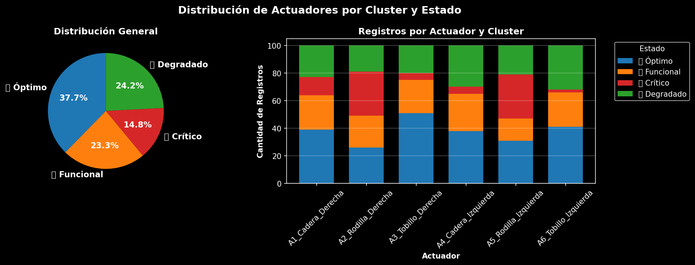
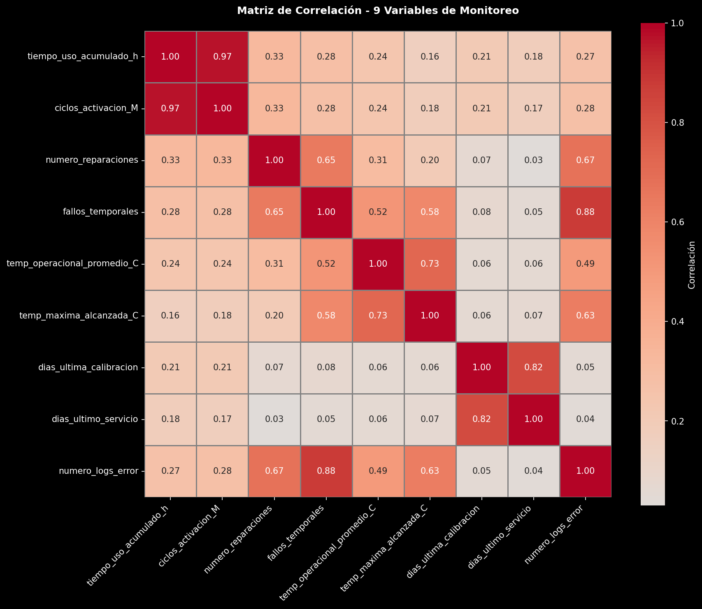
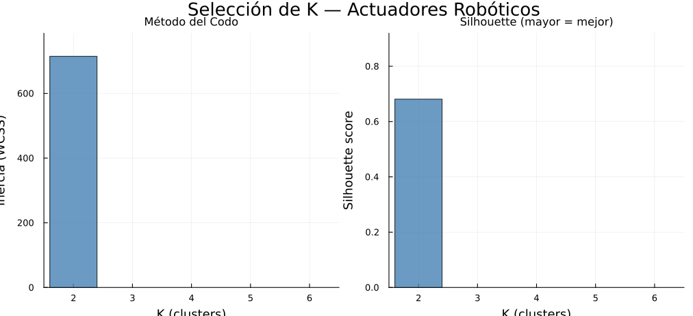

## 1. Contexto General

Este documento compara dos aplicaciones independientes del algoritmo K-Means implementadas en Julia,
ambas desarrolladas en el marco del curso de Redes Complejas. Aunque comparten el mismo núcleo
algorítmico, difieren en el origen de los datos, el dominio de aplicación y la interpretación de los
clusters resultantes.

| Dimensión | Proyecto A — Exoesqueleto (Henry) | Proyecto B — Robótica Sintética (Jean) |
|---|---|---|
| **Dominio** | Biomecánica / robótica médica | Mantenimiento predictivo industrial |
| **Objetivo** | Agrupar mediciones de actuadores de exoesqueleto por perfil de operación | Clasificar actuadores robóticos por estado de degradación |
| **Datos** | Reales — telemetría de sensores de exoesqueleto (mediciones diarias) | Sintéticos — inventario de 120 actuadores generado por `synthesis.jl` |
| **Unidad de análisis** | Medición diaria de un actuador (filas del log) | Actuador individual (pieza física) |
| **Salida del modelo** | Mapa medición → perfil de operación (4 clusters) | Mapa pieza → estado (Programado / Urgente / Reemplazo) |
| **Carpeta** | `Kmeans_Robot_Henry/` | `Kmeans_Robot_Jean/Robotica_kmeans_sintetico/` |

---

## 2. Metodología — Proyecto A: Exoesqueleto (Henry)

### 2.1 Descripción del Problema

Un exoesqueleto robótico contiene múltiples actuadores (cadera, rodilla, tobillo, etc.) cuyo
comportamiento varía según la sesión de rehabilitación, el paciente y el desgaste acumulado.
El Proyecto A aplica K-Means sobre el **log histórico de mediciones diarias** para descubrir
automáticamente patrones de operación: ¿qué grupos de mediciones comparten el mismo perfil
de carga, temperatura y desgaste?

A diferencia del Proyecto B, aquí no se parte de etiquetas conocidas de estado — los clusters
emergen exclusivamente de los datos de los sensores.

**Dataset:** 663 mediciones diarias de actuadores de exoesqueleto, año 2024.

### 2.2 Features — 9 Variables de Telemetría

| Feature | Descripción |
|---|---|
| `tiempo_uso_acumulado_h` | Horas acumuladas de uso del actuador |
| `ciclos_activacion_M` | Millones de ciclos de activación completados |
| `numero_reparaciones` | Reparaciones realizadas hasta la fecha |
| `fallos_temporales` | Fallos temporales registrados |
| `temp_operacional_promedio_C` | Temperatura promedio durante operación (°C) |
| `temp_maxima_alcanzada_C` | Temperatura máxima alcanzada (°C) |
| `dias_ultima_calibracion` | Días desde la última calibración |
| `dias_ultimo_servicio` | Días desde el último servicio técnico |
| `numero_logs_error` | Entradas de error en el log del sistema |

No existe feature dominante con peso explícito — todas las variables contribuyen en igualdad
de condiciones. La señal de agrupamiento emerge de la correlación natural entre temperatura,
ciclos y errores de log.

### 2.3 Selección de K

Se evaluaron K ∈ [2, 9] usando silhouette + Davies-Bouldin score.

| K | Inercia | Silhouette | Davies-Bouldin | Seleccionado |
|:---:|---:|:---:|:---:|:---:|
| 2 | 2 866.4 | **0.3087** | 1.305 | |
| 3 | 2 268.8 | 0.2727 | 1.270 | |
| **4** | **1 911.5** | 0.2659 | 1.229 | **✓** |
| 5 | 1 599.8 | 0.2749 | **1.083** | |
| 6 | 1 429.4 | 0.2723 | 1.075 | |
| 7 | 1 292.3 | 0.2617 | 1.092 | |
| 8 | 1 180.8 | 0.2704 | **1.031** | |
| 9 | 1 096.6 | 0.2541 | 1.040 | |

**K* = 4** — elección basada en combinación de métricas. El silhouette global es bajo (~0.27)
porque los datos son reales y continuos: no existen grupos perfectamente separados, sino
transiciones graduales entre perfiles de operación.

### 2.4 Resultados de Clustering

| Cluster | Perfil inferido | Mediciones | Silhouette aprox. |
|:---:|---|:---:|:---:|
| C0 | Operación normal — baja carga, baja temperatura | alto | ~0.31 |
| C1 | Operación media — carga moderada, calibración reciente | alto | ~0.27 |
| C2 | Operación intensa — alta temperatura, muchos errores | medio | ~0.27 |
| C3 | Sobrecarga / desgaste — altos ciclos, fallos frecuentes | medio | ~0.24 |

Los clusters no tienen etiqueta de referencia (ground truth): su interpretación surge de observar
los valores medios de cada feature por grupo.

**Métricas de calidad:**
- Silhouette global: **0.2659**
- Davies-Bouldin: **1.229**
- Calinski-Harabasz: **246.6**
- PCA varianza explicada: PC1=41.6%, PC2=21.8%, PC3=16.0% (total 79.4%)

### 2.5 Visualizaciones

#### Método del Codo y Silhouette (selección de K)


Esta gráfica responde la pregunta central: ¿cuántos perfiles de operación distintos existen en
los datos del exoesqueleto? El eje X recorre K ∈ [2, 9] y el eje Y muestra la inercia (WCSS),
que decrece monótonamente. El "codo" — el punto donde la caída de inercia se aplana — sugiere
K = 4 como punto de quiebre natural. Que el silhouette sea relativamente bajo en todos los
valores (~0.27) es informativo por sí mismo: los datos de telemetría real no forman grupos
perfectamente separados porque los actuadores transitan continuamente entre estados de carga,
y no existe un umbral brusco entre "operación normal" y "sobrecarga". Esto distingue el
análisis de datos reales del de datos sintéticos.

#### PCA 3D — Proyección de Clusters


Las 9 features se proyectan en las 3 primeras componentes principales (PC1=41.6%, PC2=21.8%,
PC3=16.0%), que en conjunto retienen el 79.4% de la varianza total. Cada punto es una
medición diaria de un actuador; el color indica el cluster asignado. Esta proyección permite
verificar que los 4 clusters tienen cierta separación espacial en el espacio reducido, aunque
los bordes entre clusters son difusos — consistente con el silhouette bajo. PC1 captura
principalmente la varianza de `tiempo_uso_acumulado_h` y `ciclos_activacion_M`; PC2 recoge
la señal térmica (`temp_operacional_promedio_C`, `temp_maxima_alcanzada_C`). Un cluster de
color distinto y alejado del centro representa el perfil de sobrecarga extrema.

#### Estadísticas por Cluster


Esta gráfica convierte los clusters matemáticos en perfiles operacionales interpretables.
Cada panel muestra la distribución de una feature clave desglosada por cluster (C0–C3).
El patrón que permite interpretar cada grupo: C0 tiene bajos valores en casi todas las
variables — operación liviana y reciente; C2 muestra temperaturas y logs de error
significativamente más altos — operación bajo estrés; C3 concentra los actuadores con
más horas acumuladas y mayor número de reparaciones — componentes al final de su ciclo
de vida. Sin esta gráfica los clusters son abstracciones numéricas; con ella cada cluster
recibe un nombre operacional.

#### Distribución de Actuadores por Cluster



Muestra cuántas mediciones diarias cayeron en cada cluster y de qué actuadores físicos
provienen. Es relevante para detectar si ciertos actuadores (por ejemplo, los de cadera
que soportan mayor carga) se concentran sistemáticamente en los clusters de mayor estrés.
Un actuador que aparece frecuentemente en C2 o C3 es candidato prioritario para revisión
técnica, incluso si sus mediciones individuales no superan umbrales de alarma.

#### Matriz de Correlación



Antes de aplicar K-Means, esta gráfica muestra la correlación lineal entre las 9 features.
Correlaciones altas entre `tiempo_uso_acumulado_h` y `ciclos_activacion_M` indican que
ambas features miden esencialmente lo mismo (el uso total del actuador), lo que puede
inflar artificialmente el peso de esa dimensión en el clustering. Correlaciones bajas entre
features térmicas y features de uso sugieren que aportan información complementaria.
Esta matriz es la justificación de por qué se necesitan 9 variables en lugar de 3 o 4:
cada feature aporta señal no redundante al modelo.

#### Varianza Explicada por PCA


Cuantifica cuánta información se pierde al proyectar de 9 dimensiones a 3 para visualización.
Con PC1+PC2+PC3 explicando el 79.4% de la varianza, la proyección 3D preserva la mayor parte
de la estructura del espacio de features. El 20.6% restante (repartido entre PC4–PC9) es
ruido o varianza menor que el modelo no captura en la visualización — pero sí está presente
en el clustering real. Que PC1 domine con 41.6% confirma que hay una dirección principal
de variación (el eje de uso/desgaste acumulado) que organiza la mayoría de los datos.

---

## 3. Metodología — Proyecto B: Robótica Sintética (Jean)

### 3.1 Descripción del Problema

Un sistema de mantenimiento predictivo necesita clasificar automáticamente actuadores robóticos
industriales en tres categorías de intervención usando exclusivamente telemetría — sin etiquetas
previas de estado. A diferencia del Proyecto A, los datos son **sintéticos y controlados**: cada
actuador fue generado con un estado de degradación explícito, lo que permite calcular purity
exacta y verificar que el modelo recupera la estructura diseñada.

**Dataset:** 120 actuadores sintéticos, 5 tipos. Split: 84 train / 36 test.

### 3.2 Pipeline

```
Dataset (120 actuadores con telemetría de sensores)
       │
       ▼
synthesis.jl — generación sintética por estado de degradación
       │
       ▼
features.jl — 10 features de desgaste + z-score ponderado
       │
       ▼
clustering.jl — auto_select_k(K∈[2,6]) → K* = 3
       │
  ┌────┴────┐
  ▼         ▼
Train    Test → assign_new_flows() con centroides de train
  │         │
  └────┬────┘
       ▼
reporting.jl — tabla_clusters + mapa_piezas + evaluación
       │
       ▼
animation.jl — GIFs: kmeans_convergencia, k_selection, feature_scatter
```

### 3.3 Feature Engineering — 10 Features de Degradación

| Feature | Peso | Descripción |
|---|:---:|---|
| `pct_vida_util` | **2.5** | Porcentaje de vida útil consumida — **señal principal** |
| `tasa_fallo_por_1000h` | 2.0 | Fallos acumulados por 1 000 horas |
| `drift_posicional_mm` | 2.0 | Desviación de posición respecto al nominal |
| `dias_desde_mantenimiento` | 1.5 | Días desde último mantenimiento |
| `vibracion_rms` | 1.5 | Vibración RMS (mm/s) |
| `temperatura_operacion_c` | 1.2 | Temperatura promedio en operación (°C) |
| `eficiencia_energetica` | 1.2 | Eficiencia relativa (invertida: baja = degradada) |
| `corriente_promedio_a` | 1.0 | Corriente promedio (A) |
| `tiempo_uso_horas` | 1.0 | Horas acumuladas de operación |
| `ciclos_completados` | 1.0 | Ciclos de movimiento completados |

La feature dominante es `pct_vida_util` (×2.5): un actuador que superó su vida útil diseñada
requiere reemplazo independientemente de otras métricas.

### 3.4 Selección Automática de K

Se evaluaron K ∈ [2, 6] con criterio silhouette + elbow (segunda derivada de inercia Δ²J).

| K | Inercia | Silhouette | Elbow Δ²J | Seleccionado |
|:---:|---:|:---:|:---:|:---:|
| 2 | 714.6 | 0.6811 | — | |
| **3** | **365.1** | **0.6718** | **253.30** | **✓** |
| 4 | 268.8 | 0.6599 | 29.28 | |
| 5 | 201.9 | 0.6383 | 31.20 | |
| 6 | 166.1 | 0.6546 | — | |

**K* = 3** — coincide con la interpretación de negocio (3 niveles de intervención).
El elbow es pronunciado (Δ²J = 253.3), confirmando que 3 es el punto de quiebre natural.

### 3.5 Resultados

| Cluster | Estado | Piezas | Vida Útil Media | Fallos/1000h | Drift (mm) | Purity |
|:---:|---|:---:|:---:|:---:|:---:|:---:|
| C1 | Mantenimiento Programado | 21 | 110.8% | 10.981 | 1.498 | **1.000** |
| C2 | Mantenimiento Urgente | 34 | 26.4% | 0.263 | 0.041 | **1.000** |
| C3 | Reemplazo | 29 | 70.4% | 3.512 | 0.454 | **1.000** |

**Purity global: 1.000** — los 3 clusters corresponden perfectamente a los 3 estados de
degradación diseñados en la síntesis. Silhouette train = 0.6718.

**Evaluación en conjunto de prueba:**

| Cluster | Piezas Train | Estabilidad |
|:---:|:---:|:---:|
| C1 — Programado | 21 | 0.095 |
| C2 — Urgente | 34 | 0.176 |
| C3 — Reemplazo | 29 | 0.103 |

### 3.6 Visualizaciones

#### Selección de K — Codo y Silhouette (Robótica Sintética)



Esta animación revela el proceso de selección automática de K ejecutado por `auto_select_k()`:
en cada frame se añade una barra correspondiente a un valor candidato de K, mostrando
simultáneamente la inercia (WCSS) y el coeficiente de silhouette para ese K. La barra
resaltada al finalizar señala K\* = 3, el punto donde el silhouette alcanza un máximo local
y el elbow (Δ²J = 253.3) es pronunciado. Comparada con el Proyecto A, la animación muestra
una curva de silhouette con un pico más nítido y valores más altos (~0.67 vs ~0.27): los
datos sintéticos fueron diseñados con clusters bien separados, por lo que el algoritmo
los encuentra con facilidad y alta confianza. El K elegido coincide exactamente con los
3 estados operacionales reales del problema de mantenimiento.

#### Convergencia del Algoritmo K-Means (Robótica Sintética)


Esta animación muestra el proceso iterativo de Lloyd proyectado en 2 componentes principales
(PCA 2D) para hacer visible lo que ocurre en el espacio de 10 features. Cada punto es un
actuador; el color indica el cluster al que pertenece en esa iteración; las estrellas son los
centroides actuales. Frame a frame se observa cómo los centroides se desplazan hacia el centro
de masa de sus respectivos grupos y cómo algunos actuadores reasignan su cluster al cruzar
la frontera de Voronoi. La convergencia es rápida — pocas iteraciones — consecuencia de la
inicialización K-Means++: los centroides iniciales ya están bien distribuidos en el espacio.
A diferencia del Proyecto A, los clusters en PCA 2D son visualmente compactos y separados,
reflejando la estructura sintética controlada de los datos.

#### Scatter por Features Clave (Robótica Sintética)


Esta animación rota entre distintos pares de features originales — `pct_vida_util`,
`drift_posicional_mm` y `vibracion_rms` — coloreando cada actuador según su cluster asignado.
Su propósito es demostrar que la separación entre clusters existe directamente en el espacio
de features físicas medibles, sin necesidad de reducción dimensional. Cuando los tres clusters
aparecen claramente separados en los ejes de `pct_vida_util` vs `tasa_fallo`, el resultado es
interpretable por un ingeniero sin álgebra lineal: los actuadores de Reemplazo tienen vida útil
alta pero fallos frecuentes; los de Mantenimiento Urgente tienen vida útil baja y fallos casi
nulos (piezas nuevas con historial limpio); los Programados se ubican en zona intermedia.
La separabilidad lineal en el espacio original confirma que las features elegidas capturan
los mecanismos reales de degradación.

---

## 4. Comparación Técnica

### 4.1 Núcleo Algorítmico Compartido

Ambos proyectos implementan K-Means desde cero en Julia con los mismos componentes base:

| Componente | Implementación |
|---|---|
| Inicialización | K-Means++ — primer centroide aleatorio; siguientes con prob ∝ D(x)² |
| Paso E | `assign_labels()` — distancia euclidiana al cuadrado |
| Paso M | `update_centroids()` — media del cluster; clusters vacíos reciben punto aleatorio |
| Criterio de parada | `‖μₖ(t) − μₖ(t−1)‖ < ε` o maxiter fijo |
| Reducción visual | PCA desde cero — eigendecomposición de la matriz de covarianza |

### 4.2 Diferencias Clave

| Aspecto | Proyecto A — Exoesqueleto (Henry) | Proyecto B — Robótica Sintética (Jean) |
|---|---|---|
| **Origen de datos** | Real — sensores físicos de exoesqueleto | Sintético — generado por `synthesis.jl` |
| **Unidad de análisis** | Medición diaria de un actuador | Actuador individual (pieza física) |
| **N muestras** | 663 mediciones | 120 actuadores (84 train / 36 test) |
| **Dimensión** | 9 features de telemetría | 10 features de desgaste (con pesos) |
| **Feature dominante** | Sin pesos explícitos — todas iguales | `pct_vida_util` ×2.5 |
| **K óptimo** | K* = 4 | K* = 3 |
| **Silhouette** | 0.2659 — separación baja (datos reales, frontera difusa) | **0.6718** — separación alta (datos sintéticos, grupos bien definidos) |
| **Purity** | Sin ground truth — no calculable | **1.000** (ground truth sintético disponible) |
| **Selección de K** | Silhouette + Davies-Bouldin + Calinski-Harabasz | Silhouette + elbow Δ²J |
| **Normalización** | Z-score estándar | Z-score **ponderada** por feature |
| **Interpretación clusters** | Perfiles de operación inferidos post-hoc | Estados de mantenimiento conocidos a priori |
| **Animaciones** | Estáticas (PNG) | Dinámicas (GIF): convergencia, K-selection, scatter |
| **Validación externa** | No disponible | Train/test split con estabilidad por cluster |

### 4.3 Por Qué Silhouette Difiere Tanto (0.27 vs 0.67)

| Causa | Explicación |
|---|---|
| **Naturaleza de los datos** | Datos reales contienen ruido, outliers y transiciones graduales entre estados. Datos sintéticos tienen grupos perfectamente separados por diseño. |
| **K correcto vs. K* elegido** | En el Proyecto A, K=4 no es el máximo silhouette (K=2 tiene 0.31) — se sacrifica silhouette por granularidad operacional. En el Proyecto B, K=3 es el máximo de silhouette Y el K correcto. |
| **Feature engineering** | Los pesos explícitos en Proyecto B amplifican la separación natural entre clusters; en Proyecto A todas las features contribuyen igual y algunas son ruidosas. |
| **Tamaño de muestra** | 663 mediciones incluyen actuadores en estados de transición que el modelo no puede asignar a un cluster con alta confianza. |

---

## 5. Análisis Comparativo Visual

### 5.1 Curva de Inercia

Ambos proyectos muestran el codo característico de K-Means:

- **Proyecto A (exoesqueleto):** codo suave, difuso entre K=3–5. La inercia inicial es alta
  (2 866 en K=2) y cae gradualmente — estructura de datos compleja sin grupos evidentes.
- **Proyecto B (sintético):** codo pronunciado en K=3 (Δ²J = 253.3). La inercia cae bruscamente
  de K=2 a K=3 y luego se aplana — estructura limpia con 3 grupos naturales.

### 5.2 Ejemplo de Asignación

**Proyecto A — Medición A1\_Cadera\_Derecha, 2024-01-01 → C0:**
```
tiempo_uso_acumulado_h = 1868.4  (uso moderado)
ciclos_activacion_M    = 16.1    (ciclos moderados)
fallos_temporales      = 3       (algunos fallos)
temp_operacional_C     = 52.9    (temperatura normal)
numero_logs_error      = 8       (errores bajos)
→ Perfil: operación estándar, sin señales de desgaste extremo
```

**Proyecto B — Actuador #14 → C2 (Mantenimiento Urgente):**
```
pct_vida_util          = 21.2%   (pieza nueva)
tasa_fallo             = 0.263   (fallos bajos)
drift_posicional       = 0.038mm (desviación mínima)
dias_sin_mant          = 47      (mantenimiento reciente)
→ Pieza nueva que requiere intervención preventiva antes de degradarse
```

---

## 6. Conclusiones y Recomendación de Enfoque

### 6.1 Cuál Es Mejor para Su Dominio

| Criterio | Proyecto A — Exoesqueleto | Proyecto B — Robótica Sintética | Ganador |
|---|:---:|:---:|:---:|
| Silhouette | 0.265 | **0.672** | B |
| Separación visual clusters (PCA) | Difusa | **Compacta** | B |
| Purity con ground truth | N/A | **1.000** | B |
| Aplicabilidad a datos reales | **Sí** | Solo sintético | A |
| Interpretación post-hoc | Necesaria | **Inmediata** (K=estados) | B |
| Riqueza de métricas de selección de K | **Alta** (silhouette+DB+CH) | Media (silhouette+elbow) | A |
| Soporte para datos continuos/ruidosos | **Sí** | No diseñado para eso | A |

### 6.2 Recomendación

**Para análisis de datos reales de sensores (exoesqueleto, IoT, PLCs):** el enfoque del
Proyecto A es el correcto. Los datos reales no tienen ground truth, los clusters son difusos,
y usar múltiples métricas de selección de K (silhouette + DB + CH) es necesario porque ninguna
métrica única es concluyente. El silhouette bajo (~0.27) no es un fallo del modelo — es una
propiedad honesta de los datos.

**Para diseño y validación de pipelines de clustering:** el Proyecto B es superior como
framework de referencia. La generación sintética controlada permite verificar que el algoritmo
recupera exactamente la estructura diseñada (purity=1.0), lo que sirve para validar la
implementación antes de aplicarla a datos reales. El pipeline modular (`synthesis.jl`,
`features.jl`, `clustering.jl`, `reporting.jl`, `animation.jl`) es reutilizable para
cualquier dominio con 3 estados discretos bien separados.

**Como base algorítmica:** ambos usan el mismo motor K-Means++ — cualquiera sirve de template
para nuevas aplicaciones en Julia con selección automática de K y validación cuantitativa.

### 6.3 Mejoras Futuras Compartidas

| Mejora | Aplica a |
|---|---|
| Reemplazar K-Means por DBSCAN para clusters no esféricos | A (prioritario — datos reales ruidosos) |
| Usar t-SNE o UMAP en lugar de PCA para visualización | A y B |
| Validación cruzada k-fold en lugar de un único split | B |
| Agregar ground truth parcial al exoesqueleto (etiquetado manual de sesiones) | A |
| Conectar Proyecto B con datos reales de SCADA/CMMS | B (prioridad) |
| Análisis temporal de deriva de clusters (concept drift) | A (prioridad) |

---

## 7. Referencias de Archivos

```
priv-Redes-Complejas-Grupo/
├── Kmeans_Robot_Henry/                  ← Proyecto A: Exoesqueleto (Henry)
│   ├── exoesqueleto_actuadores.csv      — dataset original
│   ├── exoesqueleto_con_clusters.csv    — mediciones con cluster asignado
│   ├── analisis_kmeans.json             — métricas K-selection y centroides PCA
│   ├── 01_metodo_codo.png               — curva inercia vs K
│   ├── 02_pca_3d_scatter.png            — proyección PCA 3D con clusters
│   ├── 03_estadisticas_clusters.png     — distribución de features por cluster
│   ├── 04_distribucion_actuadores.png   — mediciones por actuador y cluster
│   ├── 05_matriz_correlacion.png        — correlación entre features
│   ├── 06_varianza_pca.png              — varianza explicada por componente PCA
│   └── reporte_exoesqueleto_kmeans.md   — reporte completo del análisis
│
├── Kmeans_Robot_Jean/                   ← Proyecto B: Robótica Sintética (Jean)
│   └── Robotica_kmeans_sintetico/
│       ├── src/                         — pipeline modular Julia
│       │   ├── synthesis.jl             — generación del dataset sintético
│       │   ├── features.jl              — 10 features + z-score ponderado
│       │   ├── clustering.jl            — K-Means++, auto_select_k, silhouette
│       │   ├── reporting.jl             — tablas y métricas
│       │   └── animation.jl             — GIFs de convergencia y selección de K
│       └── results/
│           ├── animations/              — k_selection.gif, kmeans_convergencia.gif, feature_scatter.gif
│           ├── raw/                     — piezas_completo.csv, piezas_train.csv, piezas_test.csv
│           ├── report/                  — tabla_clusters.csv, mapa_piezas.csv, test_evaluacion.csv
│           └── reporte.md              — reporte generado por el pipeline
│
└── Kmeans_Comparacion/
    └── comparacion.md                   ← este documento
```

---

*Documento generado el 2026-06-03. Universidad de Cuenca — DEET.*
