# Reporte K-means para Monitoreo de Actuadores

## Introducción: Monitoreo Inteligente de Actuadores mediante K-Means

### 1. Contexto y Planteamiento del Problema
Actualmente, el funcionamiento de nuestro exoesqueleto depende de una red de motores distribuidos en sus articulaciones. Para garantizar la seguridad del usuario y la eficiencia del equipo, es vital conocer su estado de salud operativo. 

* **Hardware:** 6 motores ubicados estratégicamente (una en cada articulación).
* **Telemetría:** Base de datos (sintética) que monitorea el comportamiento de los equipos.
* **El Problema:** Evaluar los motores usando reglas de umbral aisladas (ej. mirar solo la temperatura o solo los fallos) genera diagnósticos ambiguos. 

**Variables analizadas simultáneamente (Ejemplos):**
| Desgaste Físico | Térmicas | Historial de Mantenimiento |
| :--- | :--- | :--- |
| Tiempo de uso acumulado | Temp. operacional promedio | Número de reparaciones |
| Ciclos de activación | Temp. máxima alcanzada | Logs de error y fallos temporales |

---

### 2. Nuestro Objetivo Operativo
Necesitamos responder a una pregunta crítica evaluando todas las variables en conjunto: **¿Qué motores están sanos y cuáles corren riesgo?** Nuestro objetivo es clasificar cada actuador en una de las siguientes categorías para priorizar acciones:

1. **Óptimo:** Operación normal.
2. **Funcional:** Mantenimiento rutinario.
3. **Degradado:** Mantenimiento programado a corto plazo.
4. **Crítico:** Inspección inmediata / posible reemplazo.

---

### 3. La Solución: ¿Cómo nos ayuda K-Means?
Para lograr esta clasificación de forma objetiva, implementamos el algoritmo de Machine Learning **K-Means**. En lugar de depender de la intuición humana para cruzar 9 variables distintas, K-Means lo hace matemáticamente a través de los siguientes pasos:

* **Análisis Multivariable:** Proyecta cada medición del motor en un espacio multidimensional usando las 9 variables al mismo tiempo.
* **Uso de Centroides:** El algoritmo ubica puntos de referencia llamados *centroides*, los cuales representan el "perfil ideal" de cada uno de los 4 estados operativos.
* **Distancia Euclidiana:** Mide la distancia geométrica (en línea recta) entre el estado actual del motor y cada uno de los centroides.
* **Clasificación por Proximidad:** Asigna el motor al estado operativo de su centroide más cercano.

> **En la práctica:** Si un actuador empieza a registrar, de forma simultánea, altas temperaturas y un incremento en los logs de error, su distancia matemática se acortará rápidamente hacia el centroide **"Crítico"**. Esto nos permite tomar decisiones de mantenimiento basadas en patrones integrales."

## 2. Datos disponibles

- Registros: 600
- Variables de monitoreo: 9
- Actuadores unicos: 6
- Origen de la base: **SINTETICA**

### Muestra de datos (head)

| id_actuador | tiempo_uso_acumulado_h | ciclos_activacion_M | numero_reparaciones | fallos_temporales | temp_operacional_promedio_C | temp_maxima_alcanzada_C | dias_ultima_calibracion | dias_ultimo_servicio | numero_logs_error | cluster |
|---|---|---|---|---|---|---|---|---|---|---|
| A1_Cadera_Derecha | 3454.85 | 31.03 | 0 | 10 | 59.96 | 71.37 | 232 | 308 | 82 | 0 |
| A1_Cadera_Derecha | 3212.8 | 30.51 | 1 | 13 | 61.88 | 71.38 | 216 | 303 | 97 | 0 |
| A1_Cadera_Derecha | 3535.08 | 31.78 | 2 | 13 | 61.3 | 66.93 | 281 | 318 | 95 | 0 |
| A1_Cadera_Derecha | 3569.3 | 33.19 | 4 | 15 | 58.68 | 70.67 | 283 | 327 | 100 | 0 |
| A1_Cadera_Derecha | 3048.81 | 26.78 | 2 | 13 | 60.89 | 71.91 | 274 | 291 | 92 | 0 |
| A1_Cadera_Derecha | 3165.61 | 28.57 | 4 | 15 | 61.42 | 70.56 | 250 | 340 | 100 | 0 |
| A1_Cadera_Derecha | 3423.01 | 30.17 | 3 | 14 | 59.56 | 67.56 | 274 | 321 | 97 | 0 |
| A1_Cadera_Derecha | 3343.08 | 30.05 | 2 | 12 | 61.3 | 73.39 | 245 | 267 | 90 | 0 |

### Variables analizadas

- tiempo_uso_acumulado_h
- ciclos_activacion_M
- numero_reparaciones
- fallos_temporales
- temp_operacional_promedio_C
- temp_maxima_alcanzada_C
- dias_ultima_calibracion
- dias_ultimo_servicio
- numero_logs_error

## 3. Metodo aplicado y matematica del algoritmo

### 3.1 Estandarizacion

Antes de calcular cualquier distancia, cada variable $x_i$ se transforma a z-score para que ninguna domine por escala:

$$
z_i = \frac{x_i - \mu_i}{\sigma_i}
$$

Con 600 registros y 9 variables, el vector de entrada de cada medicion queda $\mathbf{z} \in \mathbb{R}^9$.

### 3.2 K-means: distancia euclidiana y asignacion

Para cada medicion $\mathbf{z}$ y cada centroide $\boldsymbol{\mu}_k$ (con $k = 1 \ldots K$), se calcula la distancia euclidiana:

$$
d(\mathbf{z}, \boldsymbol{\mu}_k) = \sqrt{\sum_{j=1}^9 (z_j - \mu_{kj})^2}
$$

La medicion se asigna al cluster cuyo centroide esta mas cerca:

$$
c^* = \underset{k}{\arg\min} \; d(\mathbf{z}, \boldsymbol{\mu}_k)
$$

Esto responde directamente por que la distancia importa: **un registro pertenece al cluster cuya media multivariable es geometricamente mas proxima en el espacio estandarizado**. Si un actuador tiene temperatura alta, muchos fallos y logs elevados, su vector $\mathbf{z}$ estara lejos de los centroides de clusters "sanos" y cerca del centroide critico.

### 3.3 Actualizacion de centroides

Despues de asignar todos los registros, cada centroide se recalcula como la media de los puntos asignados a ese cluster:

$$
\boldsymbol{\mu}_k = \frac{1}{|C_k|} \sum_{\mathbf{z} \in C_k} \mathbf{z}
$$

Este proceso de asignar → recalcular se repite hasta que los centroides no se desplazan mas de una tolerancia $\varepsilon$ (convergencia). El GIF `07_centroides_3d_evolucion.gif` muestra este movimiento iteracion a iteracion.

### 3.4 Funcion objetivo (inercia)

El algoritmo minimiza la suma de distancias al cuadrado intra-cluster (inercia total $J$):

$$
J = \sum_{k=1}^{K} \sum_{\mathbf{z} \in C_k} \| \mathbf{z} - \boldsymbol{\mu}_k \|^2
$$

En esta corrida: $J = 770.50$ (con $K=4$ clusters).

### 3.5 Evaluacion de K

Para elegir el numero optimo de clusters se evaluo $K \in [2, 9]$ con tres criterios:

- Inercia (metodo del codo)
- Silhouette Score
- Davies-Bouldin Index

Luego se entrenó el modelo final con $K=4$ y se proyectaron los datos con PCA de 3 componentes para visualizacion.

Finalmente se aplico analisis de prevalencia por actuador para decision operativa.

## 4. Ecuaciones PCA e interpretacion

Normalizacion previa:

$$
z_i = \frac{x_i - \mu_i}{\sigma_i}
$$

Convencion de variables:

- z1: tiempo_uso_acumulado_h
- z2: ciclos_activacion_M
- z3: numero_reparaciones
- z4: fallos_temporales
- z5: temp_operacional_promedio_C
- z6: temp_maxima_alcanzada_C
- z7: dias_ultima_calibracion
- z8: dias_ultimo_servicio
- z9: numero_logs_error

### PC1 (87.17% varianza)

$$
\mathbf{PC_1} = 0.3474\cdot z1 + 0.3450\cdot z2 + 0.2615\cdot z3 + 0.3426\cdot z4 + 0.3437\cdot z5 + 0.3300\cdot z6 + 0.3378\cdot z7 + 0.3368\cdot z8 + 0.3464\cdot z9
$$

Interpretacion sugerida: componente dominada por tiempo de uso acumulado (positivo), numero de logs de error (positivo), ciclos de activacion (positivo).

### PC2 (6.84% varianza)

$$
\mathbf{PC_2} = - 0.1652\cdot z1 - 0.1691\cdot z2 + 0.8486\cdot z3 + 0.2316\cdot z4 - 0.1851\cdot z5 - 0.2282\cdot z6 - 0.1519\cdot z7 - 0.1700\cdot z8 + 0.1791\cdot z9
$$

Interpretacion sugerida: componente dominada por numero de reparaciones (positivo), fallos temporales (positivo), temperatura maxima alcanzada (negativo).

### PC3 (1.98% varianza)

$$
\mathbf{PC_3} = - 0.2659\cdot z1 - 0.3037\cdot z2 + 0.0134\cdot z3 + 0.1104\cdot z4 + 0.3178\cdot z5 + 0.7400\cdot z6 - 0.2506\cdot z7 - 0.3367\cdot z8 + 0.0012\cdot z9
$$

Interpretacion sugerida: componente dominada por temperatura maxima alcanzada (positivo), dias desde ultimo servicio (negativo), temperatura operacional promedio (positivo).

## 5. Asignacion de cluster por variable (matriz de decision)

Despues de que K-means clasifica cada registro por distancia euclidiana, la etapa de prevalencia traduce esos clusters en una decision operativa por actuador usando percentiles globales como regla interpretable.

Para cada variable $v$ y valor medido $x_v$, se calculan $P25_v$, $P50_v$, $P75_v$ sobre todo el dataset y se aplica:

$$
C_v(x_v)=
\begin{cases}
0 \;(\text{Optimo}), & x_v \le P25_v \\
1 \;(\text{Funcional}), & P25_v < x_v \le P50_v \\
2 \;(\text{Critico}), & P50_v < x_v \le P75_v \\
3 \;(\text{Degradado}), & x_v > P75_v
\end{cases}
$$

Se repite para las 9 variables. El estado final del actuador se determina por mayoria:

$$
\text{Estado}(\text{actuador}) = \underset{k}{\arg\max} \; \text{count}(C_v = k,\; v \in \text{variables})
$$

**Ejemplo concreto — variable `fallos_temporales` en esta corrida:**

| Percentil | Valor |
|---|---|
| P25 | 2.00 |
| P50 | 5.00 |
| P75 | 9.00 |

$$
C_{fallos}(x)=
\begin{cases}
0, & x \le 2.00 \\
1, & 2.00 < x \le 5.00 \\
2, & 5.00 < x \le 9.00 \\
3, & x > 9.00
\end{cases}
$$

Por ejemplo: si un registro tiene $fallos\_temporales = 10$ (mayor que P75 = 9.00), cae en $C_{fallos} = 3$ (Degradado) para esa variable.

## 6. Seleccion de K (imagenes y GIFs)

### Curvas de seleccion

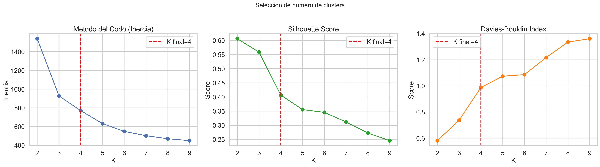

### Avance en GIF por metodo

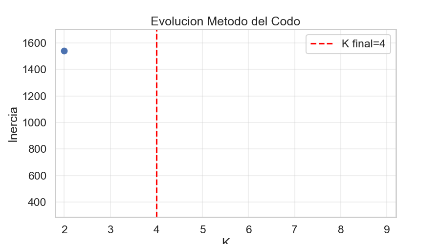

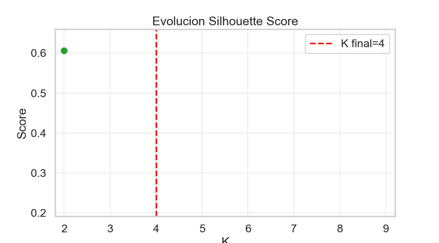

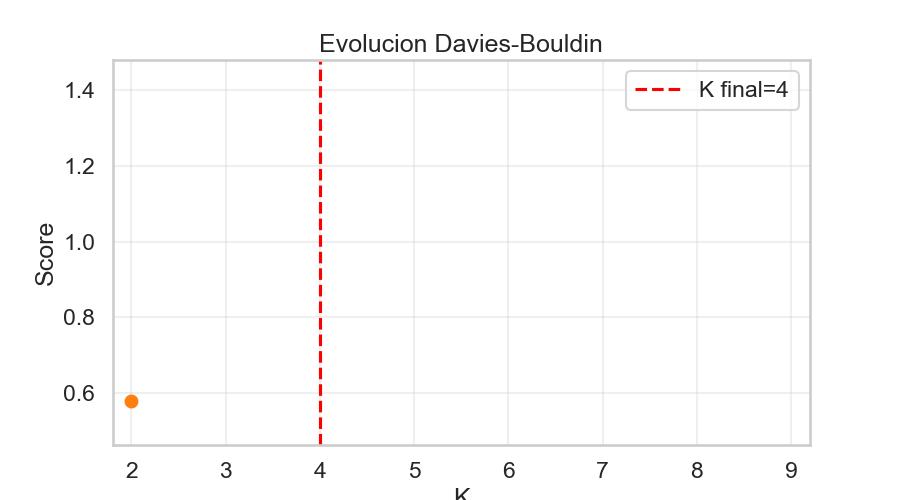

## 7. Metricas del modelo: ecuaciones, interpretacion y valores obtenidos

### 7.1 Inercia (suma de distancias intra-cluster)

$$
J = \sum_{k=1}^{K} \sum_{\mathbf{z} \in C_k} \| \mathbf{z} - \boldsymbol{\mu}_k \|^2
$$

Mide que tan compactos son los clusters. Cuanto menor, mas juntos estan los puntos alrededor de su centroide. Se usa para el metodo del codo: se busca el K donde la reduccion marginal cae significativamente.

**Valor obtenido:** $J = 770.50$ con $K=4$.

### 7.2 Silhouette Score

Para cada punto $i$ con distancia promedio intra-cluster $a_i$ y distancia promedio al cluster vecino mas cercano $b_i$:

$$
s_i = \frac{b_i - a_i}{\max(a_i,\, b_i)}
$$

El score global es el promedio de $s_i$ sobre todos los puntos. Rango: $[-1, 1]$.

- Cercano a 1: puntos bien asignados y separados del vecino.
- Cercano a 0: puntos en la frontera entre clusters.
- Negativo: posiblemente asignados al cluster incorrecto.

**Valor obtenido:** $s = 0.4066$ → separacion buena.

### 7.3 Davies-Bouldin Index

Para cada cluster $k$ con dispersion interna $S_k$ (desviacion promedio al centroide) y separacion entre centroides $d(\boldsymbol{\mu}_k, \boldsymbol{\mu}_l)$:

$$
DB = \frac{1}{K} \sum_{k=1}^{K} \max_{l \ne k} \frac{S_k + S_l}{d(\boldsymbol{\mu}_k, \boldsymbol{\mu}_l)}
$$

Valores mas bajos indican clusters compactos y bien separados. No tiene limite superior; un valor cercano a 0 es ideal.

**Valor obtenido:** $DB = 0.9879$ → separacion muy buena.

### 7.4 Calinski-Harabasz Index (Variance Ratio Criterion)

Compara la dispersion entre clusters (traza de la matriz de dispersion inter-cluster $B_K$) contra la dispersion intra-cluster (traza de $W_K$):

$$
CH = \frac{\text{tr}(B_K) \,/\, (K-1)}{\text{tr}(W_K) \,/\, (N-K)}
$$

Valores mas altos indican mejor separacion relativa. Util para comparar distintos valores de K.

**Valor obtenido:** $CH = 1193.68$ → separacion muy definida.

### 7.5 Varianza explicada PCA

$$
\text{VE} = \frac{\sum_{i=1}^{3} \lambda_i}{\sum_{i=1}^{p} \lambda_i} \times 100\%
$$

donde $\lambda_i$ son los autovalores de la matriz de covarianza. Indica cuanta informacion se conserva al reducir de 9 dimensiones a 3.

**Valor obtenido:** VE = 95.98% → representacion muy fiel del espacio original.

### 7.6 Resumen de metricas

| Metrica | Valor | Interpretacion |
|---|---|---|
| K final | 4 | Numero de clusters elegido |
| Inercia $J$ | 770.50 | Compacidad total (menor = mejor) |
| Silhouette $s$ | 0.4066 | Separacion [-1,1] (mayor = mejor) |
| Davies-Bouldin | 0.9879 | Compacidad/separacion (menor = mejor) |
| Calinski-Harabasz | 1193.68 | Separacion relativa (mayor = mejor) |
| Varianza PCA (PC1-3) | 95.98% | Informacion retenida en 3D |

### Distribucion por clusters

- Cluster 0: 17.3% de registros
- Cluster 1: 31.5% de registros
- Cluster 2: 32.7% de registros
- Cluster 3: 18.5% de registros

### Correlaciones mas fuertes

- tiempo_uso_acumulado_h ↔ ciclos_activacion_M: r=0.99
- ciclos_activacion_M ↔ tiempo_uso_acumulado_h: r=0.99
- fallos_temporales ↔ numero_logs_error: r=0.98
- numero_logs_error ↔ fallos_temporales: r=0.98
- temp_operacional_promedio_C ↔ temp_maxima_alcanzada_C: r=0.94

## 8. Visualizaciones de resultado

### Clusters en espacio PCA 3D

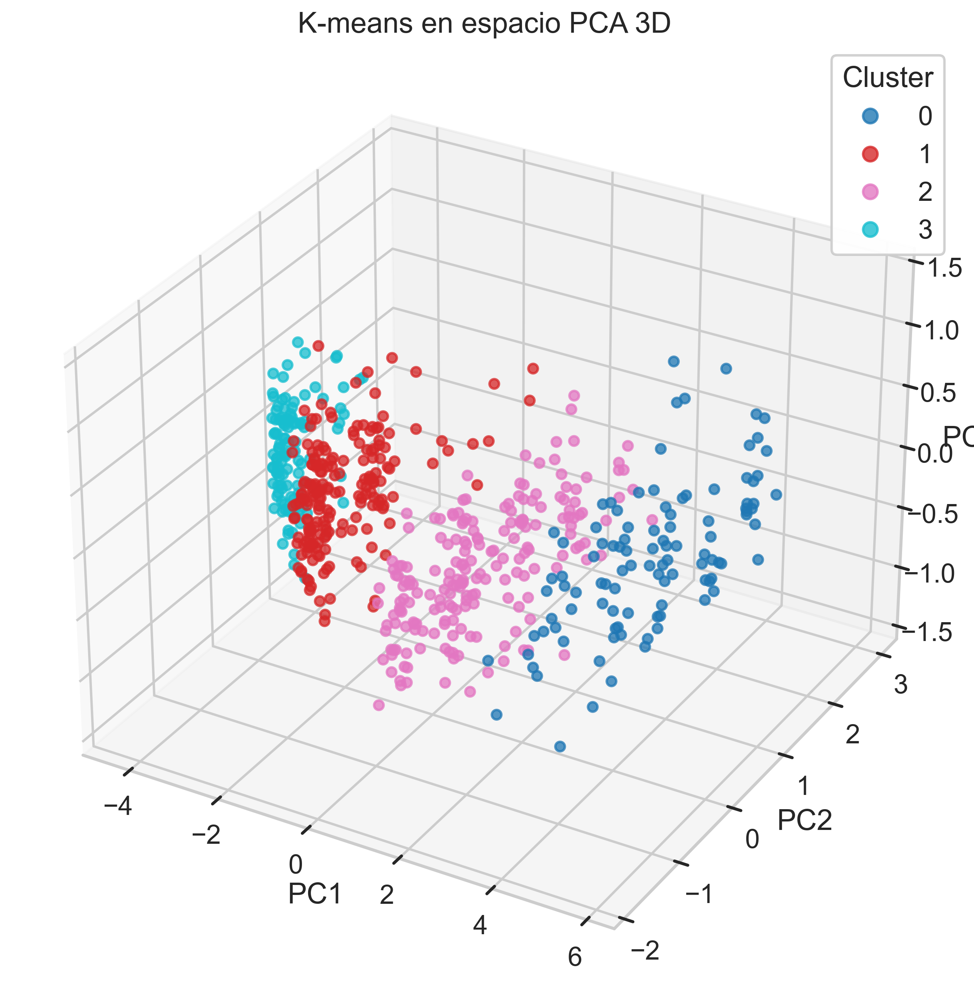

### Perfil por cluster (media estandarizada)

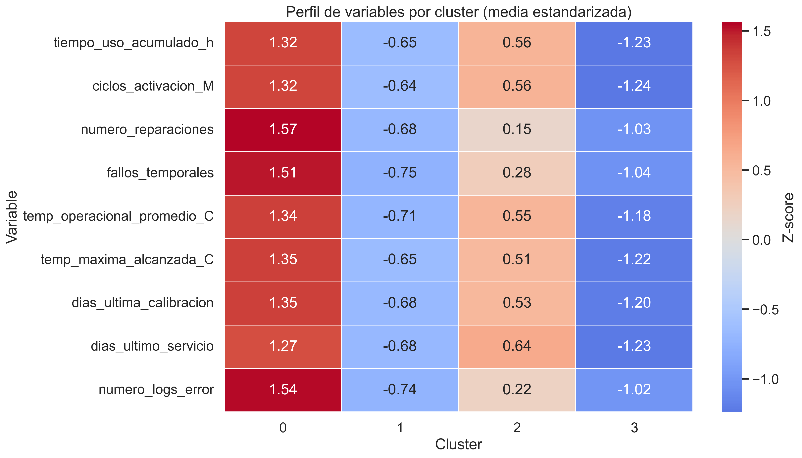

### Distribucion por actuador y cluster

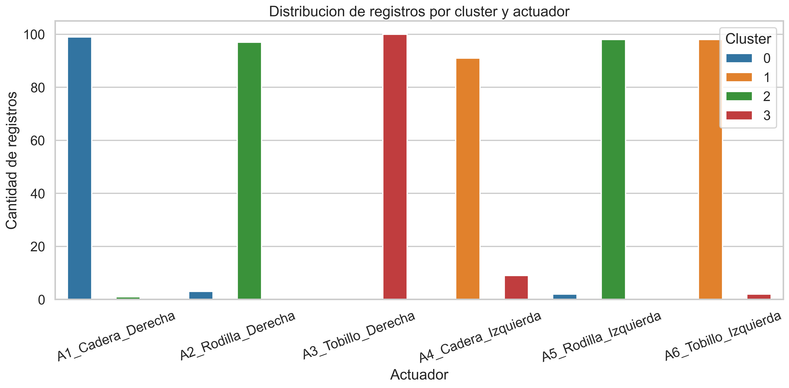

### Matriz de correlacion

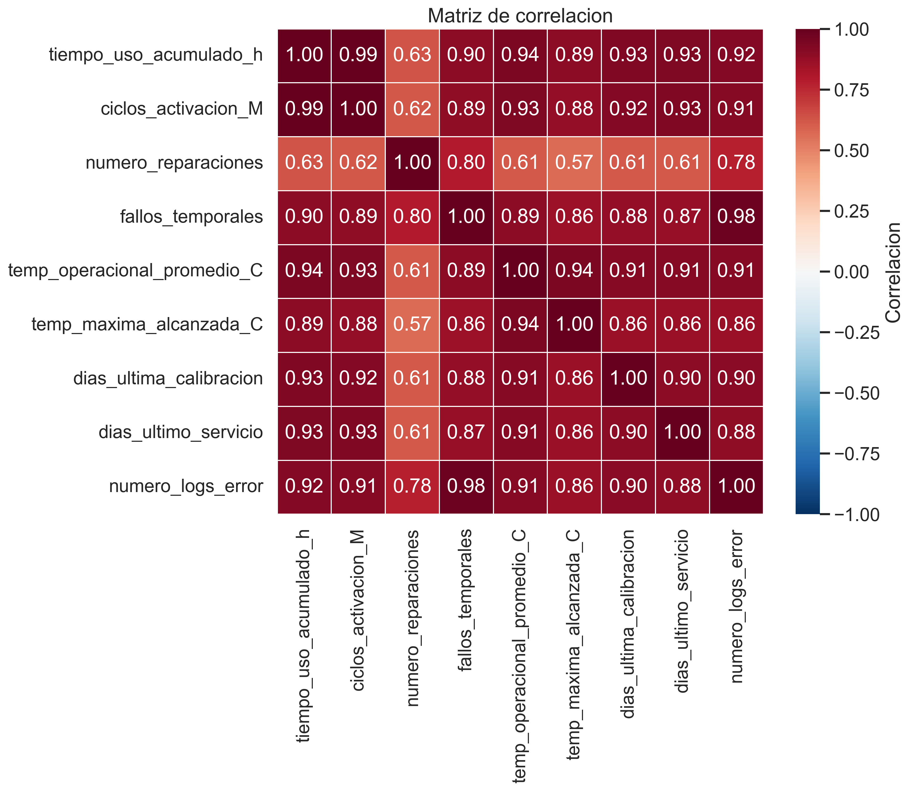

### Varianza explicada PCA

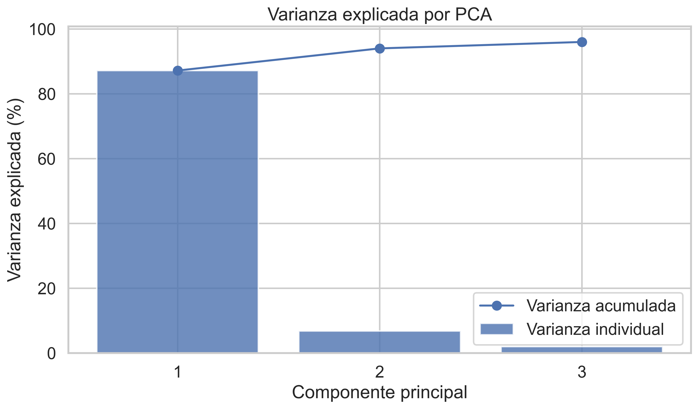

### Evolucion de centroides en PCA 3D

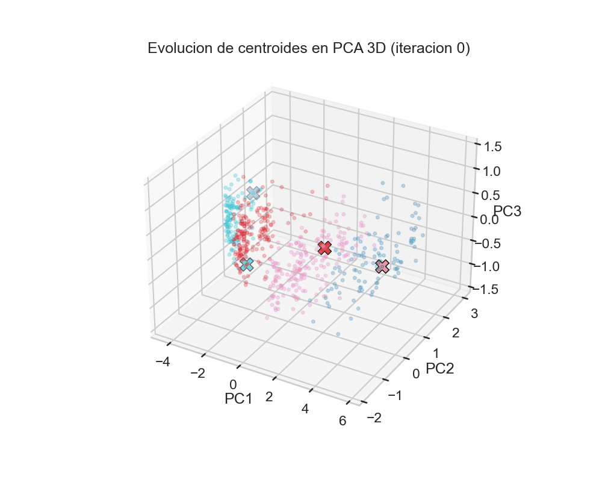

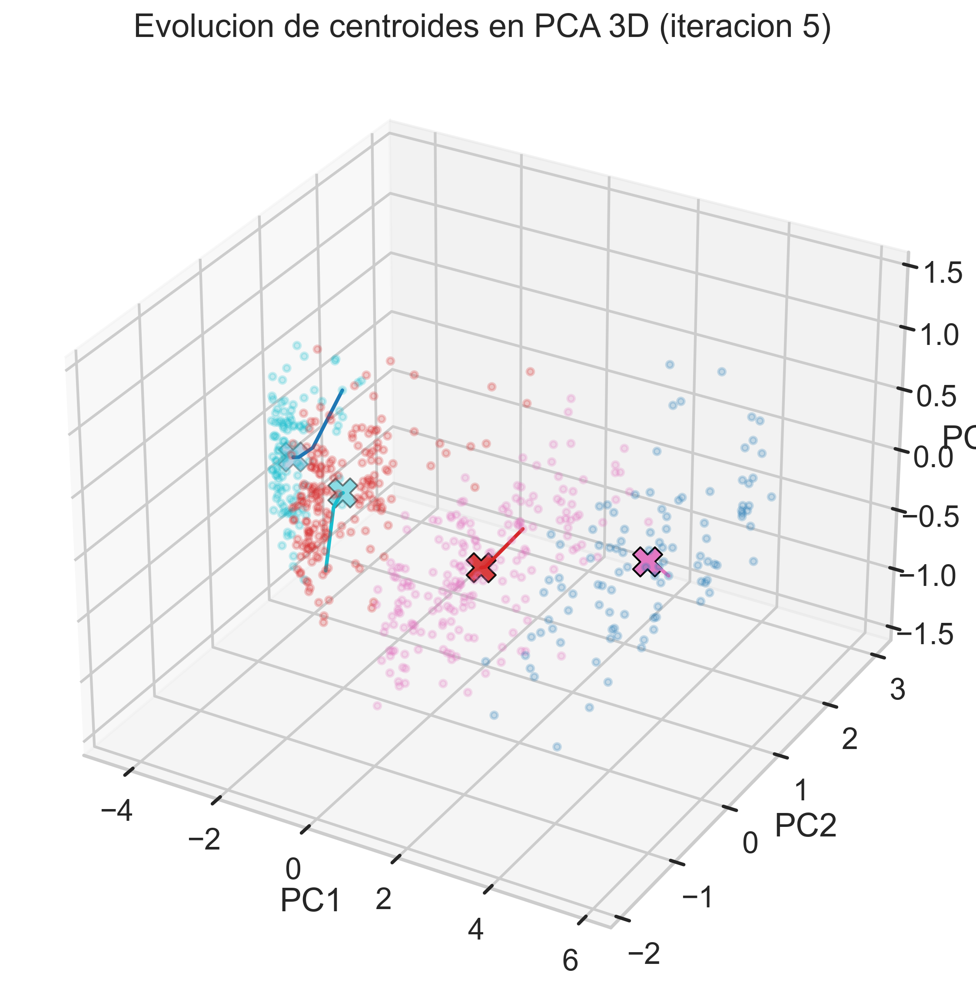

### Como interpretar el perfil estandarizado por cluster

- El valor 0 representa la media global de la variable.
- Valores positivos indican que el cluster esta por encima de la media en esa variable.
- Valores negativos indican que el cluster esta por debajo de la media.
- Cuanto mas lejos de 0 (en valor absoluto), mayor diferencia respecto al comportamiento promedio.
- Filas con rojo intenso en variables de riesgo (fallos, temperatura, logs) suelen describir clusters de mayor severidad.

## 9. Casos extremos y accion recomendada

Cuando un actuador cae a la vez en perfiles opuestos (por ejemplo C1 y C3), **no conviene tratarlo como perfecto ni como reemplazo inmediato**. Es una zona de inestabilidad/heterogeneidad y la accion recomendada es inspeccion diagnostica temprana con seguimiento corto.

Regla aplicada en este reporte:
- Si C1>=3 y C3>=3 (sobre 9 variables) y diferencia <=1: **AMBIGUO C1-C3** → inspeccion 7-14 dias.
- Si mezcla C1-C3 sin equilibrio fuerte: mantenimiento preventivo anticipado + monitoreo.
- Si hay predominio claro: seguir accion del cluster dominante.

Interpretacion de la columna "Clasificacion":
- **DOMINIO CLARO**: un cluster domina de forma consistente el perfil del actuador.
- **AMBIGUO C1-C3**: mezcla casi equilibrada entre funcional y degradado; requiere inspeccion temprana.
- **MIXTO C1-C3**: coexistencia de señales opuestas, pero con algo de predominio.
- **EMPATE**: no hay dominancia robusta, conviene revisar tendencia temporal.

## 10. Matriz de decision por actuador

| Actuador | Estado | Prevalencia (%) | Clasificacion | Accion |
|---|---|---|---|---|
| A1_Cadera_Derecha | DEGRADADO | 100.0 | DOMINIO CLARO | Mantenimiento en 30-60 dias |
| A2_Rodilla_Derecha | CRITICO | 100.0 | DOMINIO CLARO | Investigar inmediatamente / posible reemplazo |
| A4_Cadera_Izquierda | FUNCIONAL | 100.0 | DOMINIO CLARO | Mantenimiento rutinario |
| A5_Rodilla_Izquierda | CRITICO | 100.0 | DOMINIO CLARO | Investigar inmediatamente / posible reemplazo |
| A6_Tobillo_Izquierda | FUNCIONAL | 100.0 | DOMINIO CLARO | Mantenimiento rutinario |
| A3_Tobillo_Derecha | OPTIMO | 88.9 | DOMINIO CLARO | Operacion normal |

## 11. Ejemplo de asignacion por variable para un motor

**Motor ejemplo:** A1_Cadera_Derecha

| Variable | Cluster asignado |
|---|---|
| tiempo_uso_acumulado_h | C3 |
| ciclos_activacion_M | C3 |
| numero_reparaciones | C3 |
| fallos_temporales | C3 |
| temp_operacional_promedio_C | C3 |
| temp_maxima_alcanzada_C | C3 |
| dias_ultima_calibracion | C3 |
| dias_ultimo_servicio | C3 |
| numero_logs_error | C3 |

**Conteo por cluster:** C0=0, C1=0, C2=0, C3=9

**Estado final:** DEGRADADO (100.0%)

## 12. Conclusiones

K-means fue util en este caso porque separa patrones operativos con multiples indicadores y permite pasar de una lectura por sensor aislado a una **decision por perfil**. El uso combinado de PCA y prevalencia por variable mejora interpretabilidad y evita decisiones ambiguas cuando el motor muestra comportamientos mixtos.
