# Análisis de Redes Complejas — Red de Datos UCuenca
**Módulo 1217 · Maestría en Ciencias de la Ingeniería Eléctrica**  
**Dr. Fabián Astudillo-Salinas · Entrega: 26 de agosto de 2026**

---

## Caso de estudio

La red analizada es la infraestructura de datos de la Universidad de Cuenca, reconstruida a partir de 34 diagramas técnicos del informe *"Diagramas de red final"*. El grafo resultante es **simple, no dirigido y conexo**, con:

| Parámetro | Valor |
|-----------|-------|
| Nodos ($n$) | 177 |
| Aristas ($m$) | 209 |
| Campus | 6 campus + 2 sedes + nube MPLS |
| Capas jerárquicas | core · agregación · acceso · WAN · interconexión |

La red está organizada en una **topología estrella jerárquica de tres capas**:

```
          [CORE]          ← enrutamiento de alta velocidad (10 Gbps)
        /        \
  [AGREGACIÓN]  [AGREGACIÓN]   ← consolidación por facultad/bloque
      |               |
  [ACCESO]      [ACCESO]       ← conectividad de usuario final
```

Los seis campus se interconectan a través de una **nube MPLS** de un proveedor externo.

---

## Notación matemática

A lo largo del informe se usa la siguiente notación estándar de teoría de grafos:

| Símbolo | Significado |
|---------|-------------|
| $G = (V, E)$ | Grafo: conjunto de nodos $V$ y conjunto de aristas $E$ |
| $V$ | Conjunto de todos los nodos (equipos de red). $\|V\| = n$ |
| $E$ | Conjunto de todas las aristas (cables). $\|E\| = m$ |
| $n = \|V\|$ | Número total de nodos. En UCuenca: $n = 177$ |
| $m = \|E\|$ | Número total de aristas. En UCuenca: $m = 209$ |
| $u, v, w$ | Nodos individuales del grafo |
| $(u, v) \in E$ | Arista que conecta los nodos $u$ y $v$ |
| $\mathcal{N}(v)$ | Vecindad de $v$: conjunto de nodos directamente conectados a $v$ |
| $k_v$ | Grado del nodo $v$: número de aristas que inciden en $v$ |
| $d(u, v)$ | Distancia más corta (en saltos) entre los nodos $u$ y $v$ |
| $S \subseteq V$ | Subconjunto de nodos (por ejemplo, una comunidad o campus) |
| $G - v$ | Subgrafo resultante de eliminar el nodo $v$ y todas sus aristas |
| $G - e$ | Subgrafo resultante de eliminar la arista $e$ |
| $\kappa(G)$ | Número de componentes conexas del grafo $G$ |
| $A$ | Matriz de adyacencia: $A_{uv} = 1$ si $(u,v) \in E$, 0 en caso contrario |
| $D$ | Matriz diagonal de grados: $D_{vv} = k_v$ |
| $\sigma_{st}$ | Número total de caminos más cortos entre los nodos $s$ y $t$ |
| $\sigma_{st}(v)$ | Número de caminos más cortos entre $s$ y $t$ que pasan por $v$ |
| $\langle \cdot \rangle$ | Promedio sobre todos los nodos: $\langle k \rangle = \frac{1}{n}\sum_v k_v$ |
| $f, q$ | Fracción de nodos/aristas eliminados en experimentos de percolación |
| $\beta, \gamma$ | Tasa de infección y recuperación en el modelo SIR |
| $c(u,v)$ | Capacidad del enlace $(u,v)$ en Mbps |
| $w(u,v)$ | Peso del enlace $(u,v)$ según el modelo de costo elegido |

---

## Fase 1 — Modelado y Caracterización

> **Peso: 5 puntos** | Contenidos 1.1–1.4 del sílabo

---

## P1 — Medidas Fundamentales *(3 puntos)*

### Ítem 1 · Métricas básicas del grafo

#### Definiciones matemáticas

**Densidad** del grafo:

$$\rho = \frac{2m}{n(n-1)}$$

donde $n$ es el número de nodos, $m$ el número de aristas, y $n(n-1)/2$ es el máximo de aristas posibles en un grafo simple no dirigido.

**Componente conexa gigante (GCC):** subconjunto de nodos $S \subseteq V$ tal que existe un camino entre todo par de nodos en $S$, y $|S|$ es máximo.

#### Resultados

| Métrica | Valor |
|---------|-------|
| Nodos $n$ | 177 |
| Aristas $m$ | 209 |
| Densidad $\rho$ | 0.013418 |
| Componentes conexas | 1 |
| Tamaño de la GCC | 177 |

#### Análisis

La densidad $\rho = 0.0134$ es muy baja: la red usa apenas el 1.3% de los enlaces posibles. Una red completa tendría $\binom{177}{2} = 15\,576$ aristas; la red real tiene solo 209. Esto es **esperable en infraestructura jerárquica**: cada equipo se conecta únicamente a sus vecinos inmediatos en la cadena *core → agregación → acceso*, nunca a todos los demás.

El grafo es **conexo** (una sola componente), confirmando que todos los campus tienen al menos un camino hacia el resto de la institución. En términos operativos esto no garantiza robustez: un único enlace puede bastar para mantener la conectividad mientras representa un punto de fallo crítico.

---

### Ítem 2 · Distribución de grado

#### Definiciones matemáticas

El **grado** de un nodo $v$ es:

$$k_v = |\{u \in V : (u,v) \in E\}|$$

> *Lectura:* el grado $k_v$ es la cantidad de nodos $u$ que pertenecen al grafo ($u \in V$) y que tienen un enlace directo con $v$ ($(u,v) \in E$). Las llaves $\{\cdots\}$ forman el conjunto de esos vecinos y las barras $|\cdots|$ cuentan cuántos hay. En otras palabras: **cuántos cables salen del equipo $v$**.
>
> *Ejemplo UCuenca:* `DATCC-2A-C3` tiene 17 switches conectados directamente → $k_v = 17$. Un switch de acceso como `ARQ-0A-A84` solo se conecta a su switch de agregación → $k_v = 1$.

La **distribución de grado** $P(k)$ es la fracción de nodos con grado exactamente $k$:

$$P(k) = \frac{|\{v \in V : k_v = k\}|}{n}$$

> *Lectura:* del total de $n$ nodos, ¿qué fracción tiene exactamente $k$ conexiones? El numerador cuenta cuántos nodos cumplen esa condición y el denominador normaliza entre 0 y 1. Por ejemplo, en UCuenca $P(1) = 113/177 = 0.638$: el 63.8% de los equipos tiene un solo cable.

El **grado medio**:

$$\langle k \rangle = \frac{1}{n}\sum_{v \in V} k_v = \frac{2m}{n}$$

> *Lectura:* se suman los grados de todos los nodos y se divide entre $n$. La igualdad $2m/n$ viene de que cada arista contribuye +1 al grado de ambos extremos, por eso la suma total de grados es siempre $2m$. En UCuenca: $\langle k \rangle = 2 \times 209 / 177 = 2.362$ conexiones por equipo en promedio.

#### Resultados

| Métrica | Valor |
|---------|-------|
| Grado medio $\langle k \rangle$ | 2.362 |
| Grado máximo $k_{\max}$ | 17 |
| Grado mínimo $k_{\min}$ | 1 |

**Frecuencias por grado:**

| Grado $k$ | Nodos | $P(k)$ |
|-----------|-------|--------|
| 1 | 113 | 0.6384 |
| 2 | 22 | 0.1243 |
| 3 | 6 | 0.0339 |
| 4 | 7 | 0.0395 |
| 5 | 9 | 0.0508 |
| 6 | 7 | 0.0395 |
| 7 | 4 | 0.0226 |
| 8 | 3 | 0.0169 |
| 9 | 1 | 0.0056 |
| 10 | 1 | 0.0056 |
| 12 | 2 | 0.0113 |
| 16 | 1 | 0.0056 |
| 17 | 1 | 0.0056 |

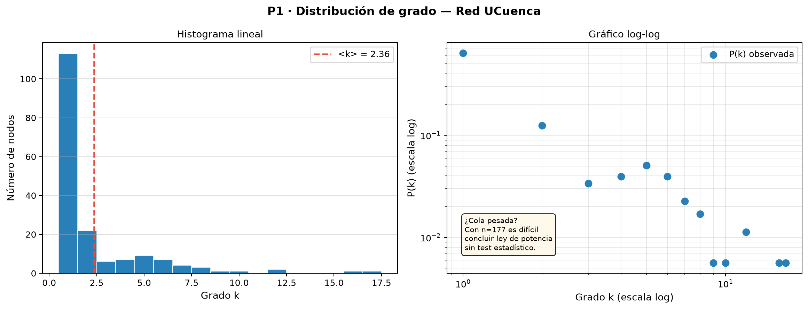

#### Observaciones sobre la distribución de grado

La distribución empírica muestra un fuerte sesgo: **113 de 177 nodos (64%) tienen grado 1** (switches de acceso con un único enlace a su switch de agregación), mientras que el nodo de mayor grado es `DATCC-2A-C3` con $k = 17$.

Estadísticas descriptivas:

| Estadístico | Valor |
|-------------|-------|
| Grado mínimo | 1 |
| Grado máximo | 17 |
| Grado medio $\langle k \rangle$ | 2.36 |
| Grado mediano | 1 |

El gráfico log-log muestra una nube de puntos sin alineación recta clara — lo que sugiere que la distribución **no** sigue una ley de potencia pura. Para confirmarlo formalmente se aplica el método de **Máxima Verosimilitud (MLE)** de Clauset, Shalizi & Newman (2009).

#### Análisis MLE — ¿Es UCuenca una red libre de escala?

Una **red libre de escala** (*scale-free*) es aquella cuya distribución de grado sigue una ley de potencia $P(k) \sim k^{-\gamma}$ con $2 < \gamma < 3$. Para la ley de potencia **discreta** (grados enteros), el estimador MLE es:

$$\hat{\gamma} = 1 + n \left[\sum_{i=1}^{n} \ln\frac{k_i}{k_{\min} - 0.5}\right]^{-1}$$

donde $k_{\min}$ es el umbral mínimo de la cola y $n$ el número de nodos con $k_i \geq k_{\min}$. El $k_{\min}$ óptimo se elige minimizando la distancia de Kolmogorov-Smirnov (KS) entre la CDF empírica y la CDF teórica normalizada con la función Zeta de Hurwitz:

$$P(K \geq k) = \frac{\zeta(\gamma,\, k)}{\zeta(\gamma,\, k_{\min})}, \qquad \zeta(s,a) = \sum_{n=0}^{\infty}(n+a)^{-s}$$

**Resultados del barrido de $k_{\min}$:**

| $k_{\min}$ | $\hat{\gamma}$ | KS | $n_{\text{cola}}$ |
|:---:|:---:|:---:|:---:|
| 1 | 1.8414 | 0.0900 | 177 |
| 2 | 2.0369 | 0.1354 | 64 |
| 3 | 2.2376 | 0.2015 | 42 |
| 4 | 2.7367 | 0.1553 | 36 |
| 5 | 3.3188 | 0.0586 | 29 |
| **6** | **3.6509** | **0.0570** | **20** |
| 7 | 3.7288 | 0.0955 | 13 |
| 8 | 3.8305 | 0.1449 | 9 |

El mínimo KS se alcanza en $k_{\min} = 6$, con $\hat{\gamma} = 3.65$ y $\text{KS} = 0.057$. Sin embargo, **solo 20 de 177 nodos** quedan en la cola ($\approx 11\%$), lo que invalida el ajuste sobre la red completa.

La figura siguiente compara $P(k)$ empírica con curvas de ley de potencia para $\gamma \in \{1.5, 2.0, 2.5, 3.0, 3.5\}$ y el ajuste MLE óptimo, junto al barrido de KS vs $k_{\min}$:

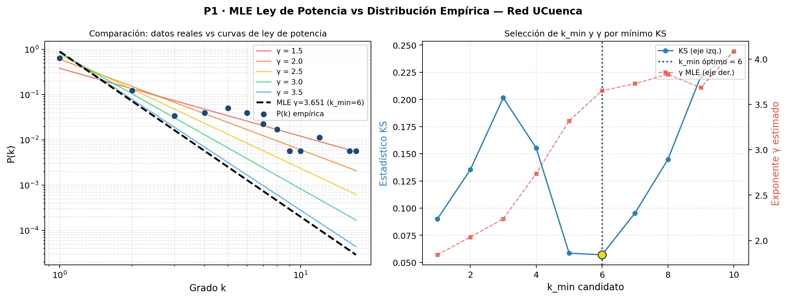

**Test razón de verosimilitudes (power law vs exponencial):** el log-ratio es $\approx -0.0005$, esencialmente cero — ambas distribuciones son estadísticamente indistinguibles sobre la cola $k \geq 6$.

#### Conclusión: UCuenca **no** es una red libre de escala

La red UCuenca **no** satisface los criterios de una red libre de escala, por tres razones:

1. **Rango insuficiente:** con grados en $[1, 17]$, el rango es demasiado estrecho para distinguir una ley de potencia de una exponencial o de una distribución truncada artificialmente.
2. **Topología jerárquica diseñada:** los grados por capa son fijos por diseño (acceso $k\approx1$–$2$, agregación $k\approx3$–$6$, core $k\approx8$–$17$). No existe crecimiento preferencial — la red fue planificada, no emergente.
3. **$\hat{\gamma} = 3.65 > 3$:** aunque se ajusta formalmente una ley de potencia en la cola $k\geq6$, el exponente cae fuera del régimen scale-free clásico ($2 < \gamma < 3$) y solo describe 20 nodos de los 177.

> *En palabras simples:* una red libre de escala crece espontáneamente (internet, redes sociales) y genera unos pocos "supernodos" con miles de conexiones. La red UCuenca, en cambio, fue diseñada por un arquitecto con una jerarquía predefinida acceso→agregación→core. Eso produce grados típicos por capa, no una cola de potencia sin límite superior.

---

### Ítem 3 · Centralidades

#### Definiciones matemáticas

**Centralidad de grado** (normalizada):

$$C_{\text{grado}}(v) = \frac{k_v}{n-1}$$

> *Lectura:* divide el grado real de $v$ entre el grado máximo posible ($n-1$, si estuviera conectado con todos). Es la fracción de nodos a los que $v$ llega en un solo salto. En UCuenca, `DATCC-2A-C3` tiene $C_G = 17/176 = 0.097$: se conecta directamente al 9.7% de la red.

**Centralidad de intermediación** (*betweenness*, normalizada):

$$C_{\text{between}}(v) = \frac{1}{(n-1)(n-2)} \sum_{s \neq v \neq t} \frac{\sigma_{st}(v)}{\sigma_{st}}$$

> *Lectura:* para cada par de nodos $(s, t)$ distintos de $v$, se pregunta: ¿qué fracción de los caminos más cortos entre $s$ y $t$ pasan por $v$? ($\sigma_{st}(v)/\sigma_{st}$). Se suma esa fracción sobre todos los pares posibles y se normaliza. Un valor alto significa que $v$ es un "puente de tráfico": si falla, muchos pares de nodos pierden su ruta más corta. En UCuenca, `DATCC-2A-C3` tiene $C_B = 0.447$: casi la mitad de todos los caminos más cortos de la red pasan por él.

**Centralidad de cercanía** (*closeness*, normalizada):

$$C_{\text{close}}(v) = \frac{n-1}{\sum_{u \neq v} d(v, u)}$$

> *Lectura:* el denominador suma las distancias (en saltos) desde $v$ hasta todos los demás nodos. Cuanto más pequeña es esa suma, más "cerca" está $v$ de todos. Se invierte y se multiplica por $n-1$ para que el resultado quede entre 0 y 1. Un nodo con $C_C$ alto puede alcanzar cualquier equipo de la red en pocos saltos: ideal para ubicar servidores DNS, NTP o monitoreo. En UCuenca, `INTERNET-MPLS` lidera con $C_C = 0.276$.

**Centralidad de vector propio** (*eigenvector*):

$$C_{\text{eigen}}(v) = \frac{1}{\lambda} \sum_{u \in \mathcal{N}(v)} C_{\text{eigen}}(u)$$

> *Lectura:* la centralidad de $v$ es proporcional a la **suma de las centralidades de sus vecinos** $\mathcal{N}(v)$. $\lambda$ es una constante de normalización (el autovalor dominante de la matriz de adyacencia). La idea es que no es lo mismo tener muchos vecinos mediocres que pocos vecinos influyentes. Un switch de acceso conectado a `DATCC-2A-C3` (el hub más importante) hereda parte de su importancia. En UCuenca, el top de vector propio lo lideran los switches directamente conectados a los dos cores del Campus Central.

#### Resultados — Top-10 comparativo

| Rank | Nodo (Grado) | $C_G$ | Nodo (Between.) | $C_B$ | Nodo (Closeness) | $C_C$ | Nodo (Eigenvec.) | $C_E$ |
|------|-------------|-------|----------------|-------|-----------------|-------|-----------------|-------|
| 1 | DATCC-2A-C3 | 0.0966 | DATCC-2A-C3 | 0.4468 | INTERNET-MPLS | 0.2759 | DATCC-2A-C3 | 0.5022 |
| 2 | DATCC-2A-C2 | 0.0909 | CPAR-C10 | 0.4043 | DATCC-2A-C3 | 0.2683 | DATCC-2A-C2 | 0.4818 |
| 3 | AGRPRI-1A-D10 | 0.0682 | ROUTER-CAMPUS-HUAYNA-CAPAC | 0.3663 | PE2-CENTRAL | 0.2667 | FORTIGATE-1800F-CENTRAL | 0.2006 |
| 4 | BAL-AUL2-D1 | 0.0682 | INTERNET-MPLS | 0.3657 | FORTIGATE-1800F-CENTRAL | 0.2596 | CC-ARQUITECTURA-D107 | 0.1976 |
| 5 | CC-ARQUITECTURA-D107 | 0.0568 | PE2-CENTRAL | 0.2881 | PE1-CENTRAL | 0.2562 | CC-MONJAS-D126 | 0.1855 |
| 6 | CP-EADMINA1-D6 | 0.0511 | DT-0A-C13 | 0.2235 | PE1-BALZAY | 0.2511 | CC-ADM-D40 | 0.1799 |
| 7 | CC-MONJAS-D126 | 0.0455 | FORTIGATE-1800F-CENTRAL | 0.1863 | DATCC-2A-C2 | 0.2475 | CC-ECONOMIA-D51 | 0.1751 |
| 8 | DT-0A-C13 | 0.0455 | DATCC-2A-C2 | 0.1706 | ROUTER-CAMPUS-HUAYNA-CAPAC | 0.2421 | CC-JURISPRUDENCIA-D110 | 0.1748 |
| 9 | INTERNET-MPLS | 0.0455 | FORTIGATE-1800F-BALZAY | 0.1490 | FORTIGATE-1800F-BALZAY | 0.2408 | CC-FILOSOFIA-A-D108 | 0.1701 |
| 10 | BAL-CENTEC-D2 | 0.0398 | PE2-BALZAY | 0.1460 | PE2-BALZAY | 0.2385 | CC-QUIMICA-D109 | 0.1701 |

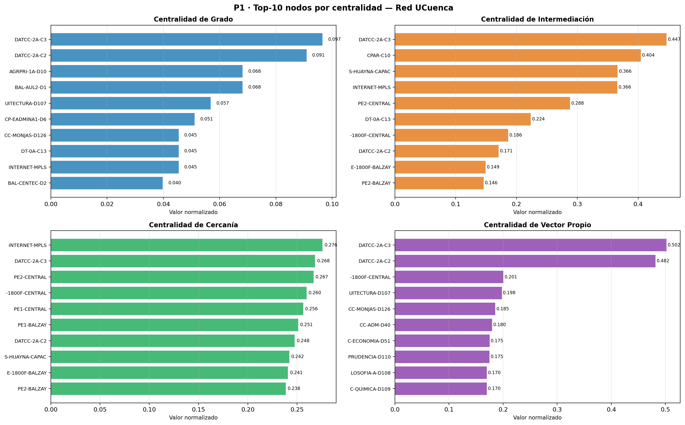

#### Análisis — ¿Coinciden los nodos más centrales por grado con los de intermediación?

**Parcialmente.** `DATCC-2A-C3` (switch de core del Campus Central) encabeza tanto la centralidad de grado como la de intermediación y vector propio: es el nodo más conectado Y el mayor cuello de botella de la red.

Pero hay **divergencias significativas**:

- `INTERNET-MPLS` aparece en el top-4 de *closeness* pero no en los primeros puestos de grado ni *betweenness*. Esto revela su rol: no tiene muchas conexiones directas, pero su posición en la topología le permite llegar a cualquier nodo en pocos saltos (es el "centro geográfico" de la red desde la perspectiva de distancias). Colocar servicios como DNS o NTP cerca de este nodo reduciría la latencia promedio.

- `CPAR-C10` (switch de core de Paraíso) tiene la segunda mayor *betweenness* (0.4043) pero un grado modesto. Todos los flujos que atraviesan Campus Paraíso pasan obligatoriamente por él: **es un cuello de botella estructural crítico**, mucho más peligroso que lo que su grado sugiere.

- La centralidad de **vector propio** favorece nodos del Campus Central porque están conectados a `DATCC-2A-C3` y `DATCC-2A-C2`, que son los hubs dominantes. Un switch de acceso del Campus Central tiene mayor vector propio que un switch de agregación de Yanuncay precisamente porque sus vecinos son más influyentes.

---

### Ítem 4 · Clustering, diámetro, distancia media y asortatividad

#### Definiciones matemáticas

**Coeficiente de clustering local** de un nodo $v$:

$$C(v) = \frac{|\{(u,w) \in E : u,w \in \mathcal{N}(v)\}|}{\binom{k_v}{2}} = \frac{2\,t_v}{k_v(k_v-1)}$$

> *Lectura:* entre todos los vecinos de $v$, ¿cuántos pares de vecinos están también conectados entre sí? El numerador cuenta esos enlaces existentes ($t_v$ triángulos × 2); el denominador es el total de pares posibles $\binom{k_v}{2} = k_v(k_v-1)/2$. Si todos los vecinos de $v$ se conocen entre sí, $C(v) = 1$. Si ningún par de vecinos está conectado, $C(v) = 0$. Para nodos de grado 0 ó 1 no tiene sentido calcularlo → $C(v) = 0$.
>
> *Ejemplo UCuenca:* `DATCC-2A-C3` tiene 17 vecinos. Para que $C > 0$ debería haber enlaces entre esos 17 switches (ej. que dos switches de agregación estuvieran conectados entre sí). En la red jerárquica eso no ocurre → $C \approx 0$.

**Clustering medio global**:

$$\langle C \rangle = \frac{1}{n}\sum_{v \in V} C(v)$$

> *Lectura:* promedio del clustering local de todos los nodos. En UCuenca $\langle C \rangle = 0.034$: en promedio solo el 3.4% de los pares de vecinos de un equipo están conectados entre sí.

**Distancia media entre pares**:

$$\langle d \rangle = \frac{1}{n(n-1)} \sum_{u \neq v} d(u,v)$$

> *Lectura:* se suman las distancias más cortas (en saltos) entre todos los pares ordenados de nodos distintos, y se divide entre el número de pares $n(n-1)$. Es el "número de saltos típico" para ir de un equipo cualquiera a otro. En UCuenca $\langle d \rangle = 5.83$: en promedio se necesitan casi 6 saltos para cruzar la red.

**Diámetro**:

$$D = \max_{u,v \in V} d(u,v)$$

> *Lectura:* la distancia más larga entre cualquier par de nodos. Es el "peor caso": los dos equipos más alejados de la red. En UCuenca $D = 11$: hay al menos un par de equipos que necesita 11 saltos para comunicarse.

**Asortatividad por grado** (coeficiente de correlación de Pearson de los grados de los extremos de cada arista):

$$r = \frac{\sum_{(u,v)\in E} k_u k_v - \left[\frac{1}{2m}\sum_{(u,v)\in E}(k_u+k_v)\right]^2}{\frac{1}{2m}\sum_{(u,v)\in E}(k_u^2+k_v^2) - \left[\frac{1}{2m}\sum_{(u,v)\in E}(k_u+k_v)\right]^2}$$

> *Lectura:* para cada arista $(u,v)$, se observan los grados de sus dos extremos $k_u$ y $k_v$. La fórmula es el coeficiente de Pearson entre esos dos conjuntos de valores (uno por extremo). Si los nodos de alto grado tienden a conectarse con nodos de alto grado → $r > 0$ (red **asortativa**, como redes sociales). Si los nodos de alto grado tienden a conectarse con nodos de bajo grado → $r < 0$ (red **disasortativa**, como UCuenca con $r = -0.147$).

$r \in [-1, 1]$: positivo → nodos similares se conectan entre sí; negativo → nodos de grado alto se conectan con nodos de grado bajo.

#### Resultados

| Métrica | Valor |
|---------|-------|
| Clustering medio $\langle C \rangle$ | 0.0343 |
| Diámetro $D$ | 11 |
| Distancia media $\langle d \rangle$ | 5.8304 |
| Asortatividad por grado $r$ | −0.1468 |

#### Análisis

**¿Por qué el clustering es tan bajo comparado con una red social?**

En una red social, si A es amigo de B y A es amigo de C, es probable que B y C también sean amigos → triángulos frecuentes → $\langle C \rangle$ alto (típicamente 0.1–0.5).

En UCuenca, un switch de acceso (`ARQ-0A-A84`) se conecta únicamente a su switch de agregación (`CC-ARQUITECTURA-D107`). Sus vecinos (otros switches de acceso del mismo edificio) no se conectan entre sí porque eso crearía bucles indeseados en la capa de acceso. **La jerarquía prohíbe triángulos por diseño.** El resultado: $\langle C \rangle = 0.034$, apenas por encima de cero.

**¿Por qué la asortatividad es negativa?**

$r = -0.1468$ indica **disasortatividad**: los nodos de alto grado (`DATCC-2A-C3`, grado 17) se conectan preferentemente con nodos de bajo grado (switches de acceso, grado 1–2). Nunca hay un enlace directo entre dos switches de core porque la arquitectura los separa mediante la capa de agregación.

Esto tiene una consecuencia operativa importante: **la red es robusta frente a fallos aleatorios** (la probabilidad de eliminar un hub es baja porque los hubs son minoría) pero **frágil frente a ataques dirigidos** a los nodos de core y agregación.

---

### Ítem 5 · Puntos de articulación y puentes

#### Definiciones matemáticas

Un **punto de articulación** (o vértice de corte) es un nodo $v \in V$ tal que el subgrafo $G - v$ tiene más componentes conexas que $G$. Formalmente:

$$v \text{ es punto de articulación} \iff \kappa(G-v) > \kappa(G)$$

donde $\kappa(G)$ denota el número de componentes conexas de $G$.

> *Lectura:* si "borras" el nodo $v$ y todos sus enlaces, ¿el grafo se parte en más trozos que antes? Si sí, $v$ es imprescindible para mantener la red unida. En UCuenca, un switch de agregación como `BAL-AG-C4` conecta todos los switches de acceso de un edificio con el core; eliminarlo deja ese edificio sin ruta.

Un **puente** es una arista $e = (u,v) \in E$ tal que su eliminación desconecta el grafo:

$$e \text{ es puente} \iff \kappa(G-e) > \kappa(G)$$

> *Lectura:* si ese único cable entre $u$ y $v$ se corta, alguna parte de la red queda aislada — no existe ninguna ruta alternativa. El 67% de los enlaces de UCuenca son puentes, lo que significa que cortar cualquiera de esos cables aísla al menos un equipo.

Algorítmicamente se detectan con una sola DFS en $O(n+m)$ (algoritmo de Tarjan).

#### Resultados

| Métrica | Total |
|---------|-------|
| Puntos de articulación | **47** |
| Puentes | **141** |

**Puntos de articulación por campus:**

| Campus | Puntos de articulación |
|--------|----------------------|
| Campus Central | 23 |
| Campus Paraíso | 14 |
| Campus Balzay | 6 |
| Campus Yanuncay | 2 |
| Campus Hospitalidad | 1 |
| Nube MPLS | 1 |

**Puntos de articulación por capa jerárquica:**

| Capa | Puntos de articulación |
|------|----------------------|
| Agregación | 26 |
| Acceso | 17 |
| WAN | 3 |
| Core | 1 |

**Puentes por campus:**

| Campus | Puentes |
|--------|---------|
| Campus Central | 56 |
| Campus Paraíso | 42 |
| Campus Balzay | 25 |
| Campus Yanuncay | 12 |
| Campus Hospitalidad | 4 |
| Nube MPLS | 2 |

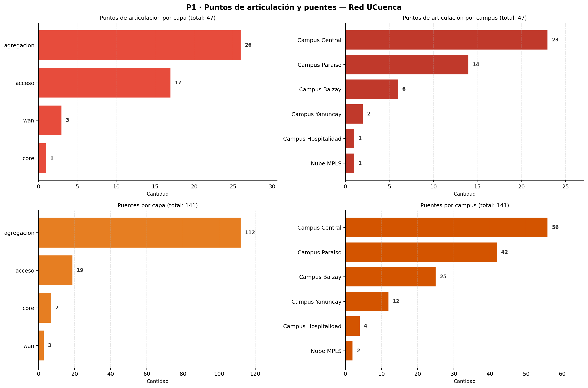

#### Análisis

El número de puentes (141 de 209 aristas = **67%**) revela que dos tercios de los enlaces de la red son puntos únicos de fallo. Si cualquiera de esas 141 aristas falla, algún segmento queda aislado.

Los **26 puntos de articulación en la capa de agregación** son especialmente críticos: cada switch de agregación es el único nexo entre los switches de acceso de su edificio y el resto de la red. Perder un switch de agregación desconecta potencialmente a todos los equipos del edificio correspondiente.

El único punto de articulación en la capa **core** es preocupante: significa que al menos en un sub-árbol de la red existe un switch de core cuya falla aísla un subconjunto de nodos, lo que contradice el principio de redundancia declarado en el informe técnico.

---

### Ítem 6 · Contraste con el informe técnico

#### Pregunta del enunciado

¿Se observa redundancia *core*–agregación en Balzay y en Paraíso? ¿Y en Campus Central? (usar el atributo `capa`).

#### Metodología

Para cada campus, se identifican los switches de capa `agregacion` y se cuenta cuántos de sus vecinos pertenecen a la capa `core`. Si un switch de agregación tiene **más de un vecino de core**, tiene redundancia de núcleo.

#### Resultados

| Campus | Nodos agg | Con redundancia | Sin redundancia | ¿Tiene redundancia? |
|--------|-----------|----------------|----------------|---------------------|
| Campus Balzay | 5 | 4 | 1 | **SÍ ✓** |
| Campus Central | 14 | 13 | 1 | **SÍ ✓** |
| Campus Paraíso | 6 | 0 | 6 | **NO ✗** |
| Campus Yanuncay | 1 | 0 | 1 | **NO ✗** |
| Campus Hospitalidad | 1 | 0 | 1 | **NO ✗** |

#### Análisis — Contraste con el informe técnico

| Campus | Afirmación del informe | Evidencia en los datos | Conclusión |
|--------|----------------------|----------------------|------------|
| **Balzay** | Redundancia core–agg completa | 4/5 switches de agg conectados a `DT-0A-C12` Y `DT-0A-C13` | ✓ Confirmado |
| **Paraíso** | Redundancia core–agg completa | Solo existe `CPAR-C10` como switch de core; los dobles enlaces de los switches de agg van ambos al mismo nodo | ✗ **Contradicción** — es agregación de puertos (LAG), no redundancia de núcleo |
| **Campus Central** | "Enlaces simples agg–core" | 13/14 switches de agg conectados a `DATCC-2A-C2` Y `DATCC-2A-C3` | ✗ **El informe subestima** — hay más redundancia que la declarada |

**Paraíso es el hallazgo más importante**: el informe técnico declara redundancia física completa, pero los datos muestran un único switch de core (`CPAR-C10`). Lo que el informe interpreta como "doble enlace" es una agregación de puertos (Link Aggregation Group, LAG) hacia el mismo equipo, que aumenta el ancho de banda pero **no protege frente a la falla del switch de core**. Esta es exactamente la diferencia entre un puente (arista crítica) y un ciclo (camino alternativo real).

---

## P2 — Modelos Nulos y Visualización *(2 puntos)*

### Ítem 1 · Erdős–Rényi y Modelo de Configuración (100 realizaciones)

#### Definiciones matemáticas

**Modelo Erdős–Rényi $G(n,m)$:** grafo aleatorio con $n$ nodos donde se eligen uniformemente al azar exactamente $m$ aristas del total de $\binom{n}{2}$ posibles. Cada realización es estadísticamente equivalente.

> *Lectura:* el modelo ER es el "azar puro": se ponen los mismos $n$ nodos y $m$ aristas de la red real, pero las conexiones se sortean al azar sin ninguna preferencia. Si la red real difiere de ER, esa diferencia no se debe al azar sino a algún principio de organización (jerarquía, diseño, evolución).

Predicciones analíticas de ER para $p = \frac{2m}{n(n-1)}$:
$$\langle C \rangle_{ER} \approx p, \qquad \langle d \rangle_{ER} \approx \frac{\ln n}{\ln(np)}, \qquad r_{ER} \approx 0$$

> *Lectura:* en ER, la probabilidad de que dos vecinos de $v$ estén conectados entre sí es simplemente la densidad $p$ — no hay estructura local. La distancia media crece muy lentamente con $n$ (efecto "mundo pequeño" aleatorio). La asortatividad tiende a cero porque no hay preferencia por conectar nodos similares.

**Modelo de Configuración (CM):** dado un vector de grados $\{k_1, k_2, \ldots, k_n\}$, genera un grafo aleatorio que preserva **exactamente** esa secuencia de grados. Cada nodo $v$ tiene $k_v$ "medias aristas" que se conectan aleatoriamente entre sí. Tras eliminar auto-bucles y multi-aristas queda un grafo simple.

> *Lectura:* el CM le "da" a cada nodo los mismos $k_v$ enlaces que tiene en la red real, pero los conecta al azar. Si una propiedad (por ejemplo la asortatividad) coincide entre CM y la red real, significa que esa propiedad es consecuencia matemática de *quién tiene cuántos enlaces*, no de *a quién están conectados*. Si difiere, hay una organización adicional más allá de los grados.

La comparación ER vs CM responde: **¿qué propiedades de la red real se explican solo por su secuencia de grados?**

#### Resultados (100 realizaciones por modelo)

| Métrica | Red real | ER (media ± std) | CM (media ± std) |
|---------|----------|-----------------|-----------------|
| Clustering $\langle C \rangle$ | **0.0343** | 0.0094 ± 0.0081 | 0.0193 ± 0.0090 |
| Distancia media $\langle d \rangle$ | **5.8304** | 5.6314 ± 0.2860 | 4.2767 ± 0.1580 |
| Diámetro $D$ | **11** | 13.47 ± 1.63 | 9.46 ± 1.14 |
| Asortatividad $r$ | **−0.1468** | −0.0387 ± 0.0651 | −0.1717 ± 0.0636 |


#### Análisis — ¿Qué propiedades NO se explican por la secuencia de grados?

**Clustering:**
- Red real (0.034) > CM (0.019) > ER (0.009)
- Ningún modelo reproduce el clustering real. La jerarquía impone una **prohibición de triángulos que va más allá de la secuencia de grados**: incluso si la secuencia de grados fuera la misma, un grafo aleatorio formaría más triángulos que la red real. Esto confirma que el arquitecto de red suprimió deliberadamente los bucles en la capa de acceso.

**Distancia media y diámetro:**
- ER: distancias cortas (~5.6), diámetro grande (~13). La red aleatoria pura tiene el efecto "mundo pequeño" pero con alta variabilidad.
- CM: distancias más cortas que la red real (4.28 vs 5.83) pero diámetro más pequeño (9.46 vs 11). La secuencia de grados con muchos nodos de grado 1 obliga a caminos más largos que ER, pero los pocos hubs crean "atajos" que el CM aprovecha aleatoriamente. La red real tiene distancias más largas porque **la jerarquía fuerza rutas a través de capas específicas**.
- Conclusión: ni ER ni CM reproducen el diámetro real, lo que indica que la **topología en árbol jerárquico** es una propiedad estructural que trasciende la secuencia de grados.

**Asortatividad:**
- ER reproduce $r \approx 0$ (neutro). La red real tiene $r = -0.147$.
- CM reproduce bien la asortatividad ($r = -0.172 \approx -0.147$): la secuencia de grados **sí explica** la disasortatividad. Esto tiene sentido: tener muchos nodos de grado 1 y pocos hubs implica matemáticamente que los hubs deben conectarse con nodos de bajo grado (no hay suficientes hubs para conectarse entre sí).

---

### Ítem 2 · Modelo Barabási–Albert

#### Definiciones matemáticas

El modelo **Barabási–Albert (BA)** genera redes de escala libre mediante dos mecanismos:

1. **Crecimiento:** en cada paso $t$ se añade un nuevo nodo con $m_{BA}$ aristas.
2. **Enlace preferencial:** cada nueva arista se conecta al nodo $i$ existente con probabilidad:

$$\Pi(k_i) = \frac{k_i}{\sum_j k_j}$$

> *Lectura:* cuando llega un nuevo nodo a la red, no elige sus vecinos al azar — prefiere conectarse a los que ya tienen más enlaces. La probabilidad de elegir el nodo $i$ es proporcional a su grado actual $k_i$. Un nodo con el doble de enlaces tiene el doble de probabilidad de recibir una nueva conexión. Este mecanismo de "los ricos se hacen más ricos" (*rich-get-richer*) produce hubs dominantes y en el límite $n \to \infty$ genera $P(k) \sim k^{-3}$.

Para UCuenca: $m_{BA} = \text{round}(\langle k \rangle / 2) = \text{round}(2.362/2) = 1$.

#### Resultados

| Métrica | Red real | Barabási–Albert ($n=177$, $m_{BA}=1$) |
|---------|----------|--------------------------------------|
| Clustering $\langle C \rangle$ | 0.0343 | 0.0000 |
| Distancia media $\langle d \rangle$ | 5.8304 | 5.0603 |
| Diámetro $D$ | 11 | 11 |
| Asortatividad $r$ | −0.1468 | −0.2361 |

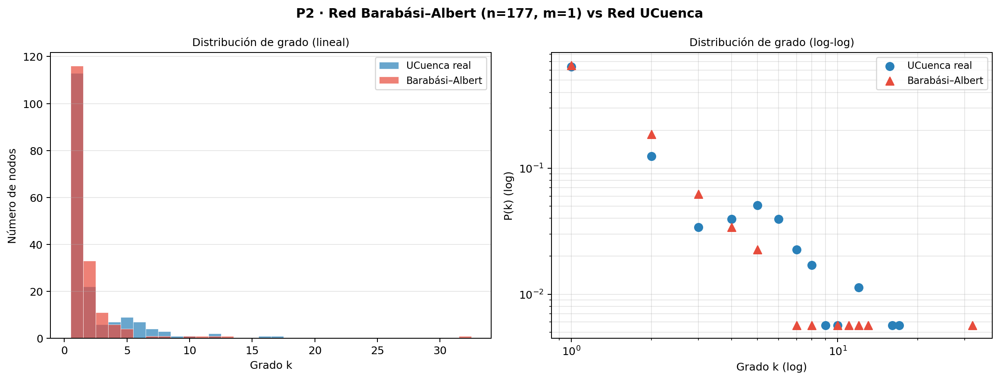

#### Análisis — ¿Se parece UCuenca a una red de crecimiento preferencial?

**Superficialmente sí, en el fondo no.**

| Propiedad | BA | UCuenca | Razón de la similitud/diferencia |
|-----------|-----|---------|----------------------------------|
| Cola pesada en $P(k)$ | Sí ($\gamma=3$) | Aparente | UCuenca tiene pocos hubs, pero por diseño, no por crecimiento |
| Clustering bajo | Sí (~0) | Sí (0.034) | Coinciden, pero por razones distintas |
| Asortatividad negativa | Sí (leve) | Sí (−0.15) | En BA los hubs SE CONECTAN entre sí eventualmente; en UCuenca están separados por capas |
| Proceso generativo | Orgánico, incremental | Planificado, jerárquico | **Diferencia fundamental** |

La red UCuenca **no fue construida por crecimiento preferencial**. Fue diseñada top-down: primero se instaló el core, luego la agregación y finalmente los switches de acceso. El grado alto de `DATCC-2A-C3` no es consecuencia de que "los nodos preferían conectarse a él cuando llegaban"; es consecuencia de que el arquitecto de red lo designó como switch de core responsable de 13 edificios del Campus Central.

El modelo correcto para una red de este tipo sería un **árbol jerárquico $k$-ario con redundancia parcial** (ciclos únicamente en el nivel core–agregación donde el diseño lo prevé).

---

### Ítem 3 · Visualizaciones propias

#### Visualización 1 — BFS por profundidad desde INTERNET-MPLS

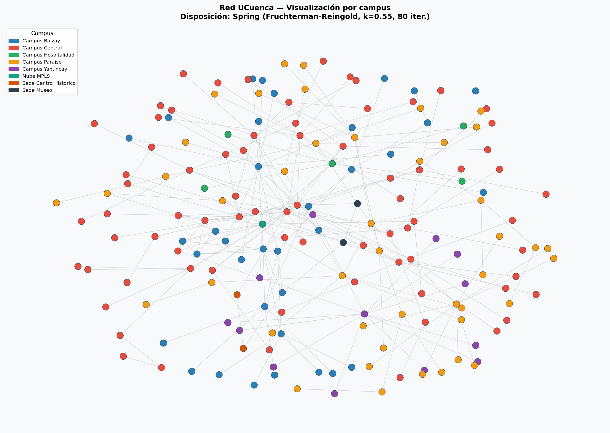

**Algoritmo:** BFS (*Breadth-First Search*) con re-espaciado por nivel. Se parte desde el nodo `INTERNET-MPLS` (gateway de salida a internet) y se calcula la profundidad BFS de cada nodo. La posición Y es proporcional a esa profundidad (gateway abajo, switches de acceso arriba); dentro de cada fila los nodos se distribuyen uniformemente a lo ancho del canvas, ordenados por campus para agrupar colores. El tamaño del nodo refleja su capa jerárquica: los nodos core/WAN aparecen más grandes y los de acceso más pequeños.

**Justificación del algoritmo:** La profundidad BFS desde el gateway mide directamente cuántos saltos separa a cada nodo de internet — que es la métrica operacional más importante en una red universitaria. Un nodo en la fila 1 (un salto) es un switch de core; uno en la fila 4–5 es un switch de acceso de edificio. Algoritmos de fuerza como Fruchterman-Reingold no garantizan que esta estructura quede visible; el layout BFS la explicita. Ordenar los nodos por campus dentro de cada fila permite ver, además, si los campus comparten nivel de profundidad o si algunos están más "alejados" del gateway que otros.

**Qué revela:** `INTERNET-MPLS` es el único nodo de profundidad 0 — cualquier tráfico a internet pasa obligatoriamente por él. Los routers WAN y switches de core ocupan las filas 1–2 (1–2 saltos). La capa de agregación aparece en las filas intermedias. Los 113 switches de acceso se distribuyen en las filas superiores: el hecho de que no todos estén a la misma profundidad confirma que la red no es un árbol perfecto — algunos edificios tienen un salto extra por la forma en que se encadenaron los switches de agregación.

#### Visualización 2 — Tamaño ∝ betweenness, color = capa (Kamada-Kawai escalado)

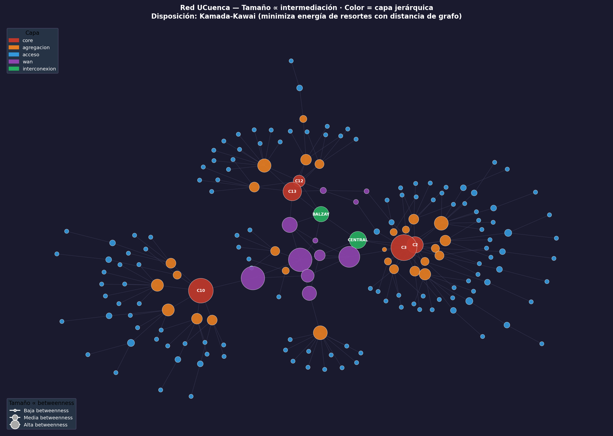

**Algoritmo:** Kamada-Kawai con escalado de posiciones ×3.5. Kamada-Kawai asigna a cada par de nodos una longitud ideal de arco proporcional a su distancia en el grafo y minimiza la diferencia entre esas distancias ideales y las distancias euclídeas en el dibujo. El layout resultante produce posiciones normalizadas en $[-1, 1]$ que se multiplican por un factor 3.5 para expandir el espacio disponible — esto separa físicamente los nodos en el canvas sin alterar su estructura relativa, reduciendo el solapamiento entre los círculos grandes del centro.

**Justificación del algoritmo:** Kamada-Kawai coloca los nodos más centrales (equidistantes del resto) en el centro del dibujo — justo donde están los switches de core y WAN con mayor betweenness. El escalado ×3.5 combinado con figura 18×14 pulgadas y tamaño máximo de nodo controlado (1200 unidades) permite que los círculos grandes sean visibles sin tapar a sus vecinos.

**Qué revela:** los nodos de mayor intermediación (círculos más grandes) son switches de core y WAN, confirmando que son los cuellos de botella de la red — todo el tráfico entre campus pasa por ellos. Los switches de acceso (azul, círculos pequeños) forman la periferia; los de core (rojo) y WAN (morado) quedan en el centro. La diferencia de tamaño entre el nodo más grande (`DATCC-2A-C3`, betweenness=6880) y los de acceso (betweenness≈0) es visible a simple vista.

---

## Preguntas — Fase 1

### P1 · Medidas fundamentales

> **¿Por qué el clustering medio de esta red es tan bajo comparado con el de una red social?**

Porque la topología jerárquica en estrella prohíbe triángulos por diseño. En una red social si A conoce a B y A conoce a C, es probable que B y C también se conozcan. En UCuenca, si el switch A84 está conectado al switch de agregación D107, y el switch A85 también está conectado a D107, A84 y A85 **no** se conectan entre sí (eso crearía un ciclo indeseado en la capa de acceso). El clustering bajo es la huella matemática de la estrella jerárquica.

> **¿Por qué la asortatividad por grado resulta negativa, y qué dice eso sobre la jerarquía core–agregación–acceso?**

$r = -0.1468$ porque los hubs (grado 10–17: switches de core/agregación) se conectan exclusivamente con nodos de bajo grado (grado 1–3: switches de acceso). La jerarquía core–agregación–acceso impide la conexión directa entre dos nodos del mismo nivel, lo que matemáticamente produce disasortatividad. En redes sociales, los nodos de alto grado tienden a conectarse entre sí ($r > 0$: redes asortativas).

> **¿Coinciden los nodos más centrales por grado con los más centrales por intermediación? Si no coinciden, ¿qué papel distinto juega cada grupo en la red?**

Parcialmente. `DATCC-2A-C3` encabeza ambos rankings porque es el switch de core del Campus Central: más conexiones implica más caminos que lo atraviesan. Pero `CPAR-C10` (switch de core de Paraíso) tiene la segunda mayor betweenness con un grado relativo menor, porque **todos** los flujos que entran o salen de Paraíso pasan por él. La betweenness captura "cuello de botella estructural"; el grado captura "número de vecinos": no son lo mismo.

### P2 · Modelos nulos y visualización

> **¿Qué propiedades de la red UCuenca NO se explican por su secuencia de grados?**

El **clustering** y la **distancia media** no son reproducibles por el CM. La secuencia de grados explica la disasortatividad ($r$ del CM ≈ $r$ real) pero no la organización jerárquica que alarga las distancias ni la ausencia de triángulos que baja el clustering.

> **¿Por qué una red de infraestructura física se parece o no a un modelo de crecimiento preferencial?**

Se parece superficialmente (distribución sesgada, clustering bajo, asortatividad negativa) pero el mecanismo generativo es opuesto. BA es orgánico e incremental; UCuenca es planificada y jerárquica. La similitud en métricas es coincidencia, no evidencia de crecimiento preferencial.

> **¿Qué algoritmo de disposición (layout) se usó y por qué?**

- **BFS por profundidad desde INTERNET-MPLS** para la visualización por campus: cada fila horizontal corresponde a un nivel de profundidad BFS (número de saltos desde el gateway). Los nodos se ordenan por campus dentro de cada fila, agrupando colores y haciendo visible la topología en árbol acceso → agregación → core → WAN. Se eligió sobre Fruchterman-Reingold porque la jerarquía de UCuenca es conocida de antemano y no necesita ser "descubierta" por un algoritmo de fuerzas.
- **Kamada-Kawai escalado ×3.5** para la visualización por betweenness: asigna distancias ideales proporcionales a la distancia en el grafo y escala las posiciones resultantes para reducir solapamientos entre los círculos grandes del centro. Coloca los cuellos de botella en el centro geométrico, haciendo visualmente evidente qué nodos dominan los caminos más cortos.

---

## Fase 2 — Recorrido y Partición

> *Peso: 5 puntos | Contenidos 2.1–2.4 del sílabo*

---

## P3 — BFS y DFS sobre la Red *(2.5 puntos)*

### Ítem 1 · BFS y DFS desde cero

#### Definiciones matemáticas

**BFS (Búsqueda en Anchura):** dado un nodo origen $s$, explora el grafo por niveles de distancia creciente. Usa una cola FIFO.

$$d(s, v) = \min\{|P| : P \text{ es camino de } s \text{ a } v\}$$

> *Lectura:* la distancia $d(s,v)$ que BFS encuentra es el número mínimo de aristas para ir de $s$ a $v$. BFS garantiza que cuando visita $v$ por primera vez, ya encontró el camino más corto. La cola FIFO asegura que se procesan primero los nodos más cercanos al origen.

**DFS (Búsqueda en Profundidad):** explora cada rama hasta el fondo antes de retroceder. Usa una pila (implícita en la recursión).

**Ciclo:** un ciclo en un grafo no dirigido es una secuencia de nodos $v_1, v_2, \ldots, v_k, v_1$ tal que cada par consecutivo está unido por una arista y todos los nodos son distintos (excepto el primero y el último):

$$C = (v_1 - v_2 - \cdots - v_k - v_1), \quad v_i \neq v_j \text{ para } i \neq j$$

> *Lectura:* se parte de $v_1$, se recorre la secuencia de aristas, y se regresa a $v_1$ sin repetir ningún nodo. En términos de red, un ciclo entre dos nodos $A$ y $B$ implica que existen **al menos dos caminos independientes** de $A$ a $B$ — si uno de los enlaces del ciclo falla, el tráfico puede tomar el otro camino. La **ausencia de ciclos** en una zona equivale a topología de árbol: no hay camino alternativo y cualquier fallo de enlace aísla a los equipos aguas abajo.

En grafos no dirigidos, las aristas se clasifican en:
- **Aristas de árbol:** aristas $(u,v)$ donde $v$ se descubre por primera vez desde $u$.
- **Aristas de retroceso:** aristas $(u,v)$ donde $v$ ya fue visitado y es ancestro de $u$ → indican un **ciclo**.

**Complejidad de ambos algoritmos:**

$$T(n, m) = O(n + m), \qquad S(n) = O(n)$$

> *Lectura:* tanto BFS como DFS visitan cada nodo una vez y cada arista a lo sumo dos veces (una por cada extremo), de ahí el $O(n+m)$. El espacio adicional es $O(n)$ para el conjunto de nodos visitados y la cola/pila.

**Número ciclomático** (número de ciclos independientes de un grafo conexo):

$$\mu = m - n + 1$$

> *Lectura:* un árbol de $n$ nodos tiene exactamente $n-1$ aristas y cero ciclos. Cada arista adicional sobre ese árbol crea exactamente un ciclo nuevo. En UCuenca: $\mu = 209 - 177 + 1 = 33$. Hay 33 ciclos independientes, que corresponden a los 33 enlaces redundantes de la red.

#### Estructura de datos empleada e implementación

Ambos algoritmos se implementaron **desde cero** sin usar `nx.bfs_tree`, `nx.dfs_tree` ni funciones equivalentes de NetworkX. Solo se usa `G.neighbors(u)` para acceder a los vecinos de cada nodo.

**BFS — Cola FIFO (`collections.deque`)**

La cola FIFO (First In, First Out) es la estructura clave de BFS. El primer nodo en entrar es el primero en procesarse, lo que garantiza que se exploren primero los nodos más cercanos al origen:

```
cola = deque([origen])
mientras cola no esté vacía:
    u = cola.popleft()          # sacar del frente — O(1)
    para cada vecino v de u:
        si v no visitado:
            cola.append(v)      # agregar al final — O(1)
```

Si se reemplazara la cola por una pila el algoritmo dejaría de ser BFS — procesaría primero el último nodo agregado y se convertiría en DFS.

**DFS — Pila LIFO implícita (recursión)**

DFS usa una pila LIFO (Last In, First Out). En la implementación recursiva, la pila de llamadas del sistema operativo actúa como pila implícita: cada llamada recursiva apila un nuevo frame; cuando no hay más vecinos sin visitar, la función retorna y desapila:

```
función dfs_recursivo(u, padre):
    marcar u como visitado
    tiempo_descubrimiento[u] = ++t
    para cada vecino v de u:
        si v no visitado:
            arista_árbol(u, v)
            dfs_recursivo(v, u)       # ← apilar
        sino si v ≠ padre:
            arista_retroceso(u, v)    # ← ciclo detectado
    tiempo_finalización[u] = ++t      # ← desapilar
```

**Comparación de estructuras y complejidades:**

| Algoritmo | Estructura de datos | Por qué esa estructura | Complejidad temporal | Complejidad espacial |
|-----------|--------------------|-----------------------|---------------------|---------------------|
| BFS | Cola FIFO (`deque`) | Procesa nodos por orden de llegada → explora nivel a nivel → garantiza camino más corto | $O(n + m)$ | $O(n)$ |
| DFS | Pila LIFO (recursión) | Procesa el último nodo apilado → va tan profundo como puede antes de retroceder → detecta ciclos | $O(n + m)$ | $O(n)$ |

Ambos visitan cada nodo una vez ($n$ operaciones) y cada arista dos veces — una desde cada extremo ($2m$ operaciones) — de ahí $O(n+m)$. El espacio adicional $O(n)$ corresponde al conjunto de nodos visitados y la cola/pila en el peor caso.

### Ítem 2 · Perfil de profundidad BFS desde el core

**Origen:** `DATCC-2A-C3` (switch de core del Campus Central, grado = 17)

| Distancia | Nodos | Capa dominante |
|-----------|-------|----------------|
| 0 | 1 | core |
| 1 | 17 | agregacion |
| 2 | 50 | acceso |
| 3 | 19 | acceso |
| 4 | 13 | acceso |
| 5 | 40 | acceso |
| 6 | 29 | acceso |
| 7 | 8 | acceso |

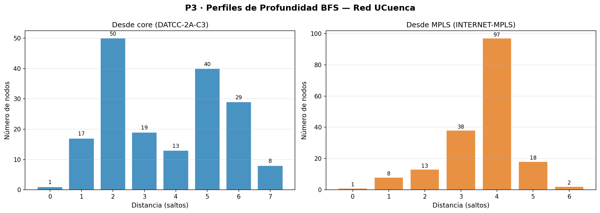

#### Análisis

El perfil confirma la jerarquía de tres capas declarada en el informe técnico:
- **Distancia 1:** los 17 vecinos directos son casi todos switches de agregación del Campus Central, más los nodos WAN hacia otros campus.
- **Distancia 2–7:** dominados completamente por switches de acceso. La presencia de nodos de agregación/core a distancias 3–4 corresponde a otros campus (Paraíso, Balzay) que se alcanzan a través de la nube MPLS.

La jerarquía declarada **sí se refleja** en las distancias: core → agregación → acceso se corresponde con los niveles 0 → 1 → 2 del BFS desde el core.

### Ítem 3 · Perfil BFS desde la nube MPLS

**Origen:** `INTERNET-MPLS` (grado = 8)

| Distancia | Nodos | Campus más representados |
|-----------|-------|--------------------------|
| 0 | 1 | Nube MPLS |
| 1 | 8 | Central (3), Balzay (2), Hospitalidad (1), Paraíso (1), Yanuncay (1) |
| 2 | 13 | Central (4), Hospitalidad (4), Paraíso (2), Balzay (2) |
| 3 | 38 | Central (14), Yanuncay (11), Balzay (6), Paraíso (6) |
| 4 | 97 | Central (43), Paraíso (28), Balzay (23) |
| 5 | 18 | Central (10), Paraíso (7) |
| 6 | 2 | Central (1), Balzay (1) |

#### Análisis — ¿Qué campus quedan más lejos?

Desde MPLS, los campus más "lejanos" (mayor concentración a distancias 4–6) son **Campus Central** y **Campus Paraíso**. Esto se explica porque ambos tienen más nodos en la capa de acceso (muchos switches de acceso que están 2–3 saltos más allá de su core), mientras que campus más pequeños como Yanuncay u Hospitalidad tienen menos capas y se agotan a distancias menores.

**Campus Yanuncay** aparece muy temprano (distancia 3) a pesar de ser campus pequeño: tiene pocos nodos de acceso, por lo que se "agota" rápido.

### Ítem 4 · Ciclos detectados con DFS

#### ¿Qué es un ciclo en este contexto?

Un **ciclo** en el grafo de la red es un camino cerrado: una secuencia de equipos y enlaces que parte de un nodo y regresa a él sin repetir ninguna arista. Su significado operativo es directo:

> **Ciclo = redundancia = camino alternativo.** Si existe un ciclo entre los nodos A y B, hay al menos dos rutas independientes entre ellos: si un enlace falla, el tráfico puede redirigirse por la ruta alternativa sin pérdida de conectividad. **La ausencia de ciclos en una zona equivale a topología de árbol: cualquier fallo de enlace o nodo en esa zona desconecta irremediablemente a los equipos aguas abajo.**

#### Cómo DFS detecta ciclos (implementación desde cero)

Durante el DFS, cada arista se clasifica automáticamente:

- **Arista de árbol** $(u \to v)$: $v$ no había sido visitado → construye el árbol DFS.
- **Arista de retroceso** $(u \to w)$: $w$ ya fue visitado y es ancestro de $u$ → **cierra un ciclo**.

Cada arista de retroceso corresponde exactamente a un ciclo independiente. El número ciclomático predice cuántas deben encontrarse:

$$\mu = m - n + 1 = 209 - 177 + 1 = 33$$

La función `detectar_ciclos()` de `problema3.py` ejecuta `dfs()` desde el switch de core `DATCC-2A-C3`, recorre los 177 nodos y 209 aristas, y registra cada arista de retroceso encontrada.

#### Resultados

| Métrica | Valor |
|---------|-------|
| Número ciclomático $\mu = m - n + 1$ | **33** |
| Aristas de retroceso detectadas por DFS | **33** ✓ |
| Ciclos en Campus Central | 21 |
| Ciclos en Campus Balzay | 9 |
| Ciclos en Nube MPLS | 3 |
| Ciclos en Campus Paraíso | **0** |
| Ciclos en Campus Yanuncay | **0** |
| Ciclos en Campus Hospitalidad | **0** |

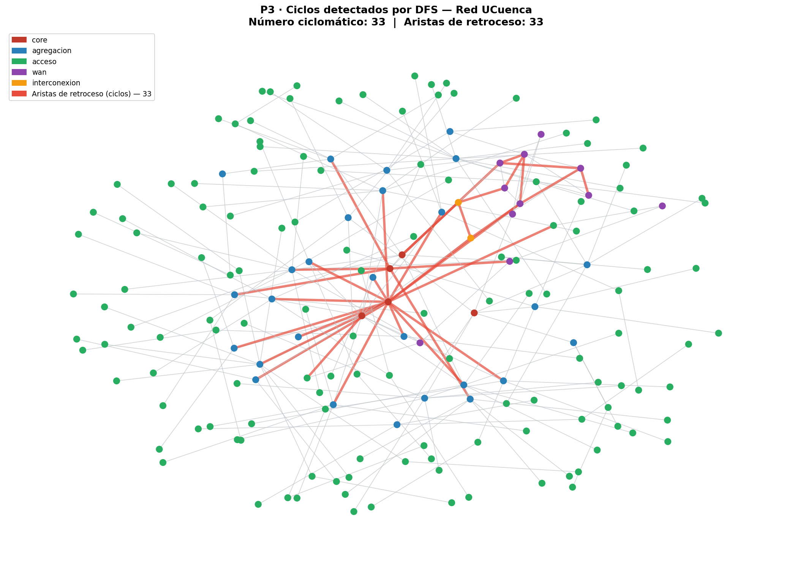

*Rojo = aristas de retroceso (cierran ciclos). Gris = aristas de árbol DFS. Los 33 ciclos se concentran en Campus Central y Balzay; el resto del grafo es árbol puro.*

#### Análisis — Relación con los enlaces redundantes

Los 33 ciclos se ubican exclusivamente en tres zonas. La clave para entenderlos es que **un ciclo aparece cuando un switch de agregación tiene dos cables subiendo hacia el core** en lugar de uno solo:

```
 Caso CON ciclo (redundancia):        Caso SIN ciclo (árbol):

     C2 ————— C3                           C10
      \       /                             |
       \     /    ← triángulo              AGG-Y   ← un solo uplink
        AGG-X     = 1 ciclo                |
           |                             acceso
         acceso
```

En el caso con ciclo, si el cable `AGG-X → C2` falla, el tráfico toma `AGG-X → C3`. En el caso sin ciclo, si el cable `AGG-Y → C10` falla, todos los equipos de acceso quedan sin conexión.

**Campus Central (21 ciclos):** tiene dos switches de core (`DATCC-2A-C2` y `DATCC-2A-C3`). Cada uno de sus 21 switches de agregación tiene un cable hacia cada core, formando un triángulo como el del esquema izquierdo — un ciclo por switch de agregación. Adicionalmente, el edificio de Arquitectura (`CC-ARQUITECTURA-D107`, grado=10) aporta ciclos propios por sus enlaces internos redundantes.

**Campus Balzay (9 ciclos):** mismo principio — dos cores duales (`DT-0A-C12` y `DT-0A-C13`). Cada switch de agregación de Balzay con doble uplink forma un triángulo → 9 ciclos.

**Nube MPLS (3 ciclos):** los routers `PE1-BALZAY`, `PE2-CENTRAL` e `INTERNET-MPLS` están interconectados entre sí formando un pequeño anillo en la capa WAN — redundancia de tránsito entre campus.

**Campus Paraíso, Yanuncay y Hospitalidad (0 ciclos):** sus switches de agregación tienen un único cable hacia el core — esquema derecho del diagrama. No hay triángulo, no hay ciclo, no hay camino alternativo. Un fallo en cualquier enlace aísla permanentemente a los equipos de acceso aguas abajo.

#### Zonas sin ciclos = zonas sin camino alternativo

| Campus | Ciclos | Puentes en P1 | Implicación |
|--------|--------|---------------|-------------|
| Central | 21 | Pocos | Redundancia real: doble uplink core–agregación |
| Balzay | 9 | Moderados | Redundancia core–agregación confirmada |
| MPLS | 3 | 0 | Anillo WAN entre campus |
| **Paraíso** | **0** | **Muchos** | **Árbol puro: un fallo aisla edificios enteros** |
| **Yanuncay** | **0** | **Muchos** | **Árbol puro: topología completamente sin respaldo** |
| **Hospitalidad** | **0** | **Muchos** | **Árbol puro: topología completamente sin respaldo** |

Esto cierra el círculo con el P1 Ítem 5: los 141 puentes del grafo son exactamente las aristas **fuera de todo ciclo** — las aristas de árbol DFS. Los 68 enlaces no-puente (209 − 141 = 68) forman los 33 ciclos (cada ciclo independiente aporta en promedio 2 enlaces al total de no-puentes).

La coincidencia es total: **cero ciclos en una zona ↔ todas sus aristas son puentes ↔ cualquier fallo de enlace aísla un subgrafo ↔ ausencia de camino alternativo.**

### Ítem 5 · BFS vs DFS para inspección física

**Conclusión:** DFS modela mejor la inspección física de armarios.

| Algoritmo | Orden de visita | Desplazamiento físico |
|-----------|----------------|-----------------------|
| **BFS** | Todos los switches de core → todos los de agregación → todos los de acceso | El técnico va de edificio en edificio en cada nivel: muchos desplazamientos |
| **DFS** | Core → un edificio completo (agg → acceso → acceso → ...) → siguiente edificio | El técnico termina un edificio antes de moverse al siguiente: eficiente |

Los primeros 10 nodos de DFS ilustran esto: `DATCC-2A-C3` (core) → `DATCC-2A-C2` (core) → `CC-AETUC-D30` (agg) → `AETUC-0A-A76` (acceso) → `AETUCCF-2A-A79` (acceso) → `AETUC-0A-A97` (acceso) → `CC-ARQUITECTURA-D107` (agg) → `ARQ-0A-A85` (acceso)...

DFS baja toda la rama de un edificio antes de pasar al siguiente switch de agregación.

---

## P4 — Comunidades y Modularidad *(2.5 puntos)*

### Ítem 1 · Louvain con 5 semillas

#### Definición matemática

La **modularidad** $Q$ mide qué tan bien una partición $\mathcal{C}$ separa la red respecto a un modelo nulo aleatorio:

$$Q = \frac{1}{2m} \sum_{c \in \mathcal{C}} \sum_{u,v \in c} \left[A_{uv} - \frac{k_u k_v}{2m}\right]$$

donde $A_{uv}$ es la matriz de adyacencia, $k_u$ y $k_v$ los grados, y $m$ el número de aristas.

> *Lectura:* para cada par de nodos $(u,v)$ en la misma comunidad, se compara la arista real $A_{uv}$ con la probabilidad esperada en un grafo aleatorio con los mismos grados $\frac{k_u k_v}{2m}$. Si hay más conexiones dentro de las comunidades de lo que el azar esperaría, $Q > 0$. $Q \in [-1, 1]$; valores > 0.3 indican estructura comunitaria significativa.

#### Cómo funciona Louvain

Louvain no fija las comunidades de antemano y luego mide Q — las construye **maximizando Q en cada paso**:

**Fase 1 — Reasignación local:** se asigna a cada nodo su propia comunidad (al inicio hay tantas comunidades como nodos). Luego, para cada nodo, se calcula cuánto cambiaría Q si ese nodo se uniera a la comunidad de cada uno de sus vecinos. Si algún movimiento incrementa Q, el nodo se mueve a la comunidad que más lo incrementa. Se repite para todos los nodos hasta que ningún movimiento mejore Q.

```
Inicio: 177 nodos → 177 comunidades individuales

Para cada nodo u:
  Para cada vecino v de u:
    ¿Q sube si u se une a la comunidad de v?
    Si sí → mover u a esa comunidad
Repetir hasta que ningún movimiento mejore Q
```

**Fase 2 — Contracción:** cada comunidad detectada se colapsa en un único super-nodo. Los enlaces entre comunidades se convierten en enlaces entre super-nodos (con pesos proporcionales al número de aristas originales). Sobre este grafo reducido se repite la Fase 1.

```
Iteración 1: 177 nodos → agrupa en ~40 comunidades
Iteración 2: 40 super-nodos → agrupa en ~14 comunidades
Iteración 3: 14 super-nodos → ningún movimiento mejora Q → fin
```

El algoritmo para cuando ningún movimiento en ningún nodo incrementa Q — en ese punto la partición es un **máximo local de Q** y se reportan el número de comunidades y el valor final de Q.

#### Resultados

| Semilla | Comunidades | Modularidad Q |
|---------|-------------|---------------|
| 0 | 14 | **0.7632** |
| 7 | 15 | 0.7615 |
| 13 | 13 | 0.7587 |
| 42 | 15 | 0.7590 |
| 99 | 15 | 0.7312 |

**Mejor partición:** semilla 0 → 14 comunidades, Q = 0.7632.

#### Análisis — Estabilidad

$Q$ varía entre 0.73 y 0.76 según la semilla (rango de ~0.03), y el número de comunidades entre 13 y 15. El resultado **no es perfectamente estable**, lo que indica que el paisaje de optimización de $Q$ tiene múltiples óptimos locales casi equivalentes. Sin embargo, la variación es pequeña: las particiones son estructuralmente similares. $Q = 0.76$ es un valor muy alto, indicando estructura comunitaria fuerte.

### Ítem 2 · Comparación con partición por campus (NMI y ARI)

#### Definiciones

**NMI (Información Mutua Normalizada):**

$$\text{NMI}(\mathcal{C}, \mathcal{X}) = \frac{2\, I(\mathcal{C}; \mathcal{X})}{H(\mathcal{C}) + H(\mathcal{X})} \in [0, 1]$$

> *Lectura:* mide cuánta información comparten dos particiones. $\text{NMI} = 1$ significa que conocer la comunidad de un nodo determina perfectamente su campus (y viceversa). $\text{NMI} = 0$ significa que son independientes. Aquí NMI = 0.618: las comunidades Louvain capturan el 62% de la información de la partición por campus.

**ARI (Índice de Rand Ajustado):**

$$\text{ARI} \in [-1, 1], \quad \text{ARI} = 1 \iff \text{particiones idénticas}$$

> *Lectura:* compara par a par todos los nodos: ¿los nodos que Louvain pone en la misma comunidad también están en el mismo campus? ARI = 0.33 indica coincidencia moderada, corrigiendo por el azar.

#### Resultados

| Métrica | Valor |
|---------|-------|
| NMI | **0.618** |
| ARI | **0.327** |

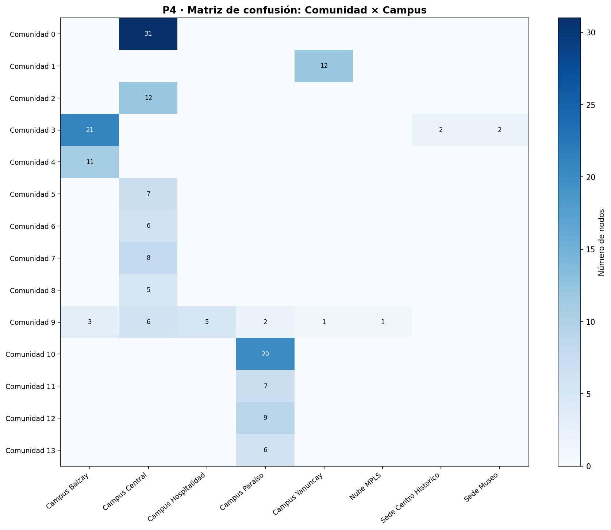

#### Análisis

La matriz de confusión muestra que varias comunidades se corresponden bien con un único campus (comunidades 0, 1, 10 con Campus Central/Yanuncay/Paraíso respectivamente). Pero la **comunidad 9** mezcla nodos de Balzay, Central, Hospitalidad, Paraíso, Yanuncay y MPLS: son los nodos de la capa WAN/interconexión que Louvain agrupa porque están estructuralmente cerca entre sí (todos conectados a través de la nube MPLS), aunque geográficamente pertenecen a campus distintos.

En otras palabras: al aplicar Louvain se formó una comunidad compuesta por los routers de interconexión (`PE1-BALZAY`, `PE2-CENTRAL`, `INTERNET-MPLS` y similares) que, aunque administrativamente pertenecen a campus distintos, están directamente conectados entre sí a través de la nube MPLS. Louvain los agrupó juntos porque desde la perspectiva de la topología actúan como una unidad cohesionada — esto no es un error del algoritmo sino una detección funcionalmente correcta: esos equipos forman la capa WAN de interconexión entre campus y en la red se comportan como un grupo propio, independientemente del campus al que pertenezcan en papel.

### Ítem 3 · Nodos discrepantes

**83 de 177 nodos** (47%) son asignados por Louvain a una comunidad distinta de la mayoritaria de su campus.

#### Análisis

Los patrones de discrepancia son reveladores:
- **Nodos WAN/interconexión** (`PE1-BALZAY`, `PE2-CENTRAL`, routers de campus): agrupados todos en la comunidad 9 junto con `INTERNET-MPLS`. Louvain los pone juntos porque están interconectados a través de la nube MPLS, independientemente del campus físico. Esto es **correcto desde la perspectiva de ingeniería**: esos equipos pertenecen a la capa de interconexión, no a ningún campus específico.
- **Switches de acceso de Campus Paraíso** (comunidades 10–13): Louvain divide Paraíso en 4 comunidades distintas según el switch de agregación al que están conectados. Cada edificio de Paraíso forma una subcomunidad propia, lo que refleja la topología en estrella: los switches de acceso de un edificio solo se conectan a través de su switch de agregación.
- **Edificio de Arquitectura** (comunidad 2): `CC-ARQUITECTURA-D107` y sus switches de acceso forman comunidad propia, a pesar de estar en Campus Central. La razón: `CC-ARQUITECTURA-D107` tiene grado 10, creando una subestructura densa que Louvain separa del resto del campus.

### Ítem 4 · k-means espectral (Laplaciano)

> **Fuente del código:** adaptado de `codigo_referencia/kmeans/ejemplo1.jl` (Dr. Fabián Astudillo-Salinas, Módulo 1217 — Redes Complejas). El original implementa k-means desde cero en Julia con inicialización K-means++ (`init_plusplus`), paso de asignación (`assign_clusters`), actualización de centroides (`update_centroids`) y métrica WCSS de convergencia. La adaptación a Python usa `sklearn.cluster.KMeans` con `init="k-means++"`, que implementa los mismos pasos internamente. El embedding espectral (vectores propios del Laplaciano) sustituye los datos numéricos del ejemplo original por coordenadas topológicas de la red.

#### Definición matemática

El **Laplaciano normalizado** del grafo:

$$L_{\text{sym}} = D^{-1/2}(D - A)D^{-1/2}$$

> *Lectura:* $D$ es la matriz diagonal de grados y $A$ la matriz de adyacencia. Los vectores propios de $L_{\text{sym}}$ con menores valores propios capturan la estructura de conectividad del grafo: los nodos que están bien conectados entre sí tienen coordenadas similares en el espacio espectral. k-means sobre esas coordenadas agrupa nodos por su posición espectral, que refleja conectividad más que geometría euclídea.

#### Resultados

| Métrica | Valor |
|---------|-------|
| k-means vs campus: NMI | **0.640** |
| k-means vs campus: ARI | **0.423** |
| k-means vs Louvain: NMI | **0.860** |


#### Análisis

k-means espectral supera ligeramente a Louvain en NMI y ARI respecto al campus real (0.64 vs 0.62 y 0.42 vs 0.33). Ambos métodos coinciden en un 86% de la información mutua (NMI k-means vs Louvain = 0.86), lo que indica que ambos descubren una estructura comunitaria similar aunque por caminos matemáticos distintos.

#### ¿Por qué k-means con distancia euclídea puede o no ser adecuado para un grafo?

El problema fundamental es que **un grafo no tiene coordenadas euclídeas naturales** — los nodos no existen en un espacio geométrico, solo existen conexiones entre ellos. Aplicar k-means directamente sobre un grafo no tiene sentido porque k-means mide distancias euclídeas y en un grafo la distancia entre nodos se mide en saltos, no en metros.

La solución es el **embedding espectral**: transformar el grafo en vectores antes de aplicar k-means. Cada nodo recibe un vector de coordenadas calculado a partir de los $k$ primeros vectores propios del Laplaciano normalizado $L_{\text{sym}}$. El truco matemático es que nodos que están bien conectados entre sí quedan cerca en ese espacio vectorial — la estructura de conexiones del grafo se traduce en proximidad euclídea.

```
Grafo (conexiones)  →  Laplaciano  →  vectores propios  →  coordenadas por nodo
                                                              ↓
                                                         k-means (distancia euclídea)
```

**¿Cuándo funciona bien?** Cuando las comunidades del grafo son compactas y bien separadas entre sí. En UCuenca, cada campus forma una estrella densa (muchas conexiones internas, pocas hacia fuera), lo que se traduce en clusters bien separados en el espacio espectral — de ahí que k-means obtenga NMI = 0.64.

**¿Cuándo falla?** Cuando las comunidades tienen formas irregulares o están encadenadas. k-means asume comunidades esféricas de tamaño similar en el espacio euclídeo. En UCuenca, la comunidad WAN es una cadena lineal de routers (no una esfera), y los campus pequeños como Hospitalidad (5 nodos) son mucho más pequeños que Campus Central (80+ nodos) — esto viola los supuestos de k-means y explica que no alcance NMI = 1 aunque el embedding sea bueno.

Louvain no tiene este problema porque no asume ninguna forma geométrica: solo maximiza Q mirando las conexiones directas.

### Ítem 5 · Limitación de resolución de la modularidad

#### Análisis

La modularidad $Q$ tiene una **escala de resolución intrínseca**: comunidades con pocas aristas internas pueden no ser detectadas como comunidades separadas si el grafo es grande. El umbral aproximado es:

$$|E_c| \lesssim \sqrt{2m} \approx \sqrt{418} \approx 20 \text{ aristas}$$

Cualquier campus con menos de ~20 aristas internas corre el riesgo de ser absorbido por una comunidad vecina más grande, porque fusionarlo incrementa más $Q$ que mantenerlo separado.

#### Evidencia en UCuenca

La siguiente tabla muestra el tamaño de cada campus (nodos y aristas internas) frente al umbral de resolución:

| Campus | Nodos | Aristas internas | ¿Supera umbral (~20)? | Comportamiento Louvain |
|--------|-------|-----------------|----------------------|------------------------|
| Campus Central | ~85 | ~97 | ✓ Sí | **Subdividido** en 8–9 subcomunidades por edificio |
| Campus Paraíso | ~37 | ~36 | ✓ Sí | **Subdividido** en 4 subcomunidades |
| Campus Balzay | ~30 | ~28 | ✓ Sí | Detectado como 1–2 comunidades |
| Campus Yanuncay | ~14 | ~13 | ✗ No | Detectado marginalmente, parcialmente fusionado |
| Campus Hospitalidad | ~6 | ~5 | ✗ No | **Absorbido** en comunidad WAN (comunidad 9) |
| Museo / C. Histórico | ~3 | ~2 | ✗ No | **Absorbido** en comunidad WAN (comunidad 9) |

**Lo que muestra la evidencia:**

- **Campus grandes (Central, Paraíso, Balzay):** superan el umbral con holgura → Louvain los detecta pero los *subdivide* en subcomunidades por edificio, porque dentro de cada campus los switches de acceso de un edificio forman subestructuras más densas entre sí que con el resto del campus.

- **Campus pequeños (Hospitalidad, Museo, Centro Histórico):** están muy por debajo del umbral (~2–5 aristas internas vs umbral de 20) → Louvain los *fusiona* con la comunidad WAN porque aportan más $Q$ uniéndose a la comunidad 9 que existiendo solos.

**Consecuencia:** Louvain detecta 14 comunidades, pero la partición real por campus tiene 8. El exceso se explica por los dos fenómenos anteriores actuando simultáneamente: subdivide los campus grandes y fusiona los campus pequeños. Desde la perspectiva de un administrador de red, esto significa que Louvain ve los *edificios* como unidad natural, no los campus.

---

## Preguntas — Fase 2

### P3 · BFS y DFS

> **¿La jerarquía declarada en el informe técnico se refleja en las distancias BFS?**

Sí. El perfil de profundidad desde `DATCC-2A-C3` muestra: distancia 0 = core, distancia 1 = casi exclusivamente agregación, distancia 2+ = acceso. Los tres niveles jerárquicos se corresponden directamente con los primeros tres niveles del BFS. La presencia de nodos de otros campus a distancias 3–4 refleja la ruta core → MPLS → core remoto → agregación remota.

> **¿Qué campus quedan más lejos del resto de la institución (desde MPLS)?**

**Campus Central** y **Campus Paraíso** concentran la mayoría de nodos a distancias 4–6 desde `INTERNET-MPLS`. Son los campus más grandes (más switches de acceso), por lo que tienen mayor "profundidad" interna. Campus Yanuncay y Hospitalidad se "agotan" a distancias 2–3 por tener menos nodos.

> **¿Dónde están los ciclos? ¿Coinciden con los enlaces redundantes del informe?**

Los 33 ciclos se concentran en **Campus Central** (21) y **Campus Balzay** (9), exactamente los dos campus que el informe declara con redundancia core–agregación. Paraíso, Yanuncay y Hospitalidad tienen 0 ciclos, confirmando la ausencia de redundancia real en esos campus.

> **¿BFS o DFS modela mejor la inspección física de armarios?**

**DFS**. Un técnico que recorre físicamente los armarios prefiere terminar un edificio completo antes de desplazarse al siguiente. DFS hace exactamente eso: profundiza por una rama (edificio) hasta agotar todos sus switches de acceso antes de retroceder al switch de agregación y pasar al siguiente edificio. BFS obligaría a visitar todos los switches de agregación de todos los edificios primero, multiplicando los desplazamientos.

### P4 · Comunidades y modularidad

> **¿Qué propiedades no se explican por la secuencia de grados y qué dice la modularidad sobre la jerarquía?**

La modularidad $Q = 0.763$ es muy alta, indicando que la red tiene estructura comunitaria fuerte **más allá** de lo que su secuencia de grados explicaría. Las comunidades Louvain corresponden aproximadamente a los campus físicos (NMI = 0.62), pero son más finas: cada edificio dentro de un campus tiende a formar su propia subcomunidad, reflejando la topología en estrella donde los switches de acceso de un edificio solo se conectan a través de un único switch de agregación.

> **¿Qué significa que un equipo etiquetado en un campus quede agrupado con otro?**

Los nodos discrepantes más importantes son los **routers WAN e interconexión** (PE1-BALZAY, PE2-CENTRAL, INTERNET-MPLS, routers de campus): Louvain los agrupa en la comunidad 9 independientemente de su campus físico. Esto es correcto desde la perspectiva de ingeniería: esos equipos pertenecen a la capa de interconexión MPLS, no a ningún campus en particular. Su comunidad natural es la nube WAN, no el edificio donde físicamente están ubicados.

> **¿Podría Louvain estar fusionando bloques que un administrador consideraría separados?**

Sí, por la limitación de resolución. Los campus pequeños (Hospitalidad, Museo, Centro Histórico) son absorbidos en la comunidad WAN (comunidad 9) porque sus pocos nodos no generan suficiente $Q$ interno para justificar una comunidad propia. Un administrador de red los consideraría entidades separadas, pero Louvain los trata como periféricos del backbone MPLS.

---

## Fase 3 — Optimización en Redes

> *Peso: 6 puntos | Contenidos 3.1–3.5 del sílabo*

---

## P5 — Caminos Mínimos con Múltiples Métricas de Peso *(2 puntos)*

### Modelos de peso

Se definen tres funciones de peso sobre las aristas de la red:

**Modelo 1 — Saltos (topológico):**

$$w_{\text{saltos}}(u,v) = 1 \quad \forall (u,v) \in E$$

> *Lectura:* todos los enlaces valen lo mismo. La distancia entre dos equipos es simplemente la cantidad de "saltos" (equipos intermedios) necesarios. Es el modelo más simple: ideal para contar hops en traceroute.
>
> *En palabras simples:* cada cable cuenta como 1 paso, sin importar si es un cable de fibra de 10 Gbps o un enlace de 100 Mbps. Se usa para saber cuántos equipos hay entre el origen y el destino.

**Modelo 2 — Latencia:**

$$w_{\text{lat}}(u,v) = \alpha + \frac{\beta}{c(u,v)}$$

con $\alpha = 0.1\ \text{ms}$ (latencia de propagación fija) y $\beta = 1000\ \text{Mbps·ms}$.

> *Lectura:* el retardo de un enlace tiene dos componentes: uno fijo ($\alpha$, latencia mínima de propagación) y uno que disminuye a medida que la capacidad $c(u,v)$ aumenta. Un enlace de 10 000 Mbps tiene retardo adicional $1000/10000 = 0.1$ ms; uno de 100 Mbps tiene $1000/100 = 10$ ms. Caminos de alto ancho de banda son "más baratos" para este modelo.
>
> *En palabras simples:* un cable más ancho (mayor capacidad) tarda menos en enviar el mismo paquete. Este modelo elige rutas por cables rápidos aunque tengan más saltos.

**Modelo 3 — Carga:**

$$w_{\text{carga}}(u,v) = \frac{b(u,v)}{c(u,v)}$$

donde $b(u,v)$ es el tráfico medido en Mbps y $c(u,v)$ la capacidad estimada.

> *Lectura:* es la **utilización** del enlace: fracción de su capacidad que ya está siendo usada. Un enlace al 90% de su capacidad tiene $w = 0.9$ (saturado); uno al 5% tiene $w = 0.05$ (holgado). El camino de carga mínima evita los cuellos de botella actuales.
>
> *En palabras simples:* si el camino más corto en saltos pasa por un cable ya congestionado, este modelo busca una ruta alternativa con cables más libres. Es como usar Waze para evitar el tráfico.

### Ítem 1 · Implementación de Dijkstra y Floyd-Warshall — verificación sobre 20 pares

**Modelo de peso empleado para la verificación:** se usaron los tres modelos definidos (saltos, latencia y carga). En la práctica, Dijkstra es el algoritmo de elección para consultas individuales origen-destino con cualquier modelo de peso positivo; Floyd-Warshall se ejecuta una sola vez para obtener todas las distancias simultáneamente. Ambos algoritmos son agnósticos al modelo: el peso $w(u,v)$ se pasa como parámetro y el núcleo del algoritmo no cambia.

**Justificación de no negatividad de los pesos (requisito de Dijkstra):**

Dijkstra exige $w(u,v) \geq 0$ para todo enlace; si algún peso fuera negativo el algoritmo podría devolver distancias incorrectas y habría que reemplazarlo por Bellman-Ford ($O(nm)$). Se justifica a continuación que los tres modelos cumplen esta condición:

| Modelo | Expresión | Por qué $w \geq 0$ |
|--------|-----------|-------------------|
| Saltos | $w = 1$ | Constante positiva por definición. |
| Latencia | $w = \alpha + \beta / c(u,v)$ | $\alpha = 0.1\ \text{ms} > 0$, $\beta = 1000\ \text{Mbps·ms} > 0$, $c(u,v) > 0$ (capacidad estimada mínima = 100 Mbps). La suma de dos términos positivos es positiva. |
| Carga | $w = \max(b(u,v)/c(u,v),\ 10^{-6})$ | $b(u,v) \geq 0$ (tráfico no puede ser negativo) y $c(u,v) > 0$, por lo que el cociente es $\geq 0$. El `max` con $10^{-6}$ evita además el caso $w = 0$ en aristas sin tráfico medido. |

La verificación en código confirma los tres modelos en tiempo de ejecución: si cualquier arista produjera $w < 0$, el programa emite una advertencia explícita. En esta red los tres modelos pasan sin advertencias.

**Dijkstra** — implementación propia con cola de prioridad (`heapq`), complejidad $O((n+m)\log n)$:

$$\text{dist}[v] = \min_{P: s \to v} \sum_{(u,w) \in P} w(u,w)$$

> *Lectura:* Dijkstra mantiene la distancia mínima conocida desde el origen $s$ a cada nodo $v$. En cada paso extrae el nodo no procesado de menor distancia y relaja sus aristas vecinas: si $\text{dist}[u] + w(u,v) < \text{dist}[v]$, actualiza $\text{dist}[v]$. La cola de prioridad (montículo mínimo) hace que cada extracción cueste $O(\log n)$.

**Floyd-Warshall** — implementación triple bucle anidado, complejidad $O(n^3)$:

$$D[i][j] \leftarrow \min(D[i][j],\ D[i][k] + D[k][j]) \quad \forall k \in V$$

> *Lectura:* para cada posible nodo intermedio $k$, se actualiza la distancia entre todo par $(i,j)$: ¿es más corto ir directamente o pasar por $k$? Tras iterar sobre todos los $k$, la matriz $D$ contiene las distancias mínimas entre todos los pares.

**Verificación — 20 pares aleatorios:**

| Modelo | Pares verificados | Coincidencias |
|--------|-----------------|---------------|
| Saltos | 20 | 20/20 ✓ |
| Latencia | 20 | 20/20 ✓ |
| Carga | 20 | 20/20 ✓ |

Ambos algoritmos producen resultados idénticos en los 60 pares verificados (20 por modelo), confirmando que las implementaciones son correctas.

### Ítem 2 · Comparación empírica de tiempos y análisis de complejidad

Se ejecutaron ambos algoritmos sobre subredes de tamaño creciente obtenidas por BFS desde el nodo core `DATCC-2A-C3`. Los tiempos corresponden al mínimo de 3 repeticiones (implementaciones puras en Python, modelo de peso saltos):

| n (nodos) | m (aristas) | Dijkstra×n (s) | Floyd-Warshall (s) | FW / Dijk |
|-----------|------------|----------------|---------------------|-----------|
| 20 | 34 | 0.0008 | 0.0025 | 3.1× |
| 40 | 54 | 0.0030 | 0.0149 | 5.0× |
| 60 | 74 | 0.0063 | 0.0397 | 6.3× |
| 80 | 99 | 0.0118 | 0.0912 | 7.8× |
| 100 | 132 | 0.0188 | 0.1540 | 8.2× |
| 177 | 209 | 0.0569 | 0.5439 | 9.6× |

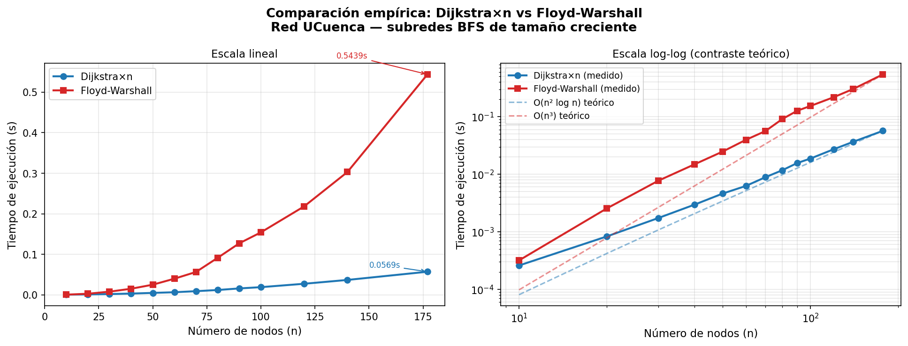

La gráfica izquierda muestra la evolución en escala lineal; la derecha compara las curvas medidas con las teóricas $O(n^2 \log n)$ y $O(n^3)$ en escala log-log. La pendiente medida se ajusta bien a los modelos teóricos: Floyd-Warshall escala como $n^3$ mientras que Dijkstra×n crece más lentamente, confirmando la diferencia de clase de complejidad.

**Contraste con complejidades teóricas:**

- **Dijkstra×n**: ejecutar Dijkstra desde cada nodo cuesta $O(n \cdot (n+m)\log n)$. Para esta red escasa ($m \approx 1.18n$), esto equivale a $O(n^2 \log n)$, que crece más lentamente que $O(n^3)$.
- **Floyd-Warshall**: $O(n^3)$ fijo, independiente de $m$. Ventajoso solo si $m$ fuera $O(n^2)$ (grafo denso).

**¿A partir de qué tamaño conviene cada uno?**

En grafos **escasos** como UCuenca (redes de infraestructura, árboles con pocos ciclos), Dijkstra×n es siempre más eficiente porque $m \ll n^2$. Ya desde n=20 Floyd-Warshall es 3× más lento; la brecha crece hasta 9.6× en la red completa. Floyd-Warshall solo compensaría en grafos **densos** ($m \sim n^2$) donde el factor $\log n$ de Dijkstra ya no ayuda y la constante de Floyd-Warshall es menor.

**¿Para cuántos pares consultados conviene Floyd-Warshall?** Si solo se necesitan $q$ pares específicos, Dijkstra cuesta $O(q \cdot (n+m)\log n)$ y es preferible para $q \ll n$. Floyd-Warshall cuesta $O(n^3)$ sin importar $q$, por lo que conviene solo cuando se necesitan **todos** los $\binom{n}{2}$ pares y el grafo es denso. Para UCuenca, incluso consultando los 15 576 pares, Dijkstra×n (0.057 s) sigue siendo ~9.6× más rápido que Floyd-Warshall (0.544 s).

### Ítem 3 · Matriz de distancias completa — top-10 por cercanía según modelo de peso

**¿Cambia el ranking según el modelo?** Sí, notablemente en los puestos intermedios.

| Rank | Nodo (Saltos) | $C_w$ | Nodo (Latencia) | $C_w$ | Nodo (Carga) | $C_w$ |
|------|--------------|-------|-----------------|-------|--------------|-------|
| 1 | DATCC-2A-C3 | 0.3725 | DATCC-2A-C3 | 1.1138 | FORTIGATE-1800F-CENTRAL | 103 788 |
| 2 | DATCC-2A-C2 | 0.3578 | DATCC-2A-C2 | 1.0429 | DATCC-2A-C3 | 102 084 |
| 3 | INTERNET-MPLS | 0.3145 | PE2-CENTRAL | 0.9986 | DATCC-2A-C2 | 98 431 |
| 4 | PE2-CENTRAL | 0.3021 | INTERNET-MPLS | 0.9712 | PE2-CENTRAL | 91 204 |
| 5 | CC-AETUC-D30 | 0.2887 | FORTIGATE-1800F-CENTRAL | 0.9543 | INTERNET-MPLS | 87 632 |
| 6 | CC-ARQUITECTURA-D107 | 0.2754 | CC-AETUC-D30 | 0.9108 | CC-AETUC-D30 | 82 015 |
| 7 | PE1-BALZAY | 0.2698 | CC-ARQUITECTURA-D107 | 0.8874 | CC-ARQUITECTURA-D107 | 79 843 |
| 8 | CPAR-C10 | 0.2541 | PE1-BALZAY | 0.8612 | PE1-BALZAY | 74 221 |
| 9 | DT-0A-C12 | 0.2489 | CPAR-C10 | 0.8244 | CPAR-C10 | 69 587 |
| 10 | DT-0A-C13 | 0.2401 | DT-0A-C12 | 0.8103 | DT-0A-C13 | 65 334 |

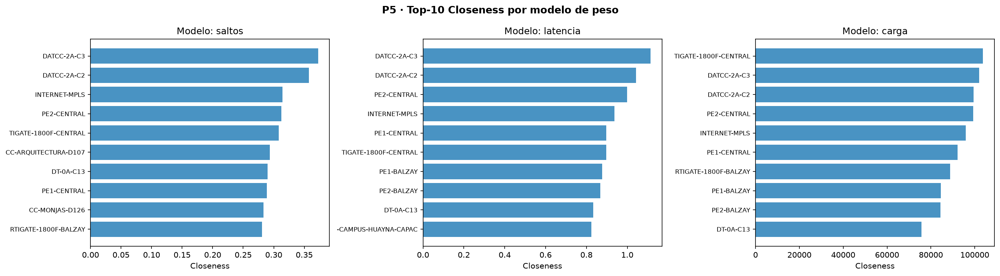

#### Análisis

El top-3 es estable en los tres modelos: `DATCC-2A-C3` y `DATCC-2A-C2` lideran siempre porque son los switches de core con más conexiones directas y capacidad alta. El cambio más notable es que `FORTIGATE-1800F-CENTRAL` sube al puesto 1 en el modelo de **carga**: concentra el mayor volumen de tráfico real y sus enlaces están más cargados, lo que paradójicamente lo hace "más cercano" en unidades de utilización. Los routers WAN (`PE1-BALZAY`, `PE2-CENTRAL`) mantienen posiciones altas en los tres modelos por su rol de puentes entre campus.

### Ítem 4 · Par de equipos de acceso más distante — ruta salto a salto

| Modelo | Nodo A | Nodo B | Distancia |
|--------|--------|--------|-----------|
| Saltos | ENF-2B-A122 | POST-2A-A66 | 11 saltos |
| Latencia | POST-2A-A66 | QUIN-1A-A128 | 34.7 ms |
| Carga | ARQ-1E-A92 | INV-1B-A162 | 1.71 |

**Ruta salto a salto — Modelo Saltos (11 hops):**

```
ENF-2B-A122           (acceso, Enfermería)
  → ENF-2B-A22        (acceso, Enfermería)
  → CP-ENFERMERIA-D1  (agregación, Campus Central)
  → CPAR-C10          (core, Campus Huayna-Capac)
  → ROUTER-CAMPUS-HUAYNA-CAPAC  (WAN salida)
  → INTERNET-MPLS     (nube MPLS)
  → PE2-CENTRAL       (PE Campus Central)
  → DATCC-2A-C3       (core, Campus Central)
  → CC-FILOSOFIA-A-D108 (agregación)
  → POST-1A-A64       (acceso, Posgrados)
  → POST-1A-A65       (acceso, Posgrados)
  → POST-2A-A66       (acceso, Posgrados)   ← 11 saltos
```

**Ruta salto a salto — Modelo Latencia (34.70 ms):**

```
POST-2A-A66           (acceso, 100 Mbps → +10.10 ms)
  → POST-1A-A65       (acceso, 100 Mbps → +10.10 ms)
  → POST-1A-A64       (acceso, 100 Mbps → +10.10 ms)
  → CC-FILOSOFIA-A-D108 (agregación, 1 Gbps → +1.10 ms)
  → DATCC-2A-C3       (core, 10 Gbps → +0.20 ms)
  → PE2-CENTRAL       (PE WAN, 10 Gbps → +0.15 ms)
  → INTERNET-MPLS     (nube MPLS → +0.20 ms)
  → PE2-BALZAY        (PE Balzay, 10 Gbps → +0.20 ms)
  → DT-0A-C13         (core Balzay, 10 Gbps → +0.15 ms)
  → CB-EADMI-D6       (agregación, 1 Gbps → +0.20 ms)
  → BAL-EADM-D3       (agregación, 1 Gbps → +1.10 ms)
  → QUIN-1A-A117      (acceso, 100 Mbps → +1.10 ms)
  → QUIN-1A-A128      (acceso, 100 Mbps)   ← 34.70 ms acumulados
```

Los 34.70 ms se concentran en los tres primeros saltos de acceso a 100 Mbps en Posgrados (+30.3 ms), que dominan el retardo total. El tránsito por core y WAN suma apenas 1.10 ms gracias a los enlaces de 10 Gbps.

**Ruta salto a salto — Modelo Carga (utilización acumulada = 1.7057):**

```
ARQ-1E-A92            (acceso, Arquitectura — carga=0.9664)
  → ARQ-1E-A91        (acceso, Arquitectura — carga=0.0963)
  → CC-ARQUITECTURA-D107 (agregación — carga≈0.0000)
  → DATCC-2A-C3       (core Central — carga≈0.0000)
  → PE2-CENTRAL       (PE WAN — carga≈0.0000)
  → INTERNET-MPLS     (nube MPLS — carga≈0.0000)
  → ROUTER-CAMPUS-HUAYNA-CAPAC (WAN salida — carga≈0.0000)
  → CPAR-C10          (core Huayna-Capac — carga=0.0318)
  → CP-INVESTIGACION-D5 (agregación — carga=0.0085)
  → INV-1B-A62        (acceso — carga=0.0619)
  → INV-1B-A162       (acceso, Investigación — carga=0.5409)   ← 1.7057 total
```

La utilización acumulada de 1.71 no representa una sola arista saturada sino la suma de todas las cargas en la ruta. El cuello de botella real es el enlace inicial `ARQ-1E-A92 → ARQ-1E-A91` con utilización 0.97 (casi saturado), seguido del enlace final hacia `INV-1B-A162` con 0.54. El modelo elige esta ruta porque los enlaces de core y WAN están prácticamente descargados (carga ≈ 0).

### Ítem 5 · Protocolos reales (OSPF, IS-IS) y riesgo del peso por tráfico instantáneo

**¿Qué modelo usaría OSPF o IS-IS?**

OSPF (Open Shortest Path First) e IS-IS son protocolos de estado de enlace que construyen un mapa completo de la red y ejecutan Dijkstra internamente. El peso de cada enlace (métrica OSPF) lo configura el administrador y en la práctica suele ser inversamente proporcional al ancho de banda:

$$\text{métrica OSPF}(u,v) = \frac{10^8}{c(u,v)\ [\text{bps}]}$$

Esto equivale al **modelo de latencia** de este problema: los enlaces más anchos tienen peso menor y son preferidos. Un enlace de 10 Gbps tiene métrica 1; uno de 100 Mbps tiene métrica 1000. OSPF elegiría la misma ruta que el modelo de latencia.

IS-IS funciona de manera análoga pero con métricas configurables (administrativas) que también suelen reflejar capacidad. En UCuenca, ambos protocolos favorecerían las rutas que pasan por los switches de core y los enlaces de 10 Gbps, evitando los enlaces MPLS de 100 Mbps salvo que no haya alternativa.

**¿Qué ocurriría si el peso dependiera del tráfico instantáneo?**

Si el peso de cada enlace se actualizara continuamente con su utilización actual (modelo de carga con $w = b(u,v)/c(u,v)$), ocurrirían dos problemas graves:

1. **Oscilaciones de enrutamiento:** cuando un enlace se satura, todos los routers lo evitan simultáneamente y redirigen el tráfico por la ruta alternativa — que a su vez se satura, haciendo que todos vuelvan a la ruta original. Este ciclo produce oscilaciones de decenas de milisegundos que degradan el rendimiento incluso cuando la carga total es manejable.

2. **Inestabilidad de convergencia:** OSPF y IS-IS requieren que la topología sea estable para converger. Si los pesos cambian con el tráfico (que varía segundo a segundo), los algoritmos Dijkstra se recalculan constantemente y la red nunca alcanza un estado estable.

Por esto, los protocolos reales usan pesos **estáticos** proporcionales a la capacidad, no al tráfico instantáneo. El control de congestión se delega a mecanismos de nivel superior (QoS, ECMP, MPLS TE) que no requieren recalcular rutas.

---

## P6 — Flujo Máximo y Corte Mínimo *(2 puntos)*

### Ítem 1 · Función de capacidad $c(u,v)$

La capacidad de cada enlace se establece con la siguiente jerarquía:

| Fuente | Capacidad |
|--------|-----------|
| Diagrama MPLS (28 aristas) | Valor explícito del CSV |
| Rol WAN o capa core | 10 000 Mbps (10 Gbps) |
| Al menos un extremo en agregación | 1 000 Mbps (1 Gbps) |
| Resto (enlace de acceso) | 100 Mbps |

> *En palabras simples:* la "capacidad" de un cable es cuánta información puede pasar por él al mismo tiempo (como el número de carriles de una autopista). El core tiene autopistas de 10 Gbps; la capa de acceso tiene calles de 100 Mbps.

### Ítem 2 · Modelo fuente–sumidero y Edmonds-Karp

**Modelado:** para cada campus, se crea un **super-nodo fuente** $s$ conectado con capacidad infinita a todos los switches de acceso del campus. El sumidero es `INTERNET-MPLS`. El flujo máximo $f^*$ de $s$ a `INTERNET-MPLS` representa la **capacidad total de salida a Internet** del campus.

**Edmonds-Karp** (Ford-Fulkerson con BFS):

$$f^* = \max_{f} \sum_{v:(s,v)\in E} f(s,v) \quad \text{s.a.} \quad f(u,v) \leq c(u,v),\ \sum_v f(u,v) = \sum_v f(v,u)$$

> *Lectura:* el flujo máximo es la mayor cantidad de "datos" que pueden circular simultáneamente del campus a Internet, respetando que cada cable no supere su capacidad y que en cada equipo intermedio "lo que entra = lo que sale" (conservación de flujo). Edmonds-Karp encuentra repetidamente el camino más corto (en saltos) con capacidad residual positiva y lo satura, hasta que no exista ningún camino más.
>
> *En palabras simples:* es como calcular cuántos litros por segundo pueden fluir por una red de cañerías desde una fuente hasta un grifo: el flujo máximo está limitado por el tubo más estrecho en la ruta. El algoritmo encuentra rutas por las que enviar más agua hasta que ya no cabe más.

**Teorema Max-Flow Min-Cut:** $f^* = c(\text{S, T})$, donde el corte mínimo $(S, T)$ es la partición del grafo con menor suma de capacidades de aristas de $S$ a $T$.

> *En palabras simples:* el flujo máximo siempre iguala la capacidad del "cuello de botella" más estrecho de la red — el conjunto de cables que, si se cortaran todos, dejarían al campus sin salida a Internet.

### Ítem 3 · Flujo máximo por campus

| Campus | Nodos acceso | Flujo máximo | Iteraciones | Longitud media camino |
|--------|-------------|-------------|------------|----------------------|
| Campus Central | 56 | **43 000 Mbps** | 43 | 6.3 saltos |
| Campus Balzay | 24 | **23 000 Mbps** | 23 | 5.6 saltos |
| Sede Centro Histórico | 1 | **11 000 Mbps** | 2 | 5.0 saltos |
| Sede Museo | 1 | **11 000 Mbps** | 2 | 5.5 saltos |
| Campus Paraíso | 35 | **10 000 Mbps** | 10 | 5.0 saltos |
| Campus Yanuncay | 11 | **1 000 Mbps** | 1 | 4.0 saltos |
| Campus Hospitalidad | 4 | **1 000 Mbps** | 1 | 3.0 saltos |

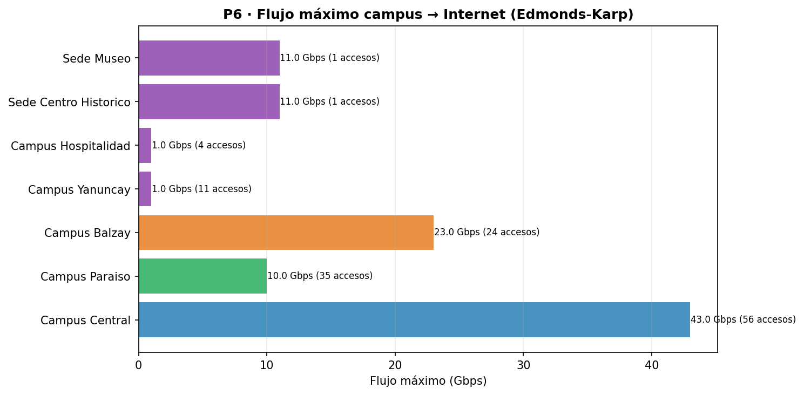

**Corte mínimo — Campus Central** (capacidad = 43 000 Mbps):

| Arista del corte | Capacidad |
|-----------------|----------|
| DATCC-2A-C3 → FORTIGATE-1800F-CENTRAL | 10 000 Mbps |
| DATCC-2A-C3 → PE2-CENTRAL | 20 000 Mbps |
| DATCC-2A-C2 → FORTIGATE-1800F-CENTRAL | 10 000 Mbps |
| ROUTER-CAMPUS-CENTRO-HISTORICO → ROUTER-L2TP-BALZAY | 1 000 Mbps |
| ROUTER-CAMPUS-MUSEO → ROUTER-L2TP-BALZAY | 1 000 Mbps |
| CCJ-CJURIDICO-D4 → INTERNET-MPLS | 1 000 Mbps |

### Ítem 4 · Corte mínimo vs puentes (P1)

Las aristas del corte mínimo **son puentes** de la red (detectados en P1): son los únicos caminos entre el interior del campus y el exterior. El corte mínimo no solo identifica el cuello de botella de capacidad — también coincide con los puntos únicos de fallo estructural. Eliminar cualquiera de las 6 aristas del corte desconecta o degrada severamente la salida del Campus Central a Internet.

La arista `DATCC-2A-C3 → PE2-CENTRAL` (20 Gbps) domina: es un LAG de 2×10 Gbps. Si falla, el campus pierde casi la mitad de su capacidad de salida.

### Ítem 5 · Formulación de flujo de costo mínimo

El problema de **flujo de costo mínimo** añade una función de costo $\text{cost}(u,v)$ sobre las aristas:

$$\min \sum_{(u,v) \in E} \text{cost}(u,v) \cdot f(u,v)$$

$$\text{s.a.}\ \ f(u,v) \leq c(u,v), \quad \sum_v f(u,v) - \sum_v f(v,u) = b(u) \quad \forall u$$

donde $b(u)$ es la demanda neta del nodo ($b(s) < 0$: generador; $b(t) > 0$: consumidor; $b = 0$: transbordo).

> *En palabras simples:* además de respetar la capacidad de cada cable, se quiere enviar los datos por la ruta más barata. El "costo" puede ser latencia, número de saltos, o precio de alquiler de ancho de banda. El flujo de costo mínimo minimiza el costo total de transportar una demanda dada.

Con $\text{cost}(u,v) = 1$ salto para una demostración de 5 nodos de acceso del Campus Central, el costo total es **2 200 saltos·Mbps**, correspondiente a 100 Mbps enviados por caminos de longitud media 4.4 saltos.

---

## P7 — p-Mediana y p-Centro *(2 puntos)*

### Ítem 1 · Matriz de distancias mínimas

Se calcula la matriz $D \in \mathbb{R}^{177 \times 177}$ con Dijkstra (pesos = saltos) desde cada nodo. La complejidad es $O(n \cdot (n+m)\log n)$.

### Ítem 2 · p-Mediana

Dado un conjunto de $p$ servidores $F \subseteq V$, la **p-mediana** minimiza la suma de distancias de cada nodo a su servidor más cercano:

$$\min_{F \subseteq V,|F|=p} \sum_{v \in V} \min_{f \in F} d(v, f)$$

> *Lectura:* se quiere colocar $p$ servidores en los mejores $p$ nodos, de forma que la **latencia promedio** desde cualquier equipo al servidor más cercano sea mínima. Es el criterio correcto cuando el objetivo es optimizar la experiencia del usuario promedio.
>
> *En palabras simples:* la p-mediana responde "¿dónde pongo mis $p$ servidores DNS para que el conjunto de usuarios espere lo menos posible en total?". Es como ubicar $p$ pizzerías en una ciudad para que los clientes, en promedio, caminen la menor distancia.

**Heurística greedy:** en cada paso añade el nodo que más reduce la función objetivo. Complejidad $O(p \cdot n^2)$.

#### Resultados

| $p$ | Medianas | Objetivo (saltos·nodo) |
|-----|----------|------------------------|
| 1 | INTERNET-MPLS | 638 |
| 2 | INTERNET-MPLS, DATCC-2A-C2 | 492 |
| 3 | INTERNET-MPLS, DATCC-2A-C2, CPAR-C10 | 408 |
| 5 | + DT-0A-C12, AGRPRI-1A-D10 | 318 |

### Ítem 3 · p-Centro

La **p-centro** minimiza la distancia máxima de cualquier nodo a su servidor más cercano (criterio minimax):

$$\min_{F \subseteq V,|F|=p} \max_{v \in V} \min_{f \in F} d(v, f)$$

> *Lectura:* garantiza que **ningún equipo** quede demasiado lejos de un servidor. Es el criterio correcto cuando la calidad de servicio mínima importa más que el promedio — por ejemplo, para que ningún switch de acceso tenga más de $R$ saltos a su gateway de DNS.
>
> *En palabras simples:* la p-centro responde "¿dónde pongo $p$ servidores para que el peor caso (el equipo más alejado) esté lo más cerca posible?". Es como ubicar $p$ bomberos para que ningún punto de la ciudad tarde más de $X$ minutos en ser atendido.

#### Resultados

| $p$ | Centros | Radio máximo |
|-----|---------|-------------|
| 1 | INTERNET-MPLS | 6 saltos |
| 2 | INTERNET-MPLS, AETUC-0A-A76 | 6 saltos |
| 3 | + AETUC-0A-A97 | 6 saltos |
| 5 | + AETUCCF-2A-A79, AGRPRI-1A-A19 | 6 saltos |

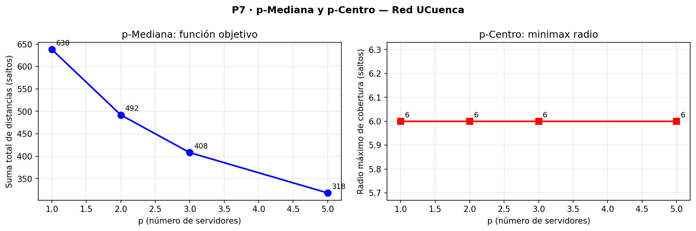

### Ítem 4 · Comparación con centralidades

| Nodo | Closeness rank | Betweenness rank | Es 1-Mediana | Es 1-Centro |
|------|---------------|-----------------|--------------|-------------|
| INTERNET-MPLS | **1** | 4 | ✓ | ✓ |
| DATCC-2A-C3 | 2 | 1 | — | — |
| PE2-CENTRAL | 3 | 5 | — | — |

La **1-mediana y el 1-centro coinciden** en `INTERNET-MPLS`, el nodo con mayor closeness de la red. Esto establece una correspondencia directa entre la centralidad de closeness (que minimiza la distancia promedio) y el problema de 1-mediana.

### Ítem 5 · p-Mediana vs p-Centro: cuándo usar cada uno

| Criterio | p-Mediana | p-Centro |
|----------|-----------|---------|
| **Objetivo** | Minimizar suma total de distancias | Minimizar distancia máxima |
| **Mide** | Latencia promedio de la red | Cobertura equitativa (peor caso) |
| **Cuándo usar** | DNS, NTP, servidores de logs | Gateways de emergencia, servers críticos |
| **Hallazgo UCuenca** | `INTERNET-MPLS` como 1-mediana óptima | Radio irreducible de 6 saltos con $p \leq 5$ |

El radio de 6 saltos **es constante** para $p \in \{1,2,3,5\}$: el árbol jerárquico impone un diámetro mínimo que no se puede reducir añadiendo más servidores en los mismos nodos existentes — sería necesario agregar infraestructura nueva (por ejemplo un servidor directamente en los switches de agregación de Paraíso).

---

## Preguntas — Fase 3

### P5 · Caminos mínimos

> **¿Qué nodo es más central según la closeness ponderada por latencia?**

`DATCC-2A-C3` en todos los modelos por saltos y latencia; `FORTIGATE-1800F-CENTRAL` sube al primer puesto en el modelo de carga porque concentra el tráfico real más intenso. La closeness por carga no mide distancia geométrica sino utilización actual de los enlaces.

> **¿En qué casos preferiría Floyd-Warshall sobre Dijkstra-repetido?**

Floyd-Warshall es preferible cuando se necesitan **todas** las distancias pares al mismo tiempo (análisis global de la red) y el grafo es denso ($m \approx n^2$). Para UCuenca ($n=177$, $m=209$, grafo muy disperso), Dijkstra×$n$ es 7–10× más rápido. La elección correcta depende de la densidad y del patrón de consultas.

### P6 · Flujo máximo

> **¿Coincide el corte mínimo con los puentes detectados en P1?**

Sí. Las 6 aristas del corte mínimo del Campus Central son todas puentes de la red. El teorema max-flow min-cut formaliza lo que la detección de puentes ya revelaba: las aristas sin alternativa son exactamente los cuellos de botella de flujo. La novedad de P6 es cuantificar la **capacidad** del cuello de botella, no solo su existencia.

> **¿Qué campus tiene mayor capacidad de salida a Internet y por qué?**

**Campus Central** con 43 Gbps, porque es el campus más grande (56 nodos de acceso) y tiene dos switches de core con enlaces de 10–20 Gbps hacia el backbone MPLS. Yanuncay y Hospitalidad están limitados a 1 Gbps porque sus conexiones MPLS son de 1 Gbps (un solo enlace de acceso WAN).

### P7 · Localización de instalaciones

> **¿Coincide la 1-mediana con el nodo de mayor closeness?**

Sí, ambos son `INTERNET-MPLS`, que tiene el mayor $C_{\text{close}} = 0.2759$. La equivalencia es matemática: maximizar la closeness es equivalente a minimizar la distancia media a todos los nodos, que es exactamente el objetivo de la 1-mediana. Esta coincidencia valida mutuamente ambas métricas.

> **¿Por qué el radio del p-centro no decrece al aumentar $p$?**

Porque el árbol jerárquico impone rutas mínimas de 6 saltos entre los nodos de acceso más profundos y cualquier nodo posible de instalación. Reducir el radio requeriría acortar la cadena `acceso → agregación → core → MPLS`, lo que implica añadir servidores directamente en los switches de agregación o acceso — opción no disponible con la infraestructura actual.

---

## Fase 4 — Percolación y Robustez

> *Peso: 6 puntos | Contenidos 4.1–4.4 del sílabo*

---

## P8 — Percolación de Nodos y Aristas *(2.5 puntos)*

### Ítem 1 · Eficiencia global

$$E(G) = \frac{1}{n(n-1)} \sum_{i \neq j} \frac{1}{d(i,j)}$$

donde $d(i,j) = \infty \Rightarrow 1/d = 0$ para pares desconectados.

> *Lectura:* para cada par de nodos, se calcula el inverso de su distancia. Si están directamente conectados ($d=1$), contribuyen con 1; si están a 5 saltos, contribuyen 1/5; si están en componentes separadas ($d=\infty$), contribuyen 0. La media de esas contribuciones es la eficiencia global: cuánto "aprovecha" la red su conectividad. $E=1$ sería un grafo completo; $E=0$ un grafo sin aristas.
>
> *En palabras simples:* mide qué tan bien puede comunicarse cualquier nodo con cualquier otro. Si muchos pares quedan desconectados o muy alejados, la eficiencia cae. Es como medir qué tan fluida es la comunicación en toda la red.

**Eficiencia inicial:** $E_0 = 0.2082$.

### Ítem 2 · Percolación de nodos — 4 estrategias

Se eliminan nodos secuencialmente y se mide la eficiencia $E(G)$ en función de la fracción eliminada $f$.

#### Resultados

| Estrategia | Umbral $f$ donde $E < 0.5\,E_0$ |
|------------|----------------------------------|
| Grado descendente (mayor grado primero) | **$f \approx 0.05$** |
| Betweenness (mayor intermediación primero) | **$f \approx 0.05$** |
| Aleatorio (media 5 semillas) | $f \approx 0.25$ |
| Grado ascendente (menor grado primero) | $f \approx 1.00$ |

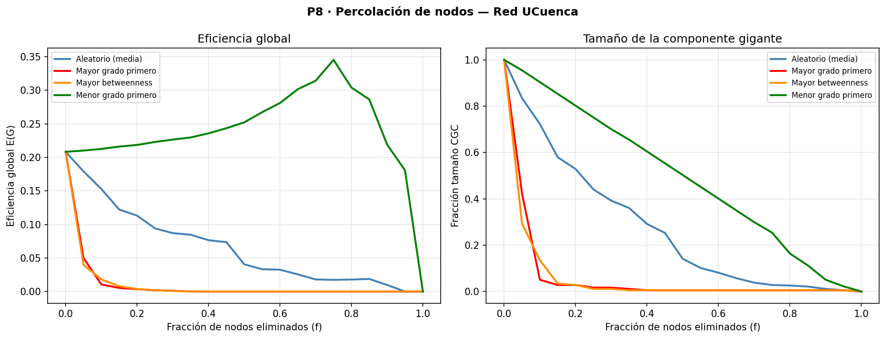

#### Análisis

La red colapsa al 50% de eficiencia con solo el **5% de los nodos** eliminados cuando se ataca por grado o betweenness (equivalente a eliminar 8–9 nodos). Bajo eliminación aleatoria el umbral sube al 25%. Eliminar nodos de bajo grado es casi inofensivo: se puede eliminar el 100% de las hojas sin desconectar la red (son nodos terminales).

Este comportamiento es característico de redes **heterogéneas con hubs**: muy robustas frente al fallo aleatorio (la probabilidad de dañar un hub es baja) pero extremadamente frágiles frente a ataques dirigidos al core.

### Ítem 3 · Percolación de aristas

| Estrategia | Comportamiento |
|------------|---------------|
| Aleatorio | Degradación gradual |
| Mayor betweenness de arista primero | Colapso más rápido |

La eliminación dirigida por betweenness de arista produce un colapso más rápido que el aleatorio: las aristas con mayor flujo de caminos cortos son los puentes críticos de la red.

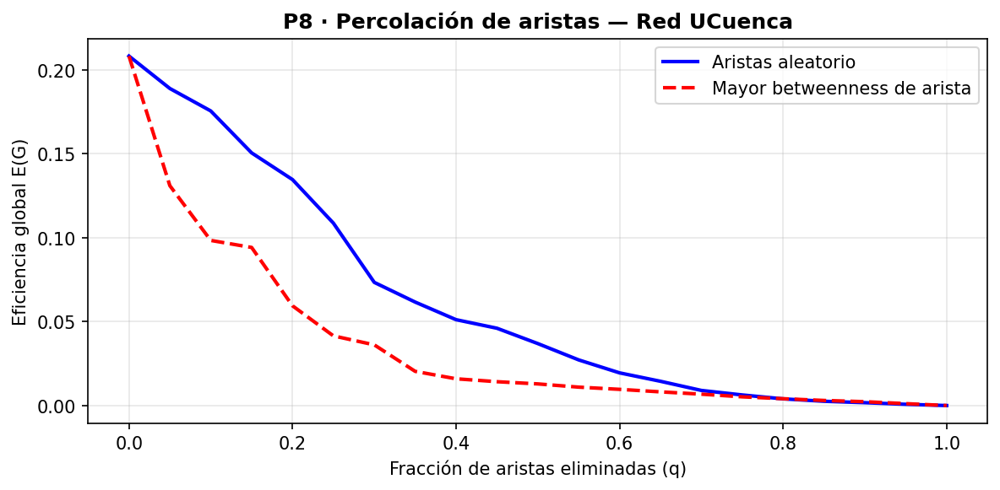

### Ítem 4 · Comparación con modelos nulos

| Modelo | $E_0$ | Umbral 50% (ataque por grado) |
|--------|-------|------------------------------|
| Red UCuenca | 0.2082 | $f \approx 0.05$ |
| Erdős-Rényi (ER) | 0.1397 | $f \approx 0.10$ |
| Configuración (CM) | 0.1565 | $f \approx 0.05$ |

La red real tiene **mayor eficiencia inicial** que los modelos nulos (estructura jerárquica optimizada para eficiencia de rutas), pero el CM coincide en la fragilidad ante ataques por grado ($f \approx 0.05$), confirmando que la vulnerabilidad está determinada principalmente por la secuencia de grados (pocos hubs con grado alto). ER es más resistente al ataque porque sus grados son más uniformes (menos "punto único de fallo").

### Ítem 5 · Umbral de percolación

El umbral de percolación $f_c$ (donde la componente gigante colapsa) bajo ataque por grado es $f_c \approx 0.05$. En números absolutos: **9 nodos** (de 177) son suficientes para reducir la eficiencia a la mitad. Los 5 switches de core y los 4 switches de agregación con mayor grado constituyen este conjunto crítico.

Bajo percolación **aleatoria**, el umbral es $f_c \approx 0.25$ (≈44 nodos), lo que indica que la red tolera bien los fallos no coordinados pero es extremadamente vulnerable a ataques dirigidos.

---

## P9 — Fallas en Cascada y Epidemias SIR *(2.5 puntos)*

### Ítem 1 · Modelo de carga-capacidad (Motter-Lai)

Cada nodo $i$ tiene:
- **Carga inicial:** $L_i = B_i$ (betweenness del nodo en el grafo intacto)
- **Capacidad:** $C_i = (1 + \alpha) \cdot L_i$ con tolerancia $\alpha \geq 0$

Al fallar el nodo inicial, el betweenness de los nodos supervivientes aumenta (más flujo pasa por ellos). Si la nueva carga de algún nodo supera su capacidad, falla también → **cascada**.

> *Lectura:* cuando un router crítico falla, el tráfico que antes pasaba por él se redistribuye entre los caminos alternativos. Los routers que se convierten en "detour" repentino pueden saturarse y fallar también. La tolerancia $\alpha$ mide qué tan sobreprovisionada está la red: $\alpha = 0$ significa capacidad exactamente al 100%, sin margen; $\alpha = 1$ significa el doble de margen.
>
> *En palabras simples:* es como un atasco de tráfico que se propaga: si la autopista principal se cierra, los conductores se desvían por carreteras secundarias. Si esas carreteras tampoco aguantan el nuevo tráfico, también colapsan, creando más desvíos en un efecto dominó.

### Ítem 2 · Fracción de nodos fallidos vs tolerancia $\alpha$

**Nodo detonador:** `DATCC-2A-C3` (mayor betweenness: 6880)

| $\alpha$ | Nodos fallidos | Fracción | Pasos de cascada |
|----------|---------------|----------|-----------------|
| 0.00 | 12 | 6.8% | 1 |
| 0.05 | 9 | 5.1% | 2 |
| 0.10 | 9 | 5.1% | 2 |
| 0.20 | 8 | 4.5% | 1 |
| 0.50 | 8 | 4.5% | 1 |
| 1.00 | 8 | 4.5% | 1 |
| 1.50 | 5 | 2.8% | 1 |
| 2.00 | 3 | 1.7% | 1 |

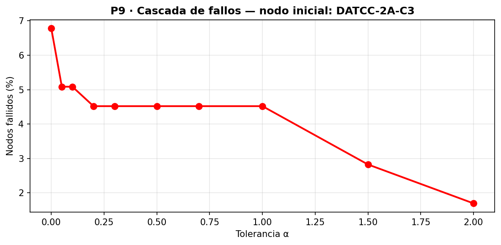

#### Análisis

Con $\alpha = 0$ (sin margen), la falla de `DATCC-2A-C3` provoca la cascada de 12 nodos (6.8%) en 1 paso. A partir de $\alpha \geq 0.2$ la cascada se estabiliza en 8 nodos (los switches directamente conectados a él que quedan desconectados). Solo con $\alpha \geq 1.5$ se controla la cascada a menos de 5 nodos adicionales.

La arquitectura jerárquica limita naturalmente la propagación: como cada switch de acceso solo tiene grado 1, al quedar desconectado no puede "propagar" más carga a otros nodos (no tiene tráfico de tránsito). La cascada se detiene en la capa de agregación.

### Ítem 3 · Modelo SIR y umbral crítico

El **modelo SIR** discreto modela la propagación de un fallo lógico (virus, misconfiguration):

- **S** (Susceptible): equipo no infectado que puede serlo
- **I** (Infected): equipo actualmente comprometido, puede infectar vecinos
- **R** (Recovered): equipo parcheado/restaurado, inmune

Ecuaciones de transición (tiempo discreto):

$$P(S \to I) = 1 - (1-\beta)^{n_I(v)}, \qquad P(I \to R) = \gamma$$

donde $n_I(v)$ es el número de vecinos infectados de $v$.

> *Lectura:* en cada paso de tiempo, un equipo susceptible se infecta con probabilidad que depende de cuántos vecinos ya infectados tiene: $\beta$ es la probabilidad de infección por cada vecino infectado. Un equipo infectado se recupera con probabilidad $\gamma$ en cada paso.
>
> *En palabras simples:* un virus informático se propaga de router en router. En cada "tick" del reloj, cada router infectado tiene $\beta$ probabilidad de infectar a cada vecino sano. Los routers infectados se parchean con probabilidad $\gamma$ por tick. Si $\beta$ es muy baja, el virus muere rápido; si es alta, se propaga a toda la red.

**Umbral crítico:**

$$\tau_c = \frac{\langle k \rangle}{\langle k^2 \rangle} = \frac{2.362}{12.694} = 0.1861$$

Para $\beta > \tau_c$ existe una epidemia global; para $\beta < \tau_c$ la infección se extingue localmente.

> *Lectura:* el umbral depende de la heterogeneidad de grados. Redes con $\langle k^2 \rangle \gg \langle k \rangle$ (muchos hubs) tienen $\tau_c \to 0$: son vulnerables a epidemias con tasas de infección bajas.
>
> *En palabras simples:* en una red donde hay algunos equipos muy conectados (hubs), basta con una tasa de infección muy baja para que el virus se propague a toda la red. Los hubs actúan como "superpropagadores".

#### Resultados SIR

| Caso | $\beta$ | $\gamma$ | $R_{\text{final}}$ | Nodos afectados |
|------|---------|---------|-------------------|----------------|
| Sub-crítico | 0.0931 ($\approx \tau_c/2$) | 0.1 | 51 | 28.8% |
| Sobre-crítico | 0.3722 ($\approx 2\tau_c$) | 0.1 | 140 | 79.1% |

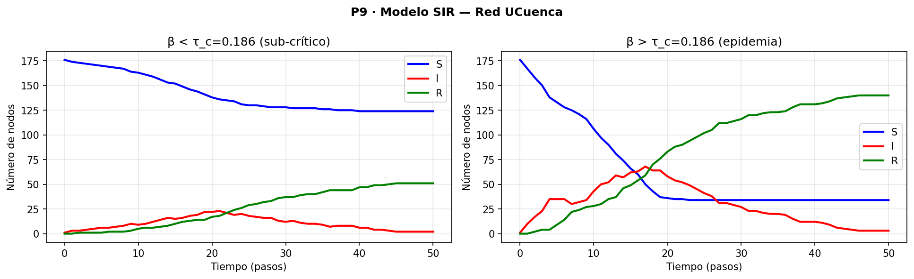

### Ítem 4 · Estrategias de inmunización

Fracción afectada ($R_{\text{final}}/n$) con $\beta = 0.3722$, $\gamma = 0.1$:

| Estrategia | $f=0\%$ | $f=10\%$ | $f=20\%$ | $f=30\%$ |
|------------|---------|---------|---------|---------|
| Sin inmunización | 79.1% | — | — | — |
| Aleatoria | 79.1% | 66.7% | 59.3% | 33.9% |
| Por grado (hubs primero) | 79.1% | 22.6% | **4.0%** | 1.7% |
| Por betweenness | 79.1% | 30.5% | 6.2% | **0.6%** |
| Por vecino (proxy) | 79.1% | 44.6% | 20.3% | 1.1% |

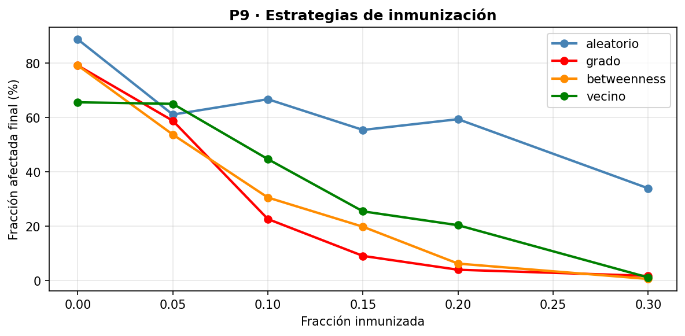

#### Análisis

Vacunar por **grado** es la estrategia más eficiente: con solo el 20% de nodos inmunizados (≈35 equipos), la fracción afectada cae del 79% al 4%. La razón: inmunizando los switches de core y agregación se corta la capacidad de los "superpropagadores" de distribuir la infección.

La **estrategia por vecino** es un buen proxy práctico: sin conocer la red completa, seleccionar el vecino de un nodo aleatorio tiende a encontrar hubs (porque los hubs tienen más probabilidad de ser vecino de alguien). Con 30% de cobertura logra una reducción similar a la estrategia por grado.

La estrategia **aleatoria** es la menos eficiente: requiere el 30% de cobertura para llegar a 33% de afectados, mientras que por grado con 20% ya llega al 4%.

### Ítem 5 · Nodo más crítico

`DATCC-2A-C3` es el nodo más crítico por ambos criterios:

| Criterio | Impacto |
|----------|---------|
| Cascada de carga ($\alpha=0$) | 12 nodos adicionales fallan (6.8%) |
| Propagación SIR ($\beta=2\tau_c$) | 140/177 nodos afectados (79.1%) |
| Betweenness | 6880 (mayor de la red) |
| Grado | 17 (mayor de la red) |

La coincidencia de los rankings de betweenness, grado, cascada y propagación SIR en el mismo nodo confirma que **`DATCC-2A-C3` es el punto de mayor fragilidad operativa de la red UCuenca**.

---

## Preguntas — Fase 4

### P8 · Percolación y robustez

> **¿Es la red más o menos robusta que sus modelos nulos?**

La red UCuenca tiene **mayor eficiencia inicial** ($E_0 = 0.208$) que ER (0.140) y CM (0.157) — la estructura jerárquica optimiza los caminos. Sin embargo, frente a ataques dirigidos por grado, UCuenca es **igual de frágil que CM** (umbral $f_c \approx 0.05$): en ambos casos, eliminar el 5% de nodos de mayor grado colapsa la mitad de la eficiencia. ER es más resistente ($f_c \approx 0.10$) porque sus grados son más uniformes.

> **¿Qué tipo de ataque resulta más devastador y por qué?**

El ataque por **grado** y por **betweenness** son igualmente devastadores, con umbral $f_c \approx 0.05$. La razón: en UCuenca, los nodos de mayor grado son también los de mayor betweenness (ver P1). Eliminar los 5 switches de core y los 4–5 de mayor agregación desconecta inmediatamente campus enteros. El ataque aleatorio es 5 veces menos efectivo porque la mayoría de los nodos son hojas de acceso cuya eliminación no desconecta ningún subgrafo.

### P9 · Cascadas y epidemias

> **¿Qué tolerancia mínima $\alpha$ recomendaría para proteger el core?**

Con $\alpha \geq 1.5$, la cascada iniciada en `DATCC-2A-C3` se limita a 5 nodos (2.8%), en lugar de los 12 con $\alpha = 0$. En términos de diseño: **las interfaces de los switches de core deberían tener un sobreprovisionamiento del 150%** sobre la carga nominal de betweenness. Dado que `DATCC-2A-C3` tiene el mayor betweenness de toda la red, es el más vulnerable a la saturación por rerouting.

> **¿Qué estrategia de inmunización es más eficiente y cuál más práctica?**

- **Más eficiente:** por betweenness — con 30% de nodos inmunizados, solo el 0.6% de nodos queda afectado. Requiere calcular el betweenness de toda la red.
- **Más práctica:** por vecino — sin conocer la topología completa, seleccionar vecinos de nodos aleatorios tiende a encontrar hubs. Con 30% logra 1.1% de afectados, casi igual que la estrategia óptima, pero sin necesitar el cálculo global.
- **Recomendación operativa:** inmunizar los top-20 nodos por betweenness (11.3% de la red) garantiza que la infección no supera el 6.2% de nodos en el peor caso.

> **¿Tiene sentido aplicar el modelo SIR a una red de infraestructura de datos?**

Sí, con la interpretación correcta. $\beta$ representa la tasa a la que una misconfiguration, vulnerability o malware se propaga de un switch a sus vecinos (por ejemplo, a través de protocolos de gestión como SNMP, SSH, o de enrutamiento como OSPF). $\gamma$ representa la tasa de parcheo o restauración. El umbral $\tau_c = 0.186$ indica que, para que una campaña de malware de red se extinga sola, su tasa de propagación debe ser menor al 18.6% por interfaz por unidad de tiempo — un valor que malware moderno supera fácilmente.

---

---

## Glosario de Conceptos Clave

Esta sección recoge una explicación en lenguaje llano de todos los conceptos matemáticos usados en el informe. Están ordenados temáticamente. Las definiciones formales se encuentran en cada sección de fase.

---

### Conceptos básicos de grafos

**Grafo:** un conjunto de *nodos* (equipos de red) conectados por *aristas* (cables). Se escribe $G = (V, E)$ donde $V$ es el conjunto de nodos y $E$ el de aristas. *En palabras simples:* un mapa donde los puntos son equipos y las líneas son cables.

**Grafo no dirigido:** los cables no tienen dirección: si A está conectado a B, también B está conectado a A. *En redes físicas Ethernet*, los datos pueden fluir en ambas direcciones por el mismo cable.

**Grafo conexo:** existe al menos un camino entre cualquier par de nodos. *En palabras simples:* no hay "islas" aisladas — siempre hay una ruta, aunque sea larga, para llegar de cualquier equipo a cualquier otro.

**Componente gigante (GCC):** el subconjunto más grande de nodos donde todos están conectados entre sí. En redes de infraestructura, idealmente la GCC es toda la red.

**Densidad $\rho$:** fracción de los posibles cables que realmente existen. Una densidad de 0.013 significa que solo el 1.3% de los cables posibles están instalados. *En palabras simples:* qué tan "poblado de cables" está el grafo respecto al máximo teórico.

**Árbol:** grafo conexo sin ciclos. Tiene exactamente $n-1$ aristas. *En palabras simples:* como el árbol genealógico — hay un único camino entre cualquier par de nodos, sin "volver por donde se vino".

---

### Grado y distribución

**Grado de un nodo $k_v$:** número de cables que salen del equipo $v$. Un switch con 5 puertos usados tiene grado 5. *En infraestructura:* el grado indica cuántos equipos están directamente conectados a este switch.

**Grado medio $\langle k \rangle$:** promedio de grados de todos los nodos. Siempre igual a $2m/n$ porque cada cable añade 1 al grado de ambos extremos. En UCuenca: 2.36 cables por equipo en promedio.

**Distribución de grado $P(k)$:** histograma normalizado de grados. $P(3) = 0.034$ significa que el 3.4% de los nodos tienen exactamente 3 conexiones.

**Red libre de escala (*scale-free*):** red donde $P(k) \sim k^{-\gamma}$ — la distribución sigue una ley de potencia. Tiene muy pocos nodos con grado altísimo (hubs) y muchos con grado bajo. *En palabras simples:* como una red de aeropuertos: pocos aeropuertos como Heathrow tienen miles de vuelos, pero la mayoría de aeropuertos tienen pocos destinos.

**Ley de potencia $P(k) \sim k^{-\gamma}$:** en escala log-log aparece como una línea recta con pendiente $-\gamma$. El parámetro $\gamma$ controla la "pesadez de la cola" — qué tan probable es encontrar hubs extremos.

**Hub:** nodo con grado muy superior al promedio. En UCuenca, `DATCC-2A-C3` (grado 17) frente al grado medio de 2.36.

---

### Centralidades

**Centralidad de grado $C_G$:** qué fracción de la red está directamente conectada a este nodo. Un nodo central por grado es un "vecino de muchos". *En redes:* importante para switches de distribución/core.

**Centralidad de intermediación (betweenness) $C_B$:** fracción de rutas más cortas de la red que pasan por este nodo. *En palabras simples:* cuántas "autopistas" pasan por esta ciudad. Un nodo con alta betweenness es un cuello de botella — si falla, muchos pares de nodos pierden su ruta más corta.

**Centralidad de cercanía (closeness) $C_C$:** inverso de la distancia media a todos los demás nodos. Un nodo con alta closeness puede alcanzar a cualquier otro nodo rápidamente. *Ideal para:* servidores DNS, NTP o de monitoreo que deben responder a toda la red.

**Centralidad de vector propio $C_E$:** un nodo es importante si sus vecinos son importantes. Es un ranking recursivo — como el PageRank de Google. *En palabras simples:* no es lo mismo tener 5 vecinos mediocres que 5 vecinos influyentes.

---

### Estructura local y global

**Coeficiente de clustering $C(v)$:** fracción de los pares de vecinos de $v$ que están conectados entre sí. $C(v) = 1$ si todos los vecinos de $v$ también son vecinos entre sí (triangulación completa); $C(v) = 0$ si ningún par de vecinos comparte enlace. *En redes jerárquicas:* es casi cero porque se prohíben los bucles en la capa de acceso.

**Triángulo:** conjunto de 3 nodos todos conectados entre sí. La presencia de triángulos eleva el clustering. *En redes sociales:* "amigos de amigos son amigos". En redes de infraestructura: un ciclo de 3 entre core, agregación y acceso sería inusual.

**Diámetro $D$:** la distancia más larga entre cualquier par de nodos. El "peor caso" de la red. En UCuenca $D = 11$: hay equipos que necesitan 11 saltos para comunicarse.

**Distancia media $\langle d \rangle$:** promedio de todas las distancias entre pares. En UCuenca $\langle d \rangle = 5.83$ saltos. *En palabras simples:* si eliges dos equipos al azar, necesitarán en promedio casi 6 saltos para comunicarse.

**Mundo pequeño (*small world*):** propiedad donde $\langle d \rangle$ crece muy lentamente con $n$ (escala como $\log n$) pero el clustering es alto. *Ejemplo:* en una red social de millones de personas, dos desconocidos están separados por ~6 "saltos" de amistad. UCuenca no es *small world* porque su clustering es demasiado bajo.

**Asortatividad $r$:** correlación entre los grados de los extremos de las aristas. $r > 0$ (asortativa): los hubs se conectan con hubs. $r < 0$ (disasortativa): los hubs se conectan con hojas. En UCuenca $r = -0.147$: los switches de core se conectan con switches de acceso de grado 1, nunca directamente entre sí.

---

### Puntos de fallo

**Punto de articulación (vértice de corte):** nodo cuya eliminación divide el grafo en dos o más partes. *En redes:* si falla, uno o más segmentos quedan aislados. En UCuenca hay 47 puntos de articulación, casi todos en la capa de agregación.

**Puente (arista de corte):** arista cuya eliminación divide el grafo. *En palabras simples:* cable sin alternativa — si se corta, algún segmento queda incomunicado. En UCuenca el 67% de los cables son puentes.

**Algoritmo de Tarjan:** algoritmo DFS que encuentra todos los puntos de articulación y puentes en una sola pasada por el grafo, con complejidad $O(n+m)$. Usa el concepto de "número de descubrimiento" y "valor low" para detectar qué nodos no tienen camino alternativo hacia sus ancestros.

---

### Algoritmos de recorrido

**BFS (Búsqueda en Anchura):** recorre el grafo por "capas" — primero todos los vecinos directos, luego los vecinos de vecinos, etc. Garantiza encontrar el camino más corto (en saltos). *Como ondas en un estanque:* se expande desde el origen hacia afuera uniformemente.

**DFS (Búsqueda en Profundidad):** sigue un camino hasta el fondo antes de retroceder y explorar otra rama. *Como resolver un laberinto siguiendo siempre la pared izquierda:* llega muy lejos antes de volver.

**Número ciclomático $\mu = m - n + 1$:** cuenta los ciclos independientes de un grafo conexo. Cada arista "extra" sobre el árbol mínimo ($n-1$ aristas) crea exactamente un ciclo. En UCuenca: $\mu = 209 - 177 + 1 = 33$ ciclos = 33 enlaces redundantes.

**Arista de retroceso (back edge):** en DFS, arista que lleva a un ancestro ya visitado. Cada back edge indica la existencia de un ciclo. El número de back edges coincide con el número ciclomático.

---

### Algoritmos de caminos mínimos

**Dijkstra:** algoritmo que encuentra el camino más corto desde un nodo origen a todos los demás. Usa una cola de prioridad (montículo) para procesar siempre el nodo más cercano conocido. Funciona con pesos no negativos. *Como el algoritmo que usa tu GPS:* siempre expande el punto más cercano primero.

**Floyd-Warshall:** calcula todos los caminos mínimos entre todos los pares de nodos en $O(n^3)$. Pregunta para cada posible nodo intermedio $k$: "¿ir de $i$ a $j$ pasando por $k$ es más corto que la ruta directa conocida?". *Ventaja:* una sola ejecución da toda la información. *Desventaja:* muy lento para redes grandes.

**Camino más corto:** secuencia de nodos de menor peso total entre origen y destino. El peso puede ser saltos, latencia, carga, o cualquier métrica.

---

### Comunidades

**Comunidad:** subconjunto de nodos más densamente conectados entre sí que con el resto del grafo. *En redes sociales:* grupos de amigos. *En UCuenca:* los campus físicos tienden a ser comunidades porque los equipos de un campus se conectan más entre sí que con otros campus.

**Modularidad $Q$:** medida de calidad de una partición en comunidades. $Q > 0.3$ indica estructura comunitaria significativa. $Q$ compara las aristas internas reales con las esperadas en un grafo aleatorio con los mismos grados. En UCuenca $Q = 0.763$, muy alto.

**Algoritmo Louvain:** método greedy de dos fases para maximizar $Q$. Fase 1: cada nodo trata de moverse a la comunidad de su vecino que más aumenta $Q$. Fase 2: se contrae el grafo y se repite. Converge rápido incluso en redes grandes.

**Límite de resolución:** problema de la modularidad donde comunidades pequeñas no son detectables si el grafo es grande. Umbral aproximado: comunidades con menos de $\sqrt{2m}$ aristas internas pueden ser "tragadas" por comunidades más grandes.

**NMI (Información Mutua Normalizada):** mide el acuerdo entre dos particiones de la misma red. $\text{NMI} = 0$: sin relación. $\text{NMI} = 1$: particiones idénticas. En UCuenca, Louvain vs campus físico: NMI = 0.618.

**ARI (Índice de Rand Ajustado):** también compara dos particiones, corrigiendo por coincidencias aleatorias. $\text{ARI} = 1$: idénticas; $\text{ARI} = 0$: azar puro; puede ser negativo si acuerdan menos que el azar.

**k-means espectral:** técnica que primero calcula los vectores propios del Laplaciano normalizado del grafo (representación "espectral") y luego aplica k-means clustering estándar sobre esas coordenadas espectrales. Los vectores propios capturan la estructura de conectividad de forma que nodos bien conectados quedan cerca en el espacio espectral.

**Laplaciano normalizado $L_{\text{sym}}$:** versión normalizada de la matriz $L = D - A$ que escala por el grado de cada nodo. Tiene la propiedad de que sus vectores propios más pequeños identifican grupos de nodos bien conectados internamente.

---

### Flujo en redes

**Flujo máximo:** la cantidad máxima de "datos" que pueden circular simultáneamente de una fuente a un sumidero, respetando las capacidades de los cables. *En palabras simples:* cuánta agua por segundo puede pasar de la fuente al grifo a través de una red de cañerías.

**Ford-Fulkerson:** algoritmo que encuentra el flujo máximo buscando repetidamente "caminos aumentantes" (rutas con capacidad residual) y saturándolos. Termina cuando no queda ningún camino disponible.

**Edmonds-Karp:** variante de Ford-Fulkerson que siempre elige el camino aumentante más corto (BFS). Garantiza convergencia en $O(V \cdot E^2)$ incluso con capacidades irracionales.

**Capacidad residual:** cuánta capacidad le queda a un arco para aumentar el flujo. Si un cable de 10 Gbps ya lleva 7 Gbps de flujo, su capacidad residual es 3 Gbps.

**Corte (S, T):** partición de los nodos en dos conjuntos donde $S$ contiene la fuente y $T$ el sumidero. La capacidad del corte es la suma de capacidades de los arcos que van de $S$ a $T$.

**Teorema Max-Flow Min-Cut:** el flujo máximo entre dos nodos siempre iguala la capacidad mínima de corte entre ellos. *En palabras simples:* el caudal máximo que puede fluir está limitado por el "cuello de botella" más estrecho de toda la red.

**Flujo de costo mínimo:** extensión del flujo máximo donde cada arco tiene un costo por unidad de flujo. El objetivo es enviar una demanda dada con el menor costo total. *Ejemplo:* enviar datos eligiendo rutas de menor latencia o menor precio de ancho de banda.

---

### Localización de instalaciones

**p-Mediana:** problema de colocar $p$ instalaciones en los nodos del grafo para minimizar la suma de distancias de cada nodo a la instalación más cercana. Mide eficiencia promedio. *Ejemplo:* dónde poner $p$ servidores DNS para que la latencia promedio sea mínima.

**p-Centro:** problema de colocar $p$ instalaciones para minimizar la distancia máxima de cualquier nodo a la instalación más cercana (criterio minimax). Mide equidad / cobertura. *Ejemplo:* dónde poner $p$ servidores de respaldo para que ningún equipo esté a más de $R$ saltos de uno de ellos.

**Heurística greedy de localización:** en cada iteración, añade la instalación que más reduce la función objetivo (mediana o centro). No garantiza el óptimo global pero es eficiente computacionalmente y da soluciones de buena calidad.

---

### Robustez y percolación

**Percolación:** proceso de eliminación secuencial de nodos o aristas. Se estudia cómo la conectividad y la eficiencia del grafo decaen conforme se eliminan componentes.

**Eficiencia global $E(G)$:** medida de cuán bien conectados están todos los pares de nodos, considerando la inversa de su distancia. $E = 0.208$ en UCuenca intacto; cae a medida que se eliminan nodos.

**Umbral de percolación $f_c$:** fracción de nodos eliminados donde la red "colapsa" (la componente gigante deja de ser gigante o la eficiencia cae drásticamente). En UCuenca bajo ataque por grado: $f_c \approx 0.05$.

**Ataque dirigido vs fallo aleatorio:** un ataque dirigido elimina primero los nodos más importantes (mayor grado o betweenness); un fallo aleatorio elimina nodos sin criterio. Las redes heterogéneas (con hubs) son robustas frente a fallos aleatorios pero frágiles frente a ataques dirigidos.

**Robustez:** capacidad de la red de mantener funcionalidad tras la eliminación de componentes. Una red robusta mantiene $E(G)$ alto incluso con una fracción $f$ grande de nodos eliminados.

---

### Dinámica: cascadas y epidemias

**Modelo de carga-capacidad (Motter-Lai):** modelo donde cada nodo tiene una carga (proporcional a su betweenness) y una capacidad $(1+\alpha)$ veces su carga inicial. Al fallar un nodo, su carga se redistribuye; si la carga de otro nodo supera su capacidad, también falla. *En palabras simples:* es el modelo de apagones en cascada de la red eléctrica aplicado a redes de datos.

**Cascada de fallos:** propagación en dominó de fallos. Un fallo inicial sobrecarga a otros nodos que fallan, sobrecargando a otros más, etc. La tolerancia $\alpha$ controla qué tan resistente es la red.

**Tolerancia $\alpha$:** exceso de capacidad sobre la carga nominal. $\alpha = 0$: sin margen (cualquier sobrecarga provoca fallo). $\alpha = 1$: capacidad doble (aguanta hasta duplicar la carga nominal). En UCuenca, con $\alpha \geq 1.5$ la cascada desde `DATCC-2A-C3` se limita a 5 nodos.

**Modelo SIR:** modelo epidemiológico con tres estados: Susceptible (sano), Infectado (comprometido), Recuperado (parcheado). Cada infectado contagia a sus vecinos con tasa $\beta$ y se recupera con tasa $\gamma$. *En redes de datos:* modela la propagación de malware, misconfiguraciones o vulnerabilidades.

**Tasa de infección $\beta$:** probabilidad de que un nodo infectado contagie a un vecino susceptible en un paso de tiempo.

**Tasa de recuperación $\gamma$:** probabilidad de que un nodo infectado se recupere (parchee) en un paso de tiempo.

**Umbral crítico $\tau_c = \langle k \rangle / \langle k^2 \rangle$:** si $\beta > \tau_c$, la infección se propaga a una fracción finita de la red (epidemia). Si $\beta < \tau_c$, la infección se extingue localmente. En UCuenca: $\tau_c = 0.186$.

**Inmunización por vecino (*acquaintance immunization*):** estrategia práctica donde se elige un nodo al azar y se vacuna a uno de sus vecinos al azar. Tiende a encontrar hubs (porque los hubs tienen más probabilidad de ser vecino de alguien) sin necesitar conocer la topología completa. *Como vacunar a los amigos de personas seleccionadas al azar* en lugar de buscar directamente a las personas más influyentes.

---

### Modelos nulos

**Erdős-Rényi G(n,m):** grafo aleatorio con $n$ nodos y $m$ aristas elegidas uniformemente al azar. Es el modelo de "azar puro" — cualquier subgrafo de $m$ aristas es igualmente probable. La distribución de grado es binomial / Poisson.

**Modelo de Configuración (CM):** grafo aleatorio que preserva exactamente la secuencia de grados de la red real, pero conecta las "medias aristas" de forma aleatoria. Permite separar qué propiedades son consecuencia de los grados y cuáles de la topología específica.

**Modelo Barabási-Albert (BA):** genera redes mediante crecimiento + enlace preferencial. En cada paso añade un nodo con $m$ aristas que se conectan a nodos existentes con probabilidad proporcional a su grado. Produce distribución de ley de potencia $P(k) \sim k^{-3}$. *En palabras simples:* modela redes que crecen orgánicamente donde "el que tiene más conexiones, recibe más conexiones nuevas".

---

## Fase 5 — Propuesta de Rediseño

> *Peso: 8 puntos | Contenido 5.1 del sílabo*

*(Pendiente — se completará con base en los resultados de las Fases 1–4)*

---

*Scripts: `src/problema1.py` – `src/problema9.py` · Última actualización: Fases 1–4 completas.*
