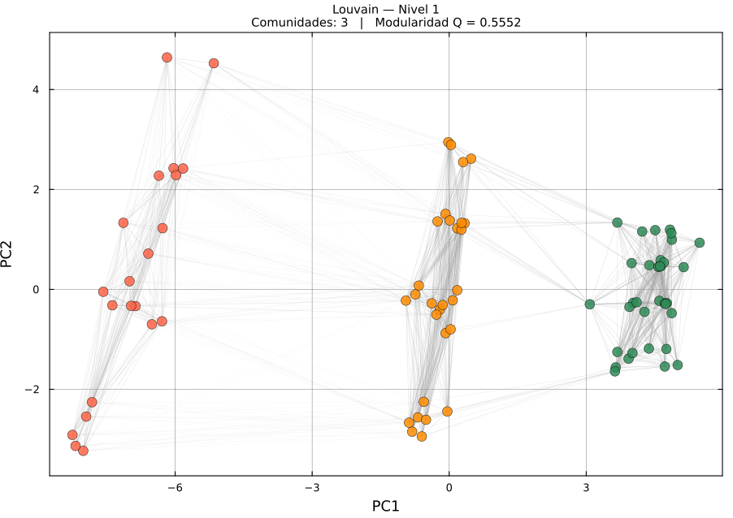
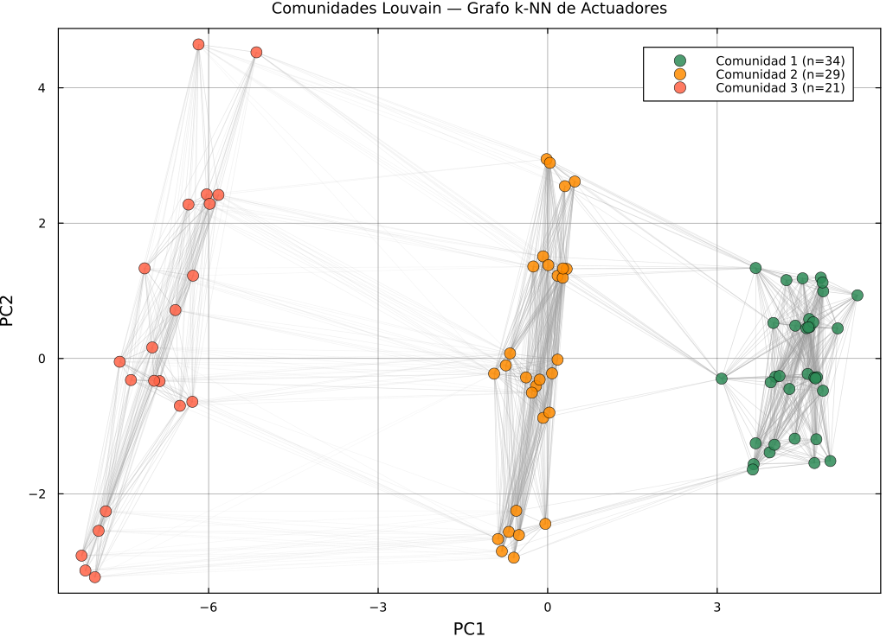
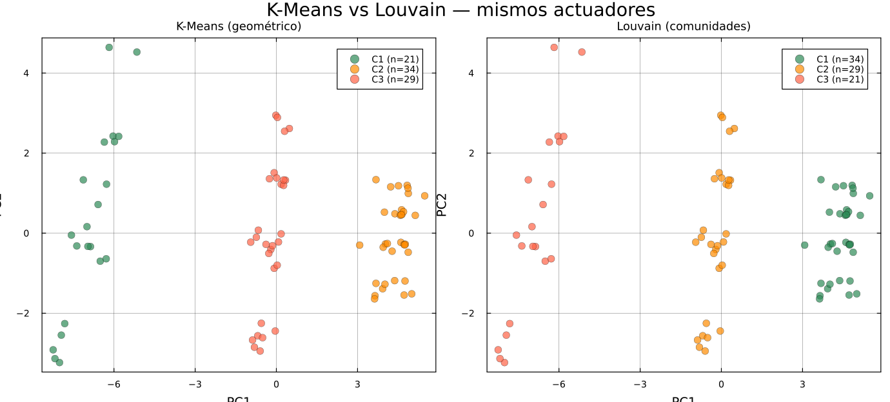

# Resultados — K-Means vs Louvain sobre Actuadores Robóticos

Documento de resultados del proyecto **unificado** `Robotica_Kmeans_Louvain`, que
fusiona los tres proyectos previos (`Kmeans_Robot_Jean`, `Kmeans_Robot_Henry`,
`Kmeans_Comparacion`) en un único pipeline y un único enfoque.

---

## 1. Objetivo

Clasificar automáticamente un inventario de actuadores robóticos en estados de
mantenimiento, aplicando **dos paradigmas de agrupamiento sobre los mismos datos**
y comparándolos cuantitativamente:

- **K-Means** — particional / geométrico (parte el espacio por distancia a centroides).
- **Louvain** — comunidades en grafo (maximiza modularidad sobre un grafo k-NN).

La pregunta de fondo: *¿dos algoritmos que no comparten nada en su formulación
llegan a la misma estructura?*

---

## 2. Dataset

| Parámetro | Valor |
|---|---|
| Total de piezas | 120 actuadores sintéticos |
| Tipos | Servo Industrial, Motor Brushless, Actuador Hidráulico, Motor Paso a Paso, Actuador Neumático |
| Split | 84 train / 36 test (estratificado) |
| Features | 10 variables de degradación con z-score ponderado |
| Ground truth | 3 estados de mantenimiento (síntesis controlada) |

Feature dominante: `pct_vida_util` (peso 2.5), seguida de `tasa_fallo_por_1000h`
y `drift_posicional_mm` (peso 2.0).

---

## 3. K-Means — Selección de K

K ∈ [2, 6] evaluado con silhouette + codo (Δ²J).

| K | Inercia | Silhouette | Elbow Δ²J | Seleccionado |
|:---:|---:|:---:|:---:|:---:|
| 2 | 714.6 | 0.6811 | — | |
| **3** | **365.1** | 0.6718 | **253.30** | **✓** |
| 4 | 268.8 | 0.6599 | 29.28 | |
| 5 | 201.9 | 0.6383 | 31.20 | |
| 6 | 166.1 | 0.6546 | — | |

**K\* = 3** — el codo es pronunciado (Δ²J = 253.3) y coincide con los 3 niveles de
intervención del negocio. Silhouette = 0.672.


### Clusters K-Means

| Cluster | Estado | Piezas | Vida Útil Media | Fallos/1000h | Drift (mm) | Pureza |
|:---:|---|:---:|:---:|:---:|:---:|:---:|
| 🟢 C1 | Mantenimiento Programado | 21 | 110.8% | 10.98 | 1.498 | **1.000** |
| 🟡 C2 | Mantenimiento Urgente | 34 | 26.4% | 0.26 | 0.041 | **1.000** |
| 🔴 C3 | Reemplazo | 29 | 70.4% | 3.51 | 0.454 | **1.000** |

---

## 4. Louvain — Comunidades en Grafo

### 4.1 Construcción del grafo k-NN

Cada actuador = un nodo. Se conecta con sus **k = 25** vecinos más cercanos
(≈ 30 % de los 84 nodos de train). Peso de arista por kernel gaussiano
`w_ij = exp(-d²_ij / 2σ²)` con σ adaptativo (mediana de distancias k-NN).
Grafo no dirigido, simetrizado.

> **Por qué k ≈ 30 % de n:** con k bajo el grafo se fragmenta en micro-comunidades
> (k = 10 → 8 comunidades); con k alto colapsa todo. k ≈ 25 es la meseta donde
> Louvain recupera la estructura real de 3 grupos.

### 4.2 Modularidad

```
Q = (1/2m) · Σ_ij [ W_ij − k_i·k_j/2m ] · δ(c_i, c_j)
```

**Comunidades detectadas: 3   |   Modularidad Q = 0.555**

El número de comunidades **no se fijó**: emergió de maximizar Q.





---

## 5. Comparación K-Means vs Louvain

### 5.1 Métricas contra ground truth

| Método | Nº Clusters | Purity vs GT | ARI vs GT | NMI vs GT | Métrica propia |
|--------|:---:|:---:|:---:|:---:|---|
| **K-Means** | 3 | 1.000 | 1.000 | 1.000 | silhouette = 0.672 |
| **Louvain** | 3 | 1.000 | 1.000 | 1.000 | modularidad Q = 0.555 |

### 5.2 Acuerdo directo entre métodos (sin ground truth)

| Métrica | Valor | Interpretación |
|---|:---:|---|
| **ARI** (K-Means ↔ Louvain) | **1.000** | Particiones idénticas |
| **NMI** (K-Means ↔ Louvain) | **1.000** | Información compartida total |



> Las dos vistas muestran **exactamente los mismos 3 grupos** (los tamaños
> 21/34/29 ↔ 34/29/21 difieren solo en el índice de etiqueta, no en la membresía).

### 5.3 Cuándo usar cada uno

| Aspecto | K-Means | Louvain |
|---------|---------|---------|
| Paradigma | Particional (geométrico) | Comunidades en grafo |
| ¿Requiere K? | Sí (auto vía silhouette) | **No** — K emerge de Q |
| Optimiza | Inercia (WCSS) | Modularidad Q |
| Forma de clusters | Esférica (Voronoi) | Arbitraria (densidad/conectividad) |
| Entrada | Matriz de features | Grafo de similitud k-NN |
| Sensibilidad | a la inicialización y a K | al parámetro k del grafo |

---

## 6. Conclusiones

1. **Convergencia de paradigmas.** K-Means (geométrico) y Louvain (comunidades en
   grafo) recuperan **la misma partición** con ARI = NMI = 1.000. Que dos métodos
   sin nada en común coincidan es evidencia fuerte de que los 3 estados de
   mantenimiento son **estructura real** del dataset, no un artefacto de un algoritmo.

2. **Louvain valida la elección de K.** K-Means necesita fijar K; Louvain lo
   descubre. Que Louvain encuentre 3 comunidades **confirma de forma independiente**
   el K\* = 3 elegido por silhouette + codo.

3. **Pipeline unificado y reproducible.** Un solo `run_pipeline.jl` ejecuta síntesis,
   features, K-Means, grafo k-NN, Louvain, comparación y reportes. Determinista por
   semilla.

4. **Limitación.** Louvain depende de k (densidad del grafo). Aquí k ≈ 30 % de n es
   robusto, pero en datos reales y ruidosos habría que validar k por estabilidad
   (p. ej. barriendo k y midiendo persistencia de comunidades).

---

## 7. Archivos

```
Robotica_Kmeans_Louvain/
├── RESULTADOS.md                              ← este documento
├── results/
│   ├── reporte.md                             ← reporte detallado autogenerado
│   ├── animations/
│   │   ├── kmeans_convergencia.gif
│   │   ├── k_selection.gif
│   │   ├── feature_scatter.gif
│   │   └── louvain_grafo.gif
│   └── report/
│       ├── comparacion_metodos.csv            ← métricas K-Means vs Louvain
│       ├── mapa_comunidades_louvain.csv       ← pieza → kmeans / louvain / GT
│       ├── louvain_comunidades.png
│       ├── comparacion_kmeans_louvain.png
│       ├── tabla_clusters.csv
│       └── ...
```

---

*Generado el 2026-06-17. Universidad de Cuenca — DEET. Proyecto Redes Complejas.*
