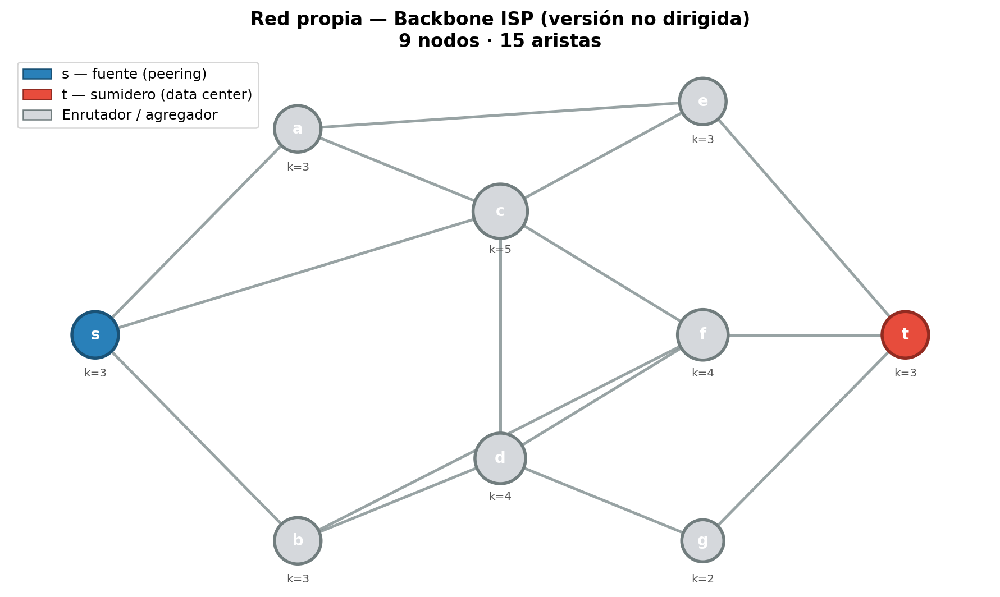
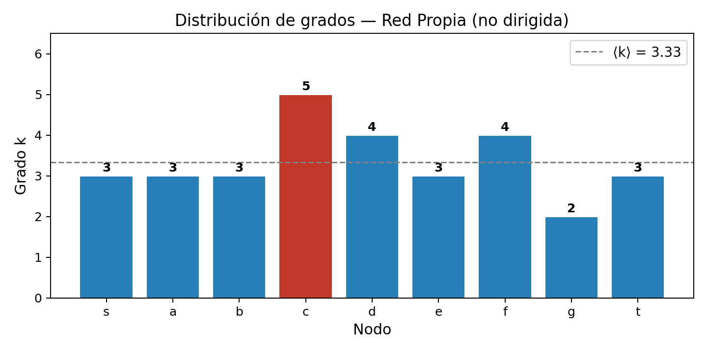
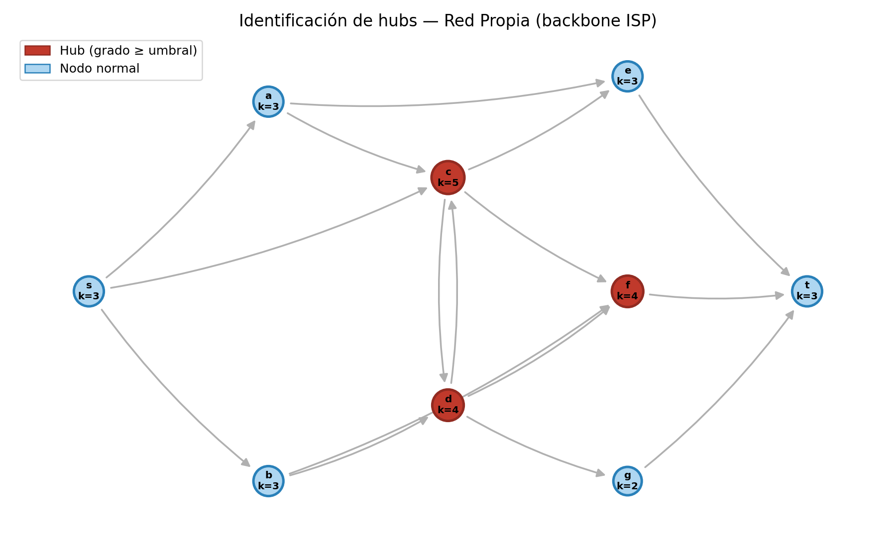
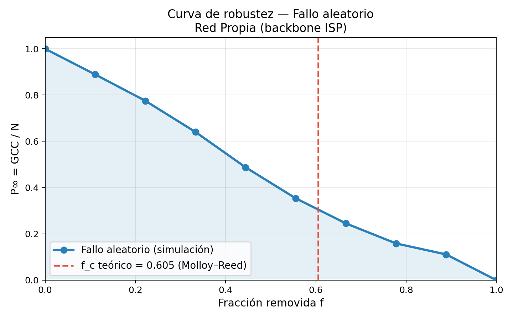
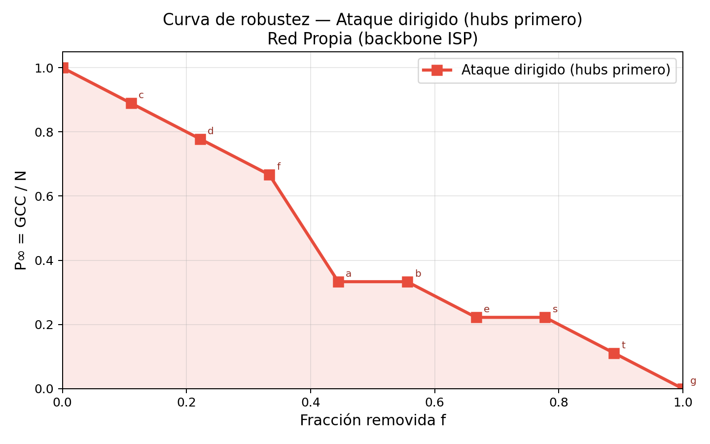
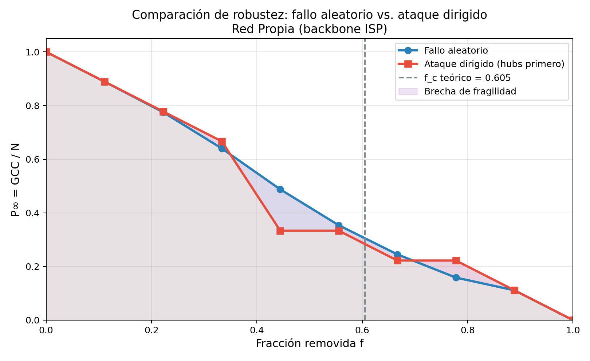

# Teoría de Percolación aplicada a la Red Propia (Backbone ISP)

**Curso:** Redes Complejas — Posgrado, Universidad de Cuenca  
**Tema:** Percolación de sitios: robustez y vulnerabilidad de redes reales

---

## 1. Red utilizada

### Escenario

La red modela el **backbone de un proveedor de Internet (ISP)** de escala regional. El escenario es el siguiente: el ISP recibe tráfico de otros operadores a través de un punto de interconexión llamado **peering** (nodo `s`), y ese tráfico debe llegar hasta un **data center** (nodo `t`) donde se procesan y sirven los datos a los usuarios finales.

Entre `s` y `t` existen dos capas de infraestructura: una capa de **enrutadores de acceso** (`a` y `b`) que distribuyen el tráfico entrante según la zona geográfica (norte y sur), y una capa de **núcleos y agregadores** (`c`, `d`, `e`, `f`, `g`) que concentran el tráfico y lo entregan al data center.

Cada **nodo** representa un equipo físico (enrutador o switch) instalado en algún punto de la red. Cada **arista** representa un enlace de fibra óptica entre dos equipos. La red tiene 9 nodos y 15 enlaces de conectividad (versión no dirigida), formando una topología mallada que ofrece múltiples rutas entre `s` y `t`.

Este escenario es especialmente interesante para el análisis de percolación porque refleja una infraestructura crítica real: si suficientes nodos fallan (por corte de fibra, fallo de hardware o ataque), la conectividad entre el punto de peering y el data center se pierde, dejando sin servicio a todos los usuarios que dependen de esa red.

### Descripción de nodos

| Nodo | Rol en la red ISP                          |
|------|--------------------------------------------|
| `s`  | Punto de peering — entrada del tráfico     |
| `a`  | Enrutador de acceso zona norte             |
| `b`  | Enrutador de acceso zona sur               |
| `c`  | Núcleo norte — mayor grado de la red (k=5) |
| `d`  | Núcleo sur                                 |
| `e`  | Agregador norte                            |
| `f`  | Agregador central                          |
| `g`  | Agregador sur                              |
| `t`  | Data center — destino del tráfico          |

### Topología

| Característica        | Valor |
|-----------------------|-------|
| Nodos                 | 9     |
| Aristas (no dirigida) | 15    |
| Grado medio ⟨k⟩       | 3.33  |
| Nodo más conectado    | `c` (k = 5) |

---

## 2. Contexto: ¿por qué aplicar percolación a esta red?

La **teoría de percolación** estudia cómo una red pierde conectividad cuando se eliminan nodos o aristas de forma aleatoria o dirigida. El análisis de flujo máximo (proyecto anterior) nos mostró cuánto tráfico puede transportar la red en condiciones ideales. Pero una red ISP real enfrenta **fallos inesperados** (cortes de fibra, fallos de hardware) y **ataques deliberados** (ataques físicos o cibernéticos a nodos críticos).

La percolación permite responder:
- ¿Cuántos enrutadores pueden fallar antes de que la red se fragmente?
- ¿Cuáles son los nodos más críticos para la conectividad?
- ¿Qué tan diferente es la vulnerabilidad ante fallos aleatorios vs. ataques deliberados?

El **parámetro de orden** usado es:

$$P_\infty(f) = \frac{|\text{GCC}|}{N}$$

donde GCC es el componente gigante conectado (conjunto más grande de nodos mutuamente alcanzables) y $f$ es la fracción de nodos removidos. Se trabaja sobre la versión **no dirigida** de la red, que captura la conectividad estructural independientemente de la dirección del flujo.

---

## 3. Análisis 1: Criterio de Molloy–Reed

**Script:** `src/01_molloy_reed.py`  
**Imagen:** `results/images/01_distribucion_grados.png`  
**Datos:** `results/files/01_molloy_reed.csv`

### Definición

El criterio de Molloy–Reed (1995) establece que existe un componente gigante si y solo si:

$$\kappa = \frac{\langle k^2 \rangle}{\langle k \rangle} > 2$$

Donde $\langle k \rangle$ es el grado medio y $\langle k^2 \rangle$ es el segundo momento de la distribución de grados. El cociente $\kappa$ pondera fuertemente los hubs: nodos con grado alto contribuyen cuadráticamente al numerador.

A partir de $\kappa$, Cohen et al. (2000) derivan la **fracción crítica de remoción aleatoria**:

$$f_c = 1 - \frac{1}{\kappa_0 - 1}$$

Esta es la máxima fracción de nodos que puede fallar aleatoriamente antes de que el GCC desaparezca.

### Resultados sobre la red propia

| Nodo | Grado k |
|------|---------|
| `c`  | 5       |
| `d`  | 4       |
| `f`  | 4       |
| `s`  | 3       |
| `a`  | 3       |
| `b`  | 3       |
| `e`  | 3       |
| `t`  | 3       |
| `g`  | 2       |

$$\langle k \rangle = \frac{30}{9} = 3.3333 \qquad \langle k^2 \rangle = \frac{106}{9} = 11.7778$$

$$\kappa = \frac{11.7778}{3.3333} = 3.5333 > 2 \quad \Rightarrow \quad \textbf{existe GCC}$$

$$f_c = 1 - \frac{1}{3.5333 - 1} = 1 - \frac{1}{2.5333} = \mathbf{0.6053}$$

**Interpretación:** teóricamente, la red puede perder hasta el **60.5% de sus nodos de forma aleatoria** antes de fragmentarse. Este valor alto refleja la buena conectividad de la red: casi todos los nodos tienen grado ≥ 3.

> *Nota:* el valor teórico de Molloy–Reed es exacto en el límite $N \to \infty$. Para $N = 9$ se observan efectos de tamaño finito que desplazan el umbral empírico (ver Análisis 3).

---

## 4. Análisis 2: Identificación de hubs

**Script:** `src/02_hubs.py`  
**Imagen:** `results/images/02_hubs_red.png`  
**Datos:** `results/files/02_hubs.csv`

### Definición

Un **hub** es un nodo cuyo grado supera significativamente el grado medio de la red. Formalmente, se clasifican como hubs los nodos con grado en el percentil 75 o superior de la distribución. Los hubs son los nodos que sostienen la conectividad global: su remoción tiene un impacto desproporcionado sobre el GCC.

### Resultados sobre la red propia

**Umbral (percentil 75):** $k \geq 4$

| Nodo | Grado | Clasificación | Rol ISP                |
|------|-------|---------------|------------------------|
| `c`  | 5     | **HUB**       | Núcleo norte           |
| `d`  | 4     | **HUB**       | Núcleo sur             |
| `f`  | 4     | **HUB**       | Agregador central      |
| `s`  | 3     | normal        | Peering (fuente)       |
| `a`  | 3     | normal        | Enrutador norte        |
| `b`  | 3     | normal        | Enrutador sur          |
| `e`  | 3     | normal        | Agregador norte        |
| `t`  | 3     | normal        | Data center (sumidero) |
| `g`  | 2     | normal        | Agregador sur          |

**Interpretación:** los tres hubs (`c`, `d`, `f`) corresponden al núcleo de la red y al agregador central. El nodo `c` (núcleo norte) es el más conectado con $k = 5$: conecta la fuente `s`, el enrutador norte `a`, los dos agregadores norte/central (`e`, `f`) y el núcleo sur `d`. Su falla desconecta directamente 5 enlaces y fragmentaría la ruta hacia los agregadores norte y central.

---

## 5. Análisis 3: Curva de robustez — Fallo aleatorio

**Script:** `src/03_robustez_aleatoria.py`  
**Imagen:** `results/images/03_robustez_aleatoria.png`  
**Datos:** `results/files/03_robustez_aleatoria.csv`

### Definición

La **percolación de sitios bajo fallo aleatorio** simula el escenario donde cada nodo falla con probabilidad $f$ de forma independiente (equivalente a $p = 1 - f$ de supervivencia). Se ejecuta el siguiente algoritmo para cada valor de $f$:

1. Seleccionar aleatoriamente $\lfloor f \cdot N \rfloor$ nodos a remover.
2. Construir el subgrafo con los nodos restantes.
3. Medir $P_\infty = |\text{GCC}| / N$.
4. Promediar sobre $R$ realizaciones.

Dado que $N = 9$ es pequeño y solo existen 10 valores discretos posibles de $f$, se utilizan $R = 5000$ realizaciones por punto para estabilizar la estimación.

### Resultados sobre la red propia

| $f$   | $P_\infty(f)$ |
|-------|---------------|
| 0.000 | 1.0000        |
| 0.111 | 0.8889        |
| 0.222 | 0.7751        |
| 0.333 | 0.6402        |
| 0.444 | 0.4875        |
| 0.556 | 0.3536        |
| 0.667 | 0.2452        |
| 0.778 | 0.1586        |
| 0.889 | 0.1111        |
| 1.000 | 0.0000        |

- **$f_c$ teórico (Molloy–Reed):** 0.6053  
- **$f_c$ empírico ($P_\infty < 0.5$):** ≈ 0.444

**Interpretación:** la caída de $P_\infty$ es gradual, característica del fallo aleatorio. La red mantiene más del 60% del GCC hasta que se remueve el 33% de los nodos. La diferencia entre el $f_c$ teórico (0.605) y el empírico (0.444) se debe al efecto de tamaño finito: la fórmula de Molloy–Reed es exacta para redes grandes ($N \to \infty$), y con solo 9 nodos el umbral efectivo se desplaza hacia valores menores.

---

## 6. Análisis 4: Curva de robustez — Ataque dirigido

**Script:** `src/04_robustez_dirigida.py`  
**Imagen:** `results/images/04_robustez_dirigida.png`  
**Datos:** `results/files/04_robustez_dirigida.csv`

### Definición

El **ataque dirigido** simula un adversario que conoce la topología y elimina primero los nodos de mayor grado (los hubs). A diferencia del fallo aleatorio, es un proceso **determinístico**: se ordenan los nodos por grado descendente y se eliminan en ese orden. No requiere promedio sobre realizaciones.

### Resultados sobre la red propia

| Paso | Nodo removido | Grado | $f$   | $P_\infty$ |
|------|---------------|-------|-------|------------|
| 0    | —             | —     | 0.000 | 1.0000     |
| 1    | `c`           | 5     | 0.111 | 0.8889     |
| 2    | `d`           | 4     | 0.222 | 0.7778     |
| 3    | `f`           | 4     | 0.333 | 0.6667     |
| 4    | `a`           | 3     | 0.444 | **0.3333** |
| 5    | `b`           | 3     | 0.556 | 0.3333     |
| 6    | `e`           | 3     | 0.667 | 0.2222     |
| 7    | `s`           | 3     | 0.778 | 0.2222     |
| 8    | `t`           | 3     | 0.889 | 0.1111     |
| 9    | `g`           | 2     | 1.000 | 0.0000     |

**Interpretación:** la caída más pronunciada ocurre en el **paso 4** (tras remover `c`, `d`, `f` y `a`): $P_\infty$ cae de 0.667 a 0.333, una reducción del 50% en un solo paso. Esto revela que después de eliminar los tres hubs, el nodo `a` actúa como conector residual crítico. Comparado con el fallo aleatorio, la degradación bajo ataque dirigido es más **abrupta**: en un solo paso se pierde la mitad de la conectividad residual.

---

## 7. Análisis 5: Comparación de escenarios

**Script:** `src/05_comparacion.py`  
**Imagen:** `results/images/05_comparacion.png`  
**Datos:** `results/files/05_comparacion.csv`

### Definición

Se superponen las dos curvas de robustez para comparar la respuesta de la red ante cada tipo de perturbación. Se calcula el **Área Bajo la Curva (AUC)** usando la regla del trapecio como métrica global de robustez: un AUC mayor indica que la red mantiene su GCC más tiempo conforme aumenta $f$.

$$\text{AUC} = \int_0^1 P_\infty(f)\, df$$

### Resultados sobre la red propia

| Escenario         | AUC    | $f_c$ empírico |
|-------------------|--------|----------------|
| Fallo aleatorio   | 0.4622 | 0.444          |
| Ataque dirigido   | 0.4506 | 0.444          |
| **Diferencia**    | 0.0116 | —              |

- **$f_c$ teórico (Molloy–Reed):** 0.6053  
- **Reducción de robustez ante ataque:** ΔAUC = 0.0116 (2.5% menos área)

**Interpretación:** aunque el $f_c$ empírico coincide en ambos escenarios (efecto de la discretización con $N = 9$), el ataque dirigido produce una caída **cualitativamente más abrupta**: mientras el fallo aleatorio degrada $P_\infty$ suavemente de 0.640 a 0.488 entre $f = 0.333$ y $f = 0.444$, el ataque dirigido la colapsa de 0.667 a 0.333 en ese mismo intervalo — exactamente la mitad de conectividad en un solo paso.

Esta diferencia es la **paradoja de robustez** descrita por Albert, Jeong y Barabási (2000): las redes con hubs resisten bien el fallo aleatorio (la probabilidad de que un fallo aleatorio elimine un hub es baja), pero son frágiles ante ataque deliberado (un atacante que conoce la topología va directamente a los hubs).

---

## 8. Conclusiones

1. **La red propia tiene un GCC sólido:** $\kappa = 3.53 > 2$ confirma que la red es globalmente conectada. El criterio de Molloy–Reed predice que puede perder hasta el 60.5% de sus nodos aleatoriamente antes de fragmentarse.

2. **Los hubs son `c`, `d` y `f`:** los núcleos norte y sur y el agregador central concentran la mayor conectividad. El nodo `c` (k=5) es el más crítico: su falla desconecta directamente 5 de las 15 aristas no dirigidas de la red.

3. **El fallo aleatorio degrada suavemente:** la curva es decreciente y aproximadamente lineal, consistente con la robustez inherente de redes con $\kappa > 2$.

4. **El ataque dirigido es más destructivo:** aunque el $f_c$ empírico coincide por la discretización (N=9), el ataque produce un colapso abrupto de 0.667 → 0.333 en un solo paso tras remover los tres hubs seguidos de `a`.

5. **Implicación para el diseño ISP:** los nodos `c`, `d` y `f` deben ser protegidos con redundancia física y failover automático. Una estrategia de defensa podría redistribuir el grado para reducir la concentración de conectividad en un único nodo (actualmente `c` duplica el grado de `g`).

---

## Referencias

- Molloy, M. & Reed, B. (1995). A critical point for random graphs with a given degree sequence. *Random Structures & Algorithms*, 6(2–3), 161–180.
- Cohen, R., Erez, K., ben-Avraham, D. & Havlin, S. (2000). Resilience of the Internet to random breakdowns. *Physical Review Letters*, 85(21), 4626.
- Albert, R., Jeong, H. & Barabási, A.-L. (2000). Error and attack tolerance of complex networks. *Nature*, 406, 378–382.
